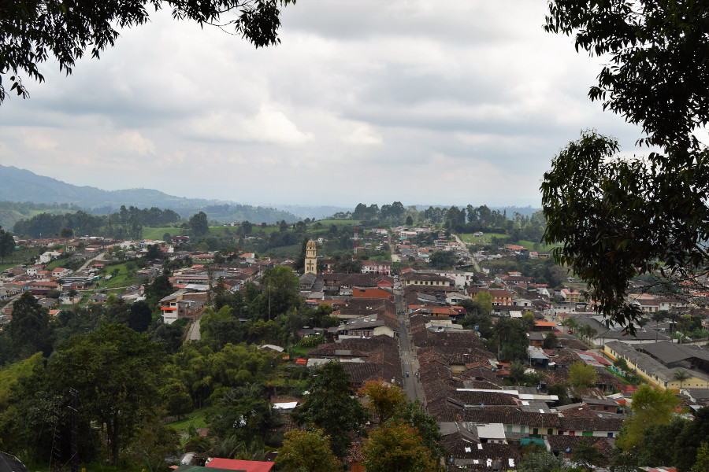
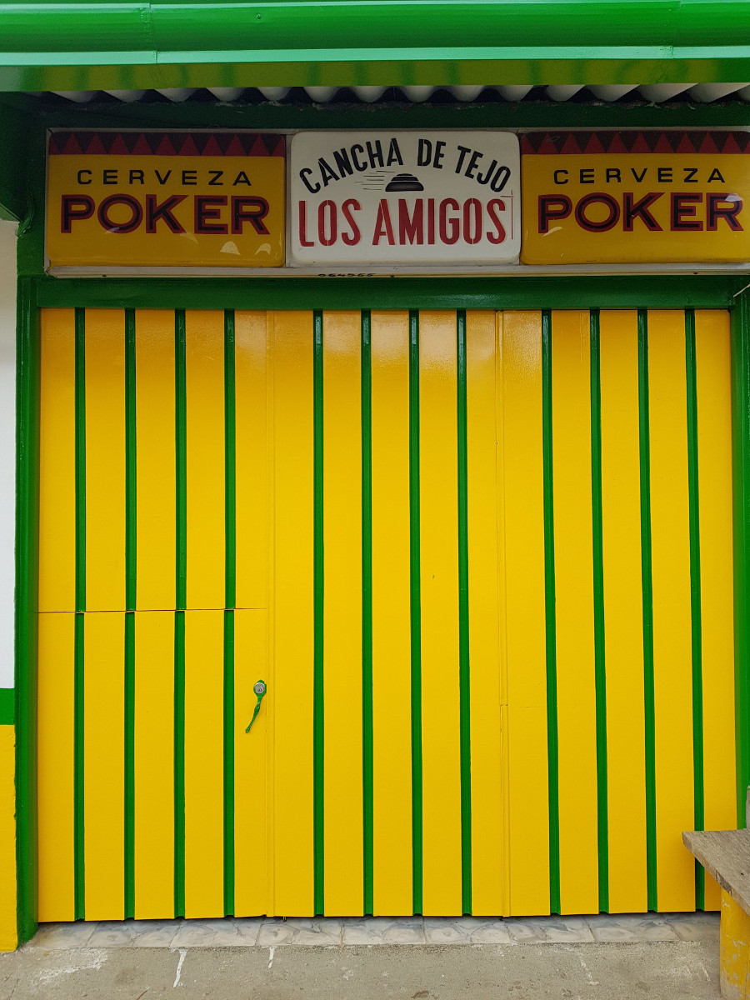
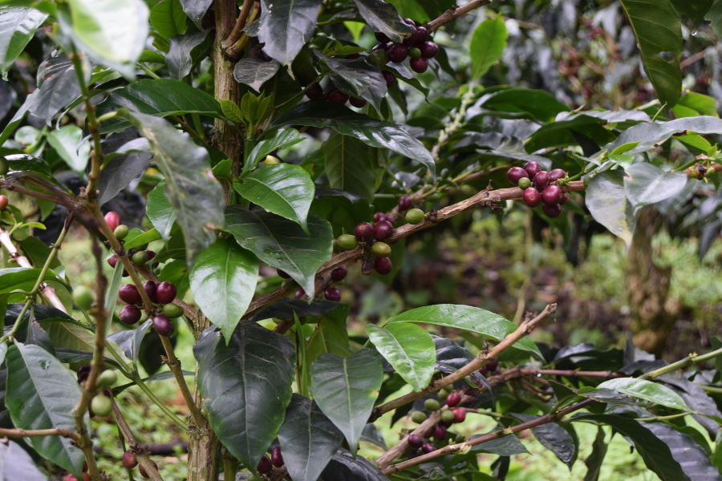
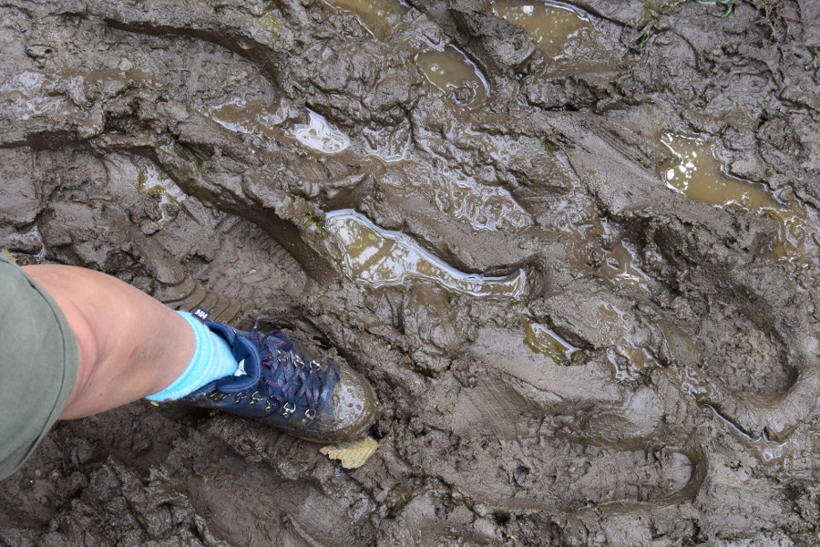
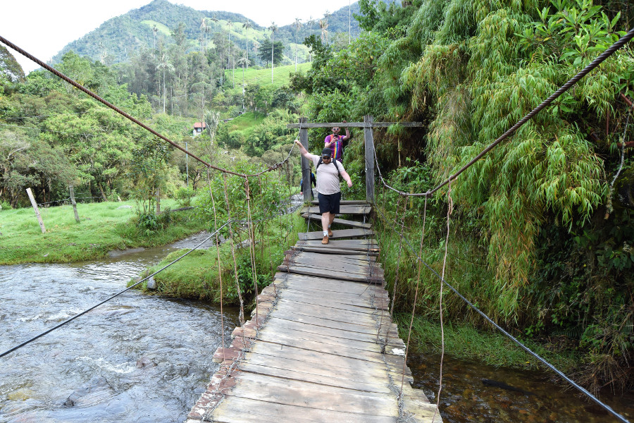
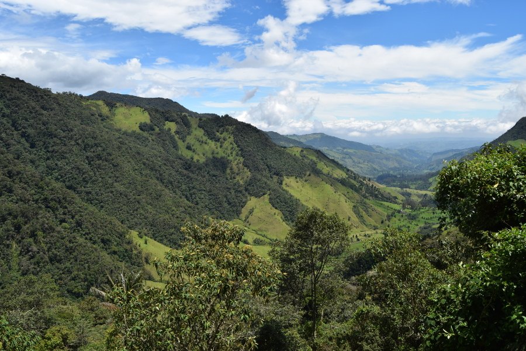
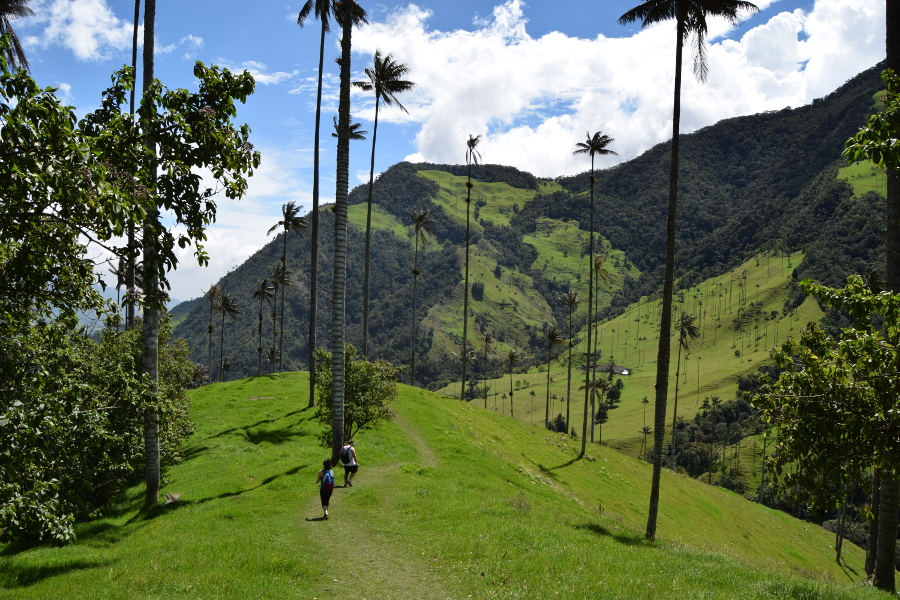
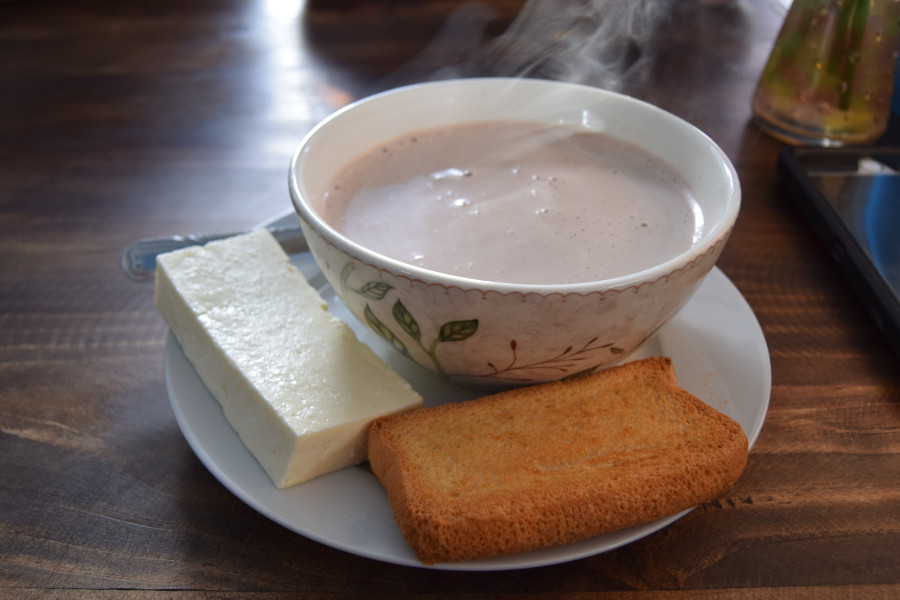

>"What matters in life is not what happens to you but what you remember and how you remember it."

Gabriel García Márquez

##Transport & accomodation
We took an overnight bus from Bogotá to Salento so we wouldn’t lose any precious daytime. We did plenty of research about the trip, nothing said it was dangerous and [Bolivariano](http://www.bolivariano.com.co/) came up top out of all of the different services. It cost us £12 each for the journey which was supposed to take around ten hours. Nothing on the internet and nobody warned us about how winding the roads were, or how crazy the driver would be. We snaked around the mountains for so long that people on the bus were throwing up in sick bags and no one could sleep as everyone was bracing themselves in their seat by their feet. It was easily the most horrific journey we’d done in three months in South America. Eventually the driver dropped us on the side of the road 8km out of Salento and told us to wait for a bus that comes every 15 minutes to finish our journey. The bus turned out to be a tiny collectivo that came every 30 minutes, we couldn’t fit on the first and ended up waiting a good 45 minutes before we could finally finish our journey to Salento.

We stayed in [Hostel Familiar Jerico](https://www.tripadvisor.com/Hotel_Review-g1580963-d11253739-Reviews-Hostal_Familiar_Jerico-Salento_Quindio_Department.html) in a family room as we were now four and not two. The hostel was run by a Colombian family who didn’t really speak English but were really welcoming and made us possibly the best coffee we’ve ever had. It contained aguapanela (sugar cane water) and it was so good that after one sip Greeno was instantly converted into a coffee lover.

##The Town
Salento is a small town in the Andes. Most of the houses are painted different colours, making it very photogenic. We walked to the edge of town and up some beautiful colourful steps for good views of the small Colombian town. Apart from eating, drinking or shopping there wasn’t much to do in Salento itself; it seemed very touristy and set up for the activities around it.

We made the most of a place called [Brunch](https://www.facebook.com/brunchdesalento/) which we’d discovered after our horrendous journey to Salento. It was a backpacker cafe which did amazing massive breakfasts all day for just £4-5. We loved the food and portions so much, we ended up going to eat there every day.

##Tejo
We’d read about this game before we even got to Colombia and thought it would be fun to try. It turned out to be like an old school bowling alley. First we were told we had to have beer to play, four Club Colombia’s all round. We then had to choose a rock and the guy told us the aim was to hit the bits of gunpowder wrapped in paper around a metal ring. He showed us the best technique and told us how to keep score. Mainly we just wanted to hit the gunpowder to get it to explode. We all managed to hit the ring or gunpowder but Greeno was the only one who actually managed to make it go bang. After a while it got a little tedious and we gave up; but was a fun game to play for $3000COP (80p).

##Coffee Farm
We deliberated over all the different coffee farms in the area and which one to visit; some offered in depth three hour tours, some were offered in English and others in Spanish. In the end we went with a 1.5 hour tour at [Finca del Osaco](http://www.fincaelocasosalento.com/web2/en/). We walked the hour there downhill on the dirt track enjoying the lush green scenery and got a Willy Jeep back to town.

There were two tours offered, a basic one for $15000COP (£4) and a premium tour for $65000COP (£17) the main difference being that we would get to try more types of coffee. We went with the cheaper option and our guide Andres showed us around the farm. It wasn’t a small or a family run coffee farm but it was interesting all the same. We got to pick and plant some beans and were shown how the beans are dried out and how coffee is made. At the end we got to try some medium roasted Colombian coffee which was very mild and weak compared to European coffee, but pretty good all the same.

##Valle del Cócora
Valle del Cocora is a valley full of Quindío wax palm trees which were left there from the Pacific Ocean. There were two ways to see the trees, to hike for 5-6 hours or to just walk the 1km path there and back. Luckily, Greeno and Iz were up for the hike. We’d read and been told that the best way was to go anti-clockwise, so that there was just one short steep climb upwards and the rest was downhill, it also meant we saw the trees in the valley at the end and not at the beginning. We’d been warned it was muddy and we could hire wellies at the beginning of the hike, however we’d also been told its not all muddy and 6 hours is a long time to spend in wellies. In the end we all decided to risk trainers and walking boots.

Even though we’d been warned, we weren’t really prepared for how muddy at least the first part of the hike was, think Glastonbury mud! Poor Iz put her foot in the first muddy puddle, up to her ankles, trainers ruined. The first part of the hike took a while as we were trying to navigate walking on the least muddy parts whilst not cutting ourselves on the barbed wire. The second part of the hike was through tropical forest. We’d hoped to see some wildlife but other than a lone kingfisher and some people riding horses we didn’t manage to see anything else. Although in the forest we had to cross the river over a number of rickety suspension bridges - great fun!

The next part was the climb uphill, we skipped the Hummingbird Sanctuary as it was 1.5 hours out of our way and we wanted to spend more time at the trees, especially as the sun was shining! The climb uphill was steep and a little slippy on the hard mud, it was a great feeling getting to the top, so much so that Greeno shouted "f**k me!" and everyone up there laughed.

At the top we sat eating our lunch from Brunch with hummingbirds fluttering around us. We also made friends with the dog at the top, who liked to eat scraps of bread and Pringles but wasn’t a fan of tomato or cucumber. A lot of people had walked clockwise, seeing the trees first with a downhill walk through the forest and a lot of mud to end their hikes. We found it quite amusing when they saw the state of our trainers and boots and then looked down to their own immaculately clean vans and converse.

After a break we got to walk the dirt track downhill towards the trees. We took loads of photos of the absolutely gigantic palm trees in the middle of the Andes and then sat in the sun trying to dry out our socks and feet.

We managed to get a Willy Jeep back at 14:00 and we’d started our hike at 08:00, not bad going as we’d made the most of our $5000COP entrance fees to see the infamous Colombian Quindío was palm trees.

##Hot chocolate with cheese
We’d heard about hot chocolate with cheese and decided we needed to try it as a ‘Colombian delicacy’. It’s a bowl of hot chocolate (with cinnamon) and a big chunk of cheese. The idea is to cut up the cheese put it in the chocolate, let it melt a little and then eat it. Sounds gross but the cheese was very creamy and mild, think mozzarella not cheddar. It actually wasn’t half bad!

##Our verdict on Salento
We all loved Salento, a sleepy colourful little town in the countryside. Greeno discovered his love for coffee (and hiking), we had amazing food, drank Mojitos, discovered Tejo and got to ride in Willy Jeeps. For anyone visiting Colombia in the future, Salento is a must!