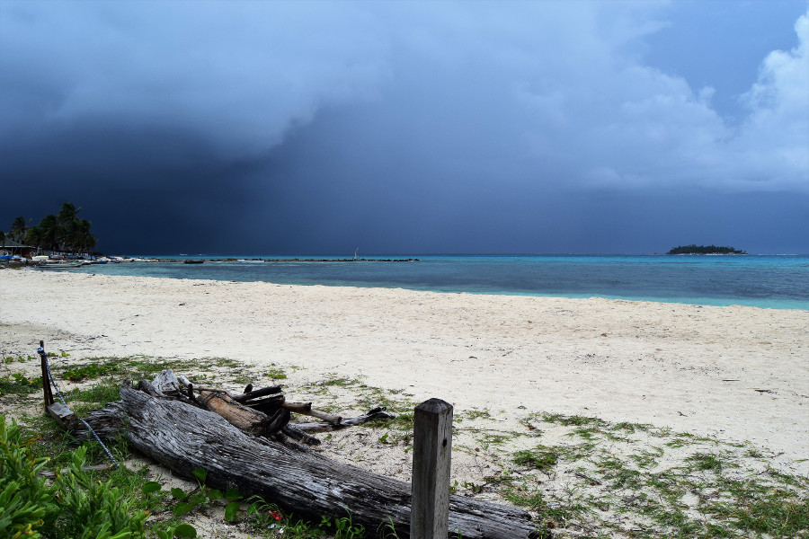
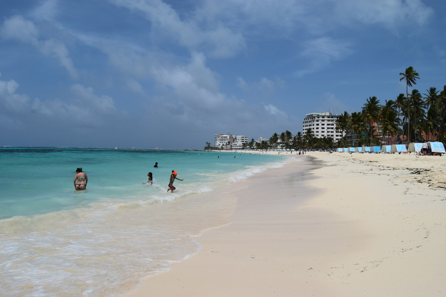
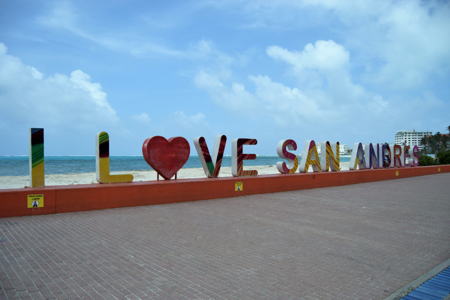
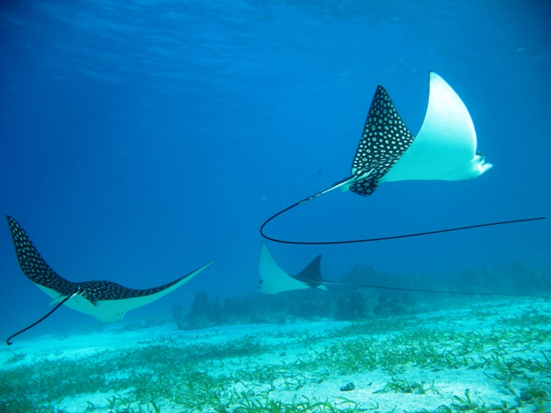
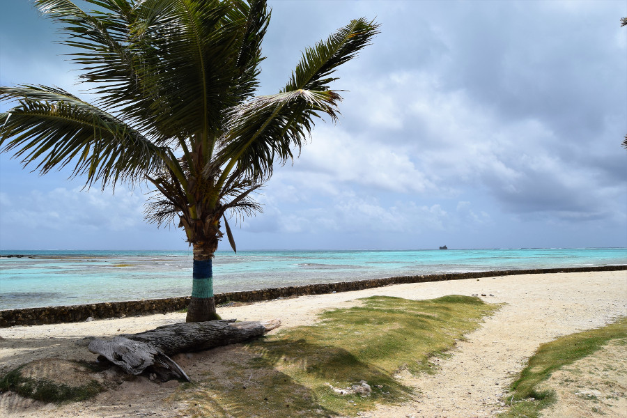
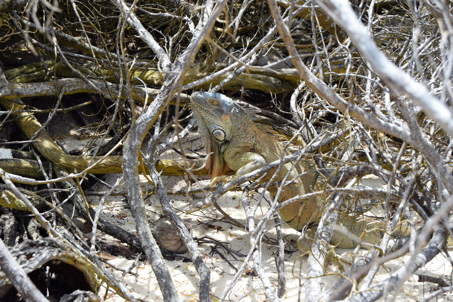

>"The worlds finest wilderness lies beneath the waves."

Robert Wayland.

##Getting there
We flew to San Andrés Island with Viva Air from Cartagena. Although it's a Colombian Island, San Andrés is located closer to Nicaragua than Colombia. We had to prove we had a flight off the island and out of Colombia in order to board the plane. And, as San Andrés is a UNESCO Biosphere Reserve, called "Seaflower Biosphere Reserve", we had to pay 106,000COP (£28) each just to enter the island. We'd met a Dutch restuarant owner in Cartagena who had visted San Andrés whilst we were in Santa Marta. When we went back to his restaurant, he told us that the weather had been bad as it was the start of rainy season and he told us that there are lots of police on the island as it used to be linked with narco trafficking. He was right about the police, but wrong about the weather. We were lucky to have blazing hot sun every day but one that we were on the island.

##El Centro
We didn’t do a lot in the time we spent on San Andrés Island other than napping on the beach, drinking and watching the World Cup. There was a beautiful beach in El Centro called Sprat Bight. It had white sand, ridiculously blue sea and a great view of Johnny Cay island. The planes leaving the island took off over the beach which was so loud as they were so low, it kept making us jump!

San Andrés itself seemed to be a holiday destination for Colombians rather than a backpacker destination. There were lots of all inclusive hotels with pools and barely any hostels and decent restuarants. We stayed in [Rock House Hostel](https://www.booking.com/hotel/co/the-rock-house.en-gb.html?aid=356980;label=gog235jc-hotel-XX-co-theNrockNhouse-unspec-pa-com-L%3Aen-O%3Aabn-B%3Achrome-N%3AXX-S%3Abo-U%3AXX-H%3As;sid=da2dd76ee5eb7f3a339f6e484605414c;dist=0&group_adults=2&sb_price_type=total&type=total&) which was outside the centre in Barrio Cabanas. It was built up a cliff face that was full of iguanas and the hostel owner had two very cute dogs! El Centro was full of duty free shops depite lacking in restaurants, although we didn't really find the prices any cheaper than elsewhere.

The centre also had a typical 'I love San Andrés' sign which was always busy with tourists. There were also statues of Captain Morgan, a pirate thought to have made his base on the island, stealing gold from Spanish ships passing through the Carribean during the time of the Spanish conquest. People believe that the gold is still buried somewhere on the island.

One thing we really wanted to do was rent a golf buggy and drive around the island. We’d read that it takes around 3 hours to get around the whole of San Andrés island and there were numerous things to see, the oldest church, a blow hole, some other more secluded beaches and a lake. However, we knew it would be a recipe for disaster, trying to drive and navigate on the wrong side of the road so we opted for a day trip out to some of the smaller islands instead.

##Snorkelling
On Greeno's penultimate day we did a snorkelling trip around the coral reefs. We found [Caribe Extremo](https://www.tripadvisor.com/Attraction_Review-g3493965-d10840302-Reviews-Caribe_Extremo-San_Andres_San_Andres_Island_San_Andres_and_Providencia_Departme.html) owned by Fernando on Trip Advisor, he had really great reviews and would only take out groups of 2-4 people for £18 each. We met him at 09:00, he gave us good snorkelling gear and took us out from the island around ten minutes away, we were the only ones by that part of the reef. The sea was really shallow and it didn’t take long before we saw two big eagle rays swimming just off the reef. In the hour we were swimming we saw three more eagle rays, two sting rays, a lobster, a crab, an octopus, lots of colourful fish and coral! The boys were able to hold their breath and go under water trying to get closer to the marine life for a good picture.

##Johnny Cay
Johnny Cay is an island just off the coast of San Andrés. For £7 we took a boat to see a rusty ship stuck on the coral, stopping at Rose Cay, Haynes Cay and Johnny Cay. On Rose Cay we were able to snorkel in the natural aquarium. The water was shallow and warm but it was so busy compared to the snorkelling trip we had taken the day before and there were just a few colourful fish to see. However, we were able to walk through the sea between Rose Cay and Haynes Cay, walking from one island to the other.

The boat then took us to Johnny Cay, which was beautiful; white sand and blue sea. The island was around 1KM in width and home to over 1000 iguanas. We walked around the island where we saw loads of iguanas, one was absolutely massive! We also saw some big crabs and some little hermit crabs. After that we found a spot of shade away from the busier part of the beach and settled down for a chilled out afternoon and I finally got my Pina Colada in a coconut.

##Our verdict on San Andrés Island
Despite the lack of food options, we absolutely loved chilling out on San Andrés and could easily have spent another week there. Johnny Cay was the best beach we visited in South America and it was great to finally have some time to nap on the beach!