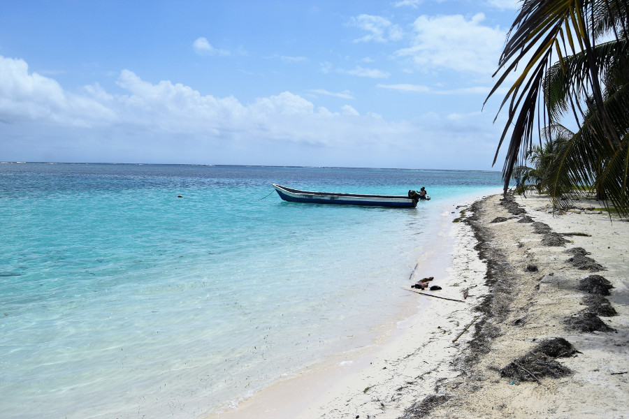
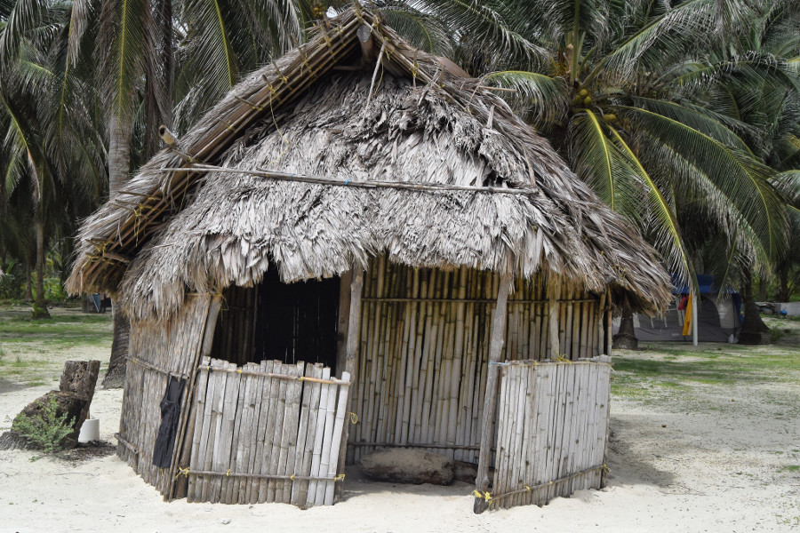
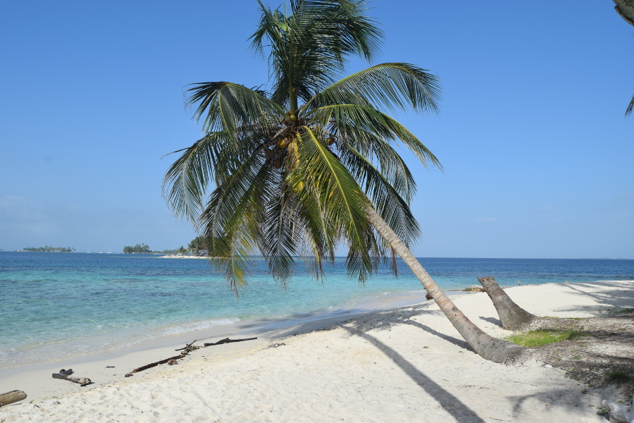
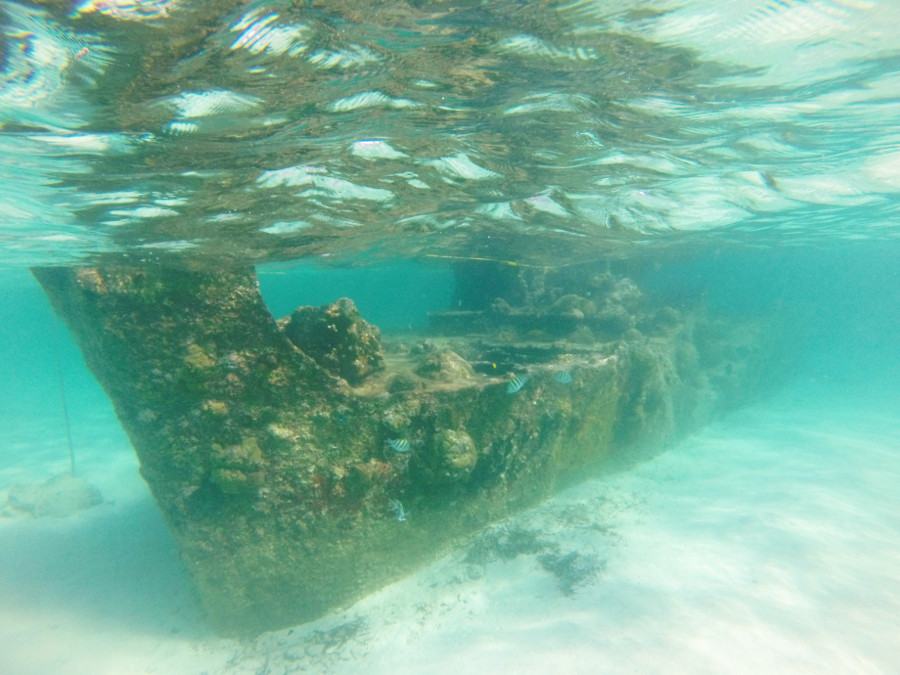

>"Paradise is not a place, its a state of mind."

Frank Sonnerberg

##San Blas
We booked our trip to San Blas through [San Blas Dreams](www.sanblasdreams.com) for $152 (£115) with a private cabin. We decided to go for just one night as we were worried we'd have terrible weather as it was rainy season. We also had the option of a late check out on the second day for an extra $20 (£15) meaning we would leave the islands at 15:00 so could make two full days of it if we wanted to.

We were picked up from [Mamallena Hostel](www.mamallena.com) at 05:30 in the morning in a 4x4, we had a quick stop at a Rey supermarket to get water and snacks before driving to the Caribbean coast. The second half of the journey was on a winding road through the jungle to the port owned by the Guna people. We paid $22 (£16.60) tourist tax and waited for a boat to Chichime Island, nicknamed Paradise Island, where we would be staying.

The sky was a little grey so we were worried about the weather as we made our way to the island, which took a little over an hour. However, once we arrived, the sky cleared up and we had sun and blue skies for the rest of the day. San Blas was idyllic, there were lots and lots of islands made up of white sand, blue sea and palm trees dotted all through the ocean.

The cabin we were staying in was really basic, basically a bamboo shack on the beach, with tarpulin to keep the rain out and a double bed with a mosquito net. The floor was sandy and full of crab holes so we had to watch where we walked, especially at night. We were told that there was only fish as a meal option on the island so we had eggs for all of our meals instead, our stay was very basic.

We chilled on the beach until 14:00 when we had a tour of the islands; firstly we headed to a natural aquarium in the sea, some shallow water near the reefs where we could snorkel. Apart from some small transparent fish, we saw some starfish, a sand dollar and a sting ray. The ray swam quickly across the shallow water and no one was ready with their snorkelling mask on, but we saw its shadow from above.

Next, we headed to Fragata Island, where we could walk from one island to another. The second island was really small and it took a few minutes to walk around it. As it was only inhabited by crabs we had to watch where we stood as we had a wander round. Finally, we headed to Perro Island which was idyllic, a gorgeous beach with a small bar and a swing. There was also a shipwreck just off shore which we could snorkel around. As we'd only hired one snorkel and mask Dan went first but put me off telling me it was really deep, dark and he'd seen three jellyfish. There were lots of fish to spot and the shipwreck was really cool to swim around.

We headed back to Chichime to chill out for the rest of the day and watch the sunset over the islands, which was so stunning we were up chiling in a hammock for sunrise too.

##Our verdict on San Blas
Paradise.