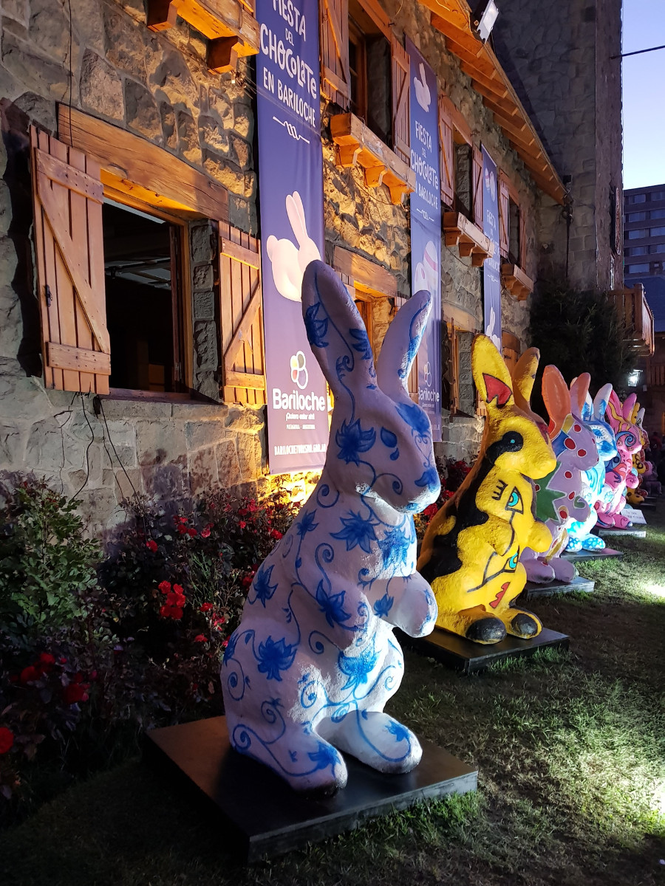
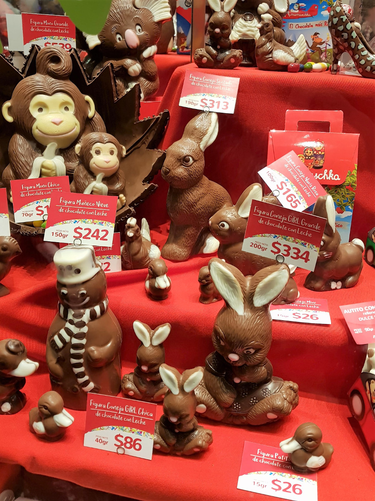

>“All you need is love. But a little chocolate now and then doesn't hurt."

Charles M. Schulz.

##Chocolate City

From our research Bariloche was a strong contender to be one of our favourite cities in Argentina. It looked really picturesque, nicknamed the Lake District of South America with Swiss influences in its architecture and it has lots and lots of chocolate shops. We also caught the last day of the annual [‘Fiesta del Chocolate’] (https://www.welcomeargentina.com/bariloche/fiesta-popular-chocolate-bariloche.html); Bariloche had been decorated with colourful bunnies and eggs and children were queuing to meet the Easter Bunny in a grotto. It was like Easter met Christmas.

We went in a number of shops hoping to pick up some cheap Easter eggs, but it seemed that Bariloche sell them all year round, so no such luck. Some of them cost around £20 and had an actual teddy bear inside. In the end we settled on treating ourselves with a tiny bar of Cadbury’s we’d found in a kiosk. However it definitely hadn't come from Bournville as it had a bitter Hershey-like taste. It was very disappointing.

After exploring Bariloche, we spent our last day doing what we do best, drinking and eating. We went to [Mamuschka](http://www.mamuschka.com/), a chocolate confiteria and finally caved and bought a couple of tiny chocolate bunnies to celebrate Easter. We also had the thickest and chocolatiest hot chocolates we’d ever drank, they were like melted chocolate in a mug.

##Cerro Otto

We stayed in [Marcopolo Inn] (http://marcopoloinnbariloche.com/index.php/hostel-bariloche-english/), which had possibly the most unhelpful staff we had yet come across on our trip. Asking for advice on what to do in the city and which buses go where, was like getting blood from a stone. On one of the receptionist’s bad advice on our first day we walked to Cerro Otto. He advised us to follow the road and suggesting it would take around an hour and 40 minutes. Not once did he mention a cable car.

The road up was dusty gravel and it was really steep. We didn’t see any tourists walking it and a number of intimidating dogs locked in gardens barked at us, making us jump as we walked past. Around a quarter of the way up, two dogs came out of the driveway of a house, barking, snarling and snapping at my ankles. I retreated quickly to the other side of the road and Dan said he had been ready to boot the one if it had bitten me. Thankfully as we walked off, the two dogs went back to their home and didn't follow us. The dogs here were very different to those in El Calafate.

Eight kilometres and two hours later we reached the top. The views were amazing of Nahuel Huapi National Park and Llao Llao, but by this time we were too pissed off to enjoy them. Dan had two huge blisters on the backs of both of his heels and my camera lens had stopped focusing so I couldn't take any photos. We were also told by a tourist information centre at the top that the only way to access the restaurant was to buy a ticket for the cable car. The fee was $300ARS per person (£12). This cost included the cable car going both up and down and a return journey on the bus to the city. We weren’t able to buy a ticket one way and we were really annoyed that the hostel hadn’t just told us to pay the £12 and enjoy the ride up and down and just do some of the smaller trails at the top to enjoy the views. By this time, we’d run out of water, were desperate for a drink and there was no way Dan’s blisters were going to allow him to walk two hours back down. So we had no choice other than to pay the £12 to ride the cable car and get us off the tourist trap hill.

Once back in the city, Dan changed into his flip flops and we desperately trawled around looking for a camera shop. As my Spanglish was not good enough to talk about a camera and the guy didn't speak English we had a conversation over google translate and I reluctantly handed over my camera to him to have a go at fixing it. Two days later, he’d managed it. My hero.

##Circuito Chico

We wanted to avoid more national park fees so rather than get the boat to Nahuel Huapi National Park, we decided to instead explore the countryside on [Circuito Chico](https://www.barilocheturismo.gob.ar/en/short-circuit). This is a road which loops around and there are lots of viewpoints of lakes and mountains and trails in the forest around it. Initially we were going to hire bikes and ride around it which takes 3-4 hours, but with big blisters from the walk the day before, we decided to go by public bus. We were told by the hostel it was easy to get public buses around Circuito Chico. We caught the 20 from town and it dropped us at Llao Llao where we had a look around San Eduardo Chapel. After this we started to walk towards the next viewpoint with the hope of jumping on a bus.

We kept walking along the road and it quickly became evident that there were no buses in this part of the circuit. In the end we walked 4.5 kilometres to the Tourist Information Centre in the hope that we could get some advice or pick up some bikes. However, as we turned the corner we saw it had closed down. We couldn’t believe it, the next stop, Bahia Lopez was 3km away and according to the information we had been given a different bus went from there.

 Whilst walking the circuit we made sure we checked off the viewpoints so saw Lago Moreno and Lago Escondido. We saw some people biking but many of the trails said 'no bikes' so presumably all they could do was bike the road. It appeared the best way to get around was to hire a car and stop at each trail or viewpoint, then continue driving. As we reached Bahia Lopez it had started to rain and we hoped to find a bar at the beach. Wrong, it was closed and guess what, no buses in sight. Our options were either to keep walking, hitch hike or steal someones bikes.

As we weren't yet desperate enough to hitchhike we kept walking, trying to enjoy the views along the way. It was quite misty which made the mountains and lakes look really eery. We stopped at Montanes Cemetery, a kilometre from the beach. It was really odd, up in the forest on a hill. We checked google maps to see how much further it was until there was possibly some civilisation and we found [Patagonia Brewery](http://www.cervezapatagonia.com.ar/) on the map. We had everything crossed that it was open, picked up the pace and continued to walk another 4km with the thought of a cold beer at the end.

After four hours of walking, 16km later, we made it to the brewery and had a cold overpriced wheat beer each. One of the members of staff told us that a bus goes past this part of the circuit every hour and the next one was coming at 17:00. We were really glad that we’d reached civilisation and had a way back to the city that wasn't more walking or hitchhiking.

It didn't help that we had visited in the autumn and not the summer, but it was clear that Bariloche was more for the Argentinian holiday-maker rather than the gringo back packer on a budget. Everyone had done the circuit by hiring a car and when we had explored the tours beforehand in the city, they were all in Spanish.

##Steak and Breweries

Two of Bariloche’s redeeming qualities were the number of microbreweries in the city and the steak we had at [Alto del Fuego](http://www.altoelfuego.com.ar/). Dan managed to find a number of microbreweries including [Belek](https://www.facebook.com/BelekBariloche/), [Bachmann](http://www.bachmann.com.ar/) and [Manush](http://www.cervezamanush.com.ar/), each serving 5-10 different types of beer, ales and stouts and they were all willing to let us try samples before committing to a pint. They all had happy hour from 17:00-20:00 which was another bonus. An elderly gentleman from North Carolina struck up a conversation with us in Belek, he said he couldn’t resist talking to us when he heard we were English. He told us he had been in Argentina for around 5 weeks fishing in remote villages across the country and that he doesn't speak Spanish. He was really well travelled and an interesting gentleman.

Alto del Fuego was a parilla or steakhouse. We went on our last night as Bariloche was our penultimate stop in Argentina and we were running out of opportunities to eat Argentinian steak. This was hands down the BEST steak we had ever eaten. We had beef de chorizo to share with chimchurri sauce and fries, washed down with a bottle of Malbec. The meat was so juicy it just melted in our mouths. The best part, the meal for two and wine only cost us £21.

##Our Verdict on Bariloche
In the beginning Bariloche didn’t live up to our high expectations. It was packed with Argentinian tourists enjoying their Easter weekend and didn’t seem to be made for the gringo backpacker. From the bad hostel advice we ended up walking 24km, got blisters and was almost bitten by dogs. However, with the help of its chocolate, steak and beer, it did manage to redeem itself. Just.

