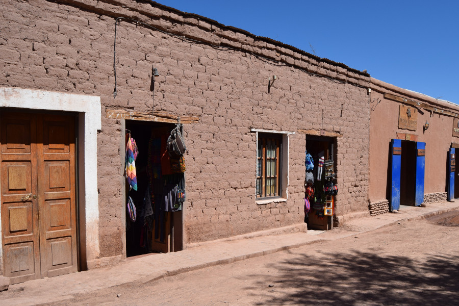
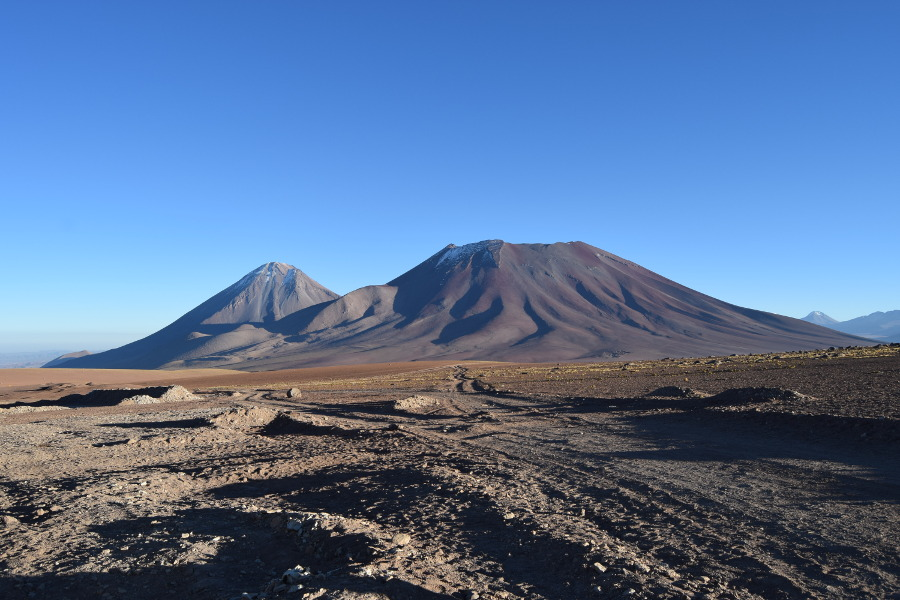
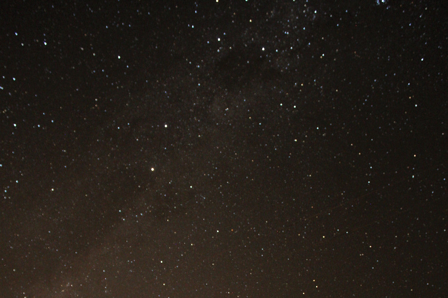
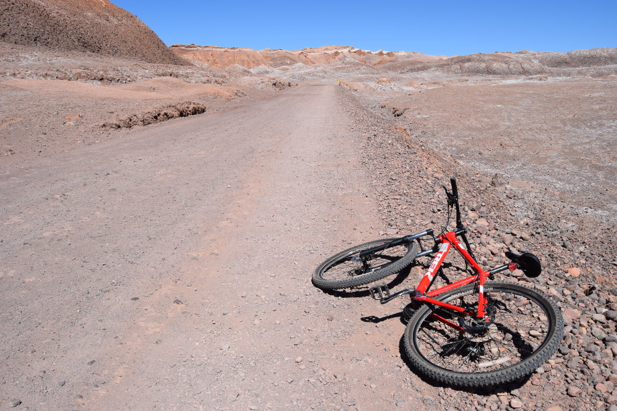
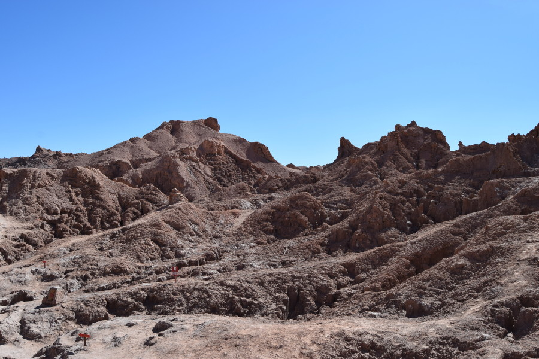
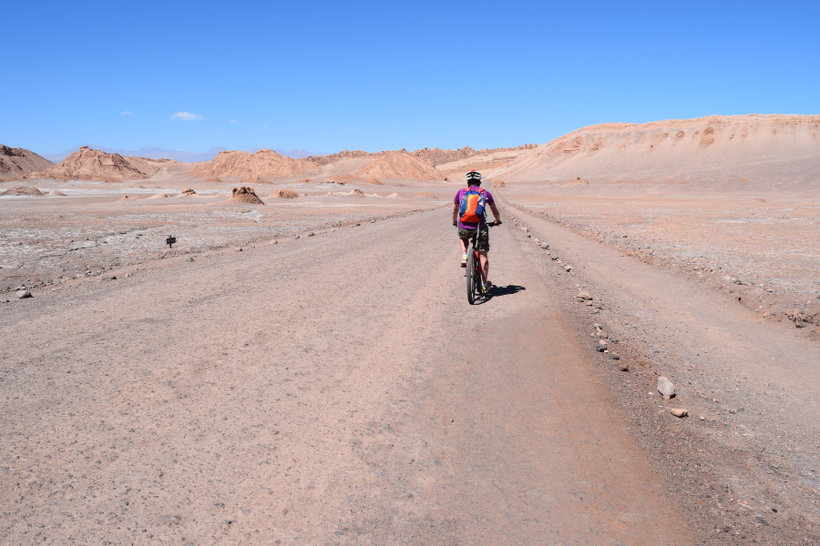
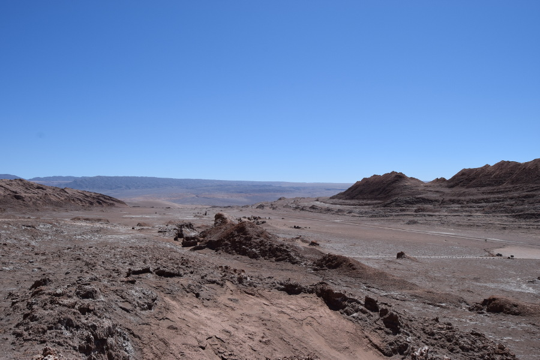

>“What makes the desert beautiful is that somewhere it hides a well."

Antoine de Saint-Exupery.

##Walking Tour
After a long lie in on our first day in San Pedro de Atacama, as we do, we decided to go on a walking tour! San Pedro de Atacama is a small town built around an oasis in the desert so we weren't really sure what there would be to see. We went with [Tours4Tips](https://tours4tips.com/san-pedro-de-atacama/) and the only building we saw was a clay church. But it wasn't the sites, it was the stories that made the walking tour interesting. Our favourite story was about the belief of the afterlife of the Likan-antai people, the indigenous people to the Atacama desert. The guide told us that the Likan-antai people used to put their dead in big ceramic pots with their animals, usually their dogs, and position them facing the sky. The story was told that the animal would take the soul of the dead to the Moon. They believed that the Moon was female, due to links with the Moon's cycle. Then in three months time a new star would be born so that their loved ones could watch over them.

Another great story from the Likan-antai people was about the volcanoes that can be seen from the town on the border of Bolivia. The two volcanoes are called Licancabur and Juriques. The story goes that Licancabur was in love with a mountain called Mount Quimal. She loved him back as he was big and strong. However, Licancabur's brother Juriques was jealous and persisted for Mount Quimals love. When Licancabur found out he became very angry, exploded and decapitated his brother. Licancabur and Jurique's father found out and moved Mount Quimal away from them, he made the two brothers live side by side for the rest of eternity. The guide told us that one day a year at sunrise and sunset, Licancabur and Quimal's shadows are long enough to reach one another and for this day only they are able to share their love once more. He also added that on this day people in San Pedro celebrate love, which often results in more babies being born 9 months after.

##Astronomy
We deliberated over paying for an astronomy tour as we thought we'd probably see some decent starry nights on our two night tour of the Salt Flats from San Pedro de Atacama to Uyuni in Bolivia. There was also a huge variation in price and in reviews. In the end we went with cheap and cheerful and we weren't disappointed. We were driven to what looked like someone's backyard outside of the town so there was no light pollution. We were also lucky as it was a new Moon so the sky was really dark and the stars were bright. The guide, Alex, showed us a video and explained about nebulas and supernovas; this all went over our heads. He got out his telescopes and showed us Jupiter, Belleguese, Sirius, the butterfly nebula and some other stars and constellations in the sky. He explained that the stars that twinkle the most are the ones that are closest to the horizon because the light has further to travel over the earth's atmosphere. As we were having our picture taken, we were also lucky enough to see a 'shooting star' or meteor.

##Valle de la Luna
We had seen some of Valle de la Luna on the way to San Pedro from the airport and it didn't seem too far away, so rather than pay for a tour we decided to explore for ourselves. Clearly we'd forgotten the trauma we experienced in Bariloche. We rented bikes from the town, which came with helmets, puncture repair kits, lights and a pump. We told the guy that we wanted to do Valle de la Luna and Valle de la Muerte. He told us that this would take around eight hours; five hours at Valle de la Luna and three at Valle de la Muerte. We thought he was exaggerating to get us to pay for the full day of the bikes, which we planned to do anyway so we could take our time.

 We were expecting a few rocks that looked a bit like the Moon to be just off the road, but of course this wasn't the case. We had approximately an 6km bike ride out of town to the entrance of Valle de la Luna. Once we got there and paid our entrance fee pf $2500CLP (£2.80) we realised what we had let ourselves in for. It was 5km to the actual entrance and there was loads to see there, caves, canyons, dunes, rocks and a mine. In the end we did a 34km bike ride from San Pedro all around Valle de la Luna, plus the short hikes to see the sites.

At the entrance to Valle de la Luna the road turned to gravel which made the ride really bumpy, it also became hilly. So much so that we had to push the bikes to the top rather than ride them. It didn't help that the gears were terrible too, however, it was fun sitting on them and just holding onto the breaks going down. We decided to complete the trecherous bike ride to the end of the road and then on our way back enjoy the sites.

The landscape was out of this world, parts of it looked just like a film set for a film about landing on the Moon or Mars. The caves were really dark and low but wide, we had to make sure we stepped over the dogs who were chilling in the shade there. We climbed a few miradors for the views but it was really hot with no shade. We noticed the air was really dry and it gave us sore throats; before we made it back we'd also got through 4 litres of water! We managed to bike and look round Valle de la Luna in six hours, by which time we were in no state to go to Valle de la Muerte, so had to give it a miss.

##Hostel
We stayed in [Hostal Casa Greda](https://www.facebook.com/Hostal-Casa-Greda-1572027869532954/) and it was the best hostel we had been in so far. Considering how dusty the roads were it was immaculately clean. The family who run the hostel pottered around making sure we had everything we needed and in the morning left us not only breakfast, but a sandwich and snacks for lunch.

##Our Verdict on San Pedro de Atacama
We originally just thought of San Pedro as a hub to get across the salt flats from Chile, however it was so much more than that and we wish we had stayed longer, as there were so many things we weren't able to see or do. We loved this little clay town in the middle of the desert!

