##The city
To reach Sandakan from Kota Kinabalu we took a public bus. We were told we could just turn up at Inanam Bus Station and the buses were hourly, we arrived at 9:30 hoping to catch the bus at 10:00, only to be told it was full and we’d have to wait until 11:00. The bus cost us 43MYR, around £8. Eventually we got to board the bus which was really uncomfortable and smelt like a toilet. The driver decided to absolutely blast the Malaysian radio for the first part of our journey, it was so loud my headphones couldn’t drown out the noise. Then he put a film on, but turned the sound down so we couldn’t hear it. The bus made one toilet stop at the grubbiest restaurant we’ve ever been in and the toilets were horrific! Seven hours after leaving Kota Kinabalu we reached the outskirts of Sandakan! We’d had visions of Borneo being a big green jungle island, so it was sad to see that almost the entire drive from Kota Kinabalu to Sandakan was through palm oil plantations, where there used to be rainforest.

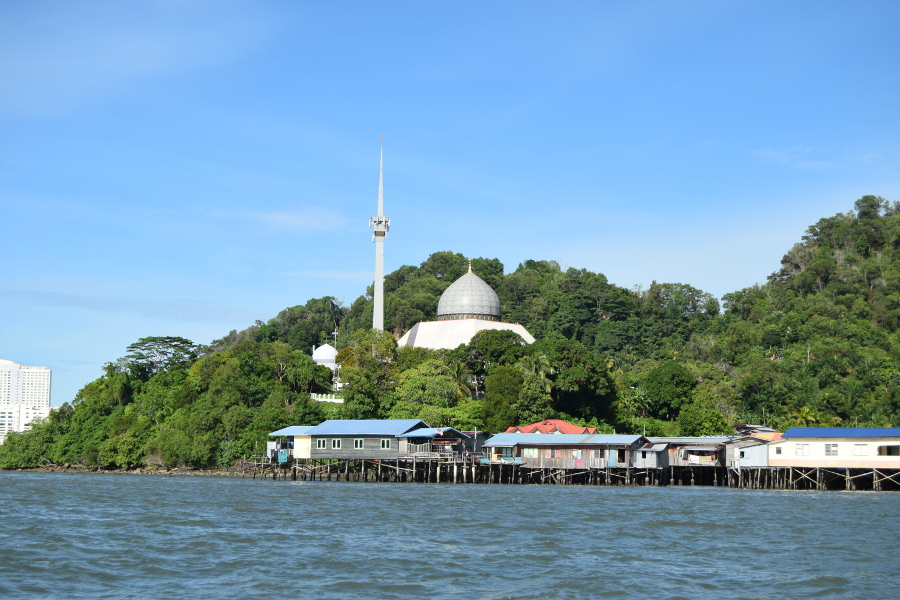

More so than Kota Kinabalu, Sandakan was a really ugly city. It's clearly used as a base for people to get to the rainforest and to Turtle Island Park before moving on to Tawau or Kota Kinabalu. There was nothing monumental to see in the city, our Grab driver pointed out the memorial to honour the victims of World War 2 after Japan invaded Borneo as most of Sandakan was destroyed. We wanted to visit [Agnes Newton Keith's House](https://en.wikipedia.org/wiki/Agnes_Newton_Keith) but after a long wait and lengthy bus ride we ran out of time. Agnes Keith was a famous American writer, she moved to Sandakan in the 1930’s. Her second book 'Three Came Home' details her time as a Japanese POW. Her house has been preserved as a museum with many original artefacts on display.

Almost all of the restaurants in Sandakan have menus based on seafood so we struggled to find anywhere to eat that wasn’t a KFC or McDonalds. We ate and returned to [Ba Lin Rooftop Bistro & Bar](http://www.balin-sandakan.com/), which was a little pricey for Malaysia but still cheap enough to have a drink and two course meal for 50MYR, around £10. We stayed at [Sandakan Backpackers](https://www.sandakanbackpackershostel.com/) each time we were in the city which was really central.

##Sepilok
On our way back from the rainforest we decided to linger about in Sepilok before going back to the city. Unfortunately we arrived at 10:30 and had missed the morning feeding time of the orangutans at [Sepilok Rehabilitation Centre](https://www.orangutan-appeal.org.uk/about-us/sepilok-orangutan-rehabilitation-centre). We bought our tickets for 30MYR (£6) and paid the 10MYR (£2) camera fee and stored all of our belongings in the lockers, fortunately they were free and there were ones big enough for our big backpacks. We headed to the playcentre and luckily some of the juvenile orangutans were still hanging around after feeding time. It wasn't long before they dispersed and headed back into the forest on the ropes and some of the wild macaque monkeys came up to the play centre to scavange the scraps.

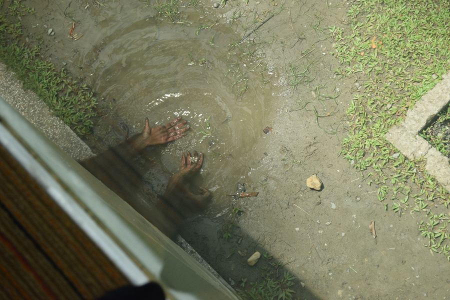

Whilst the few remaining tourists watched and photographed the macaques, Dan and I noticed that there was a pair of hands underneath us washing stones in the puddle. On the other side one of the juveniles came right up to the glass and posed for lots of photo's. He was also eating banana but kept playing with it and regurgitating it.

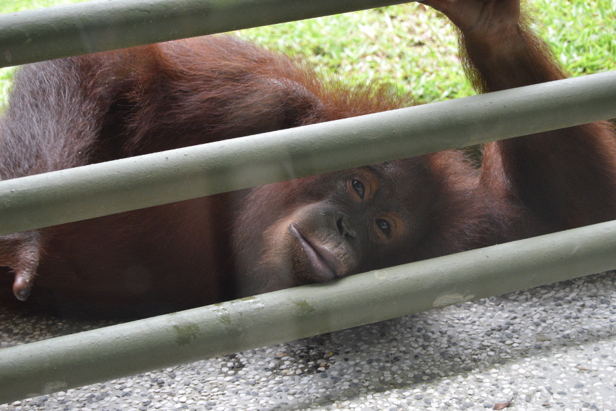

As feeding time wasn't until 15:00, we headed to the [Borneo Sun Bear Conservation Centre](http://www.bsbcc.org.my/). We managed to see three of the bears but the rest were hiding in the midday sun. The video at the entrance was a good watch and showed how the centre rehabilitates bears that have been caught and rescued from humans. We were surprised to learn on the walking tour in Kota Kinabalu that even in Sabah, bear bile can be found in traditional Chinese Medicine shops, and the international and national law preventing the hunting of the animals to be poorly enforced.

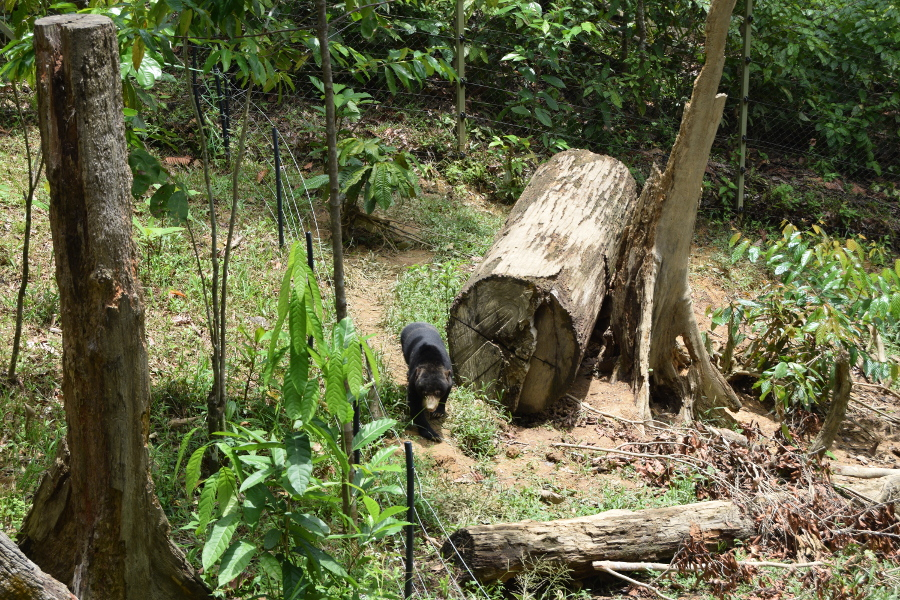

At 15:00 we headed back to the Orangutan Rehabilitation Centre, we watched the juveniles be fed and play and then headed to Platform A, where two orangutans, a mother and a juvenile were waiting to be fed. Not long after they'd had their fill, a mother and her baby came across the walkway. She was literally a meter away from us before she climbed up and onto the ropes to get to the feeding platform. Whilst we were watching her the rangers started shouting for everyone to get back and one of the big males came walking towards us. The rangers managed to get him to go into the bushes by making loud noises with a stick, he became very vocal before swinging to the platform to get some bananas. We got so lucky managing to see a male, female, juveniles and a baby orangutan! We overheard one of the volunteers say that this was the most she'd seen in a while come to feed and some days there might be just one or two orangutans.

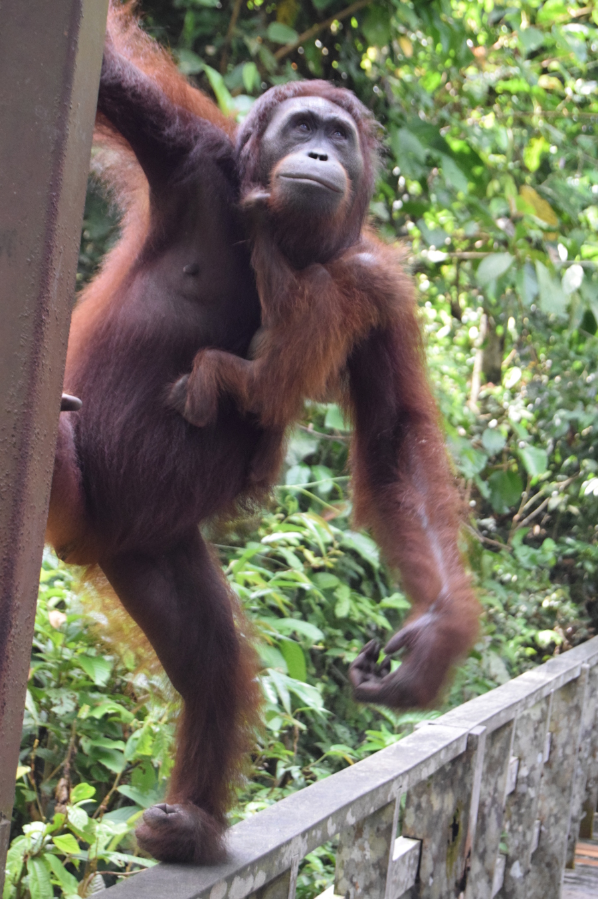

There are four feeding platforms in the centre; the first being the one tourists are allowed to and the closest to the centre, and the last being 1KM into the forest and the idea being, by the time the orangutans go to this feeding platform, they have learnt to be pretty self-sufficent. The orangutans in the centre are semi-wild and are free to roam the forest. Tourists aren't allowed to see the nursery and the rescued baby orangutans; but if you are willing to pay around £2000 for 4-8 weeks volunteering in the rescue centre you are able to work with the babies!

##Selingan Island
We were really indecisive about whether we should visit Selingan Island in [Turtle Islands Park](http://www.sabahparks.org.my/the-parks/turtle-islands-park). Everyone we met who had been to Borneo told us it was an amazing experience but it was quite costly (465MYR, £85 per person), the UK foreign travel advice was also 'all but essential travel' to islands between Kudat and Tawau in Sabah, Borneo, due to the risk of pirates in the Sulu Sea coming from the Philipines. A few days before we travelled to Sandakan, we decided to go for it and it was one of the best decisions we made on the trip. We arrived at the jetty in Sandakan for 09:00 and took the 45 minute speedboat to Selingan Island, the only island out of six (three beloning to Malaysia and three to the Philipines) that can be visited by tourists. We paid our 10MYR camera fee and 60MYR conservation fee's each, checked in to our room and headed for the beach. The island reminded us of the islands in San Blas in Panama, there was only one facility on the island, big lizards, plenty of mosquitos, white sand and warm blue sea. We were only 5KM from islands in the Philipines which we could see in the short distance.

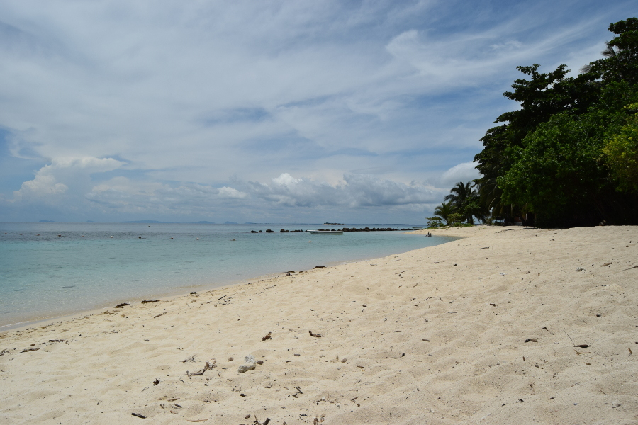

We paid for snorkelling equipment (25MYR, £5) as we were allowed on the beach until 18:00 when the turtles started to come in and Dan dragged me straight into the sea. Some of the coral was sadly dead but there was still lots that was alive and colourful. There were also lots and lots of colourful fish! At one point more fish than I've ever seen at one time swam through us, Dan was loving it, I freaked out. After lunch (all food was included in the package), Dan dragged me back into the sea for a second snorkelling session; we managed to see clown fish (Nemo), moorish idol (Gil from Nemo), a stone fish, lion fish, puffer fish, lots of sea cucumbers, yellow tang, two massive pompano, copperband butterfly fish, dussumier's halfbeak, flag snappers, parrotfish and loads more.

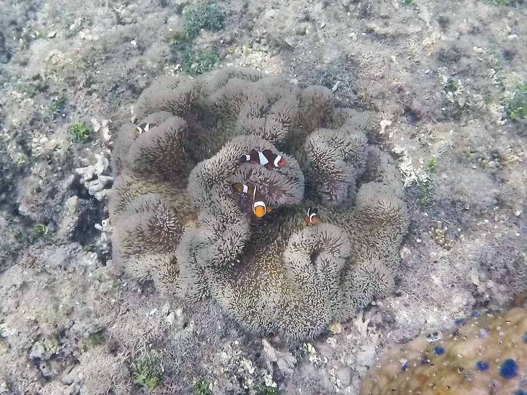

After the sun went down a lot of the eggs, already buried in the hatchery, started to hatch and baby turtles were coming out of the sand. We watched a video and visited the exhibition hall, which told us all about the park and the work that they do there. Each night the rangers collect the eggs from the turtles nests, the night we were on the island they collected 22 nests. Each nest can contain between 25-150 eggs, 80% of those eggs hatch in the hatchery after 60 days and are released during the night into the sea by the rangers. Straight after dinner, around 20:00, we were told a turtle had come onto the beach, tourists are only allowed to see the first turtle lay her eggs, after that no one is allowed on the beach until 06:00AM. By the time we got to her, she'd finished so the rangers told us we could see another turtle when they landed.

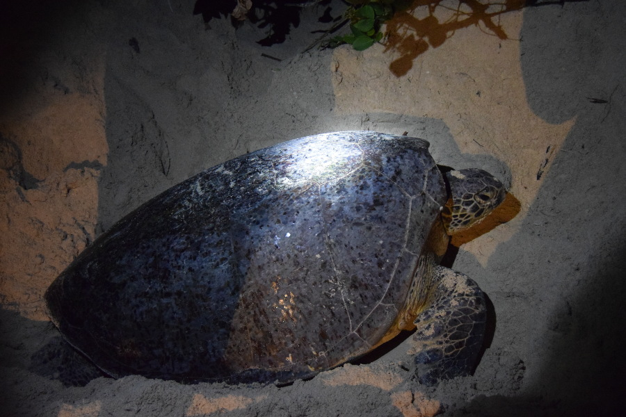

We watched the ranger bury the eggs and he explained that if the eggs are in the sun the majority of the turtles will be female but if they are in the shade, so are cooler, they will be male. We then took some of the hatched baby turtles to the beach and the ranger said we could help release them into the sea. He stood in the sea with his torch and explained they would be attracted to the light. He said if the turtles went the wrong way we could help them by turning them around. It was mayhem, but we managed to help around 4 of them turn around and go in the right direction out to the sea.

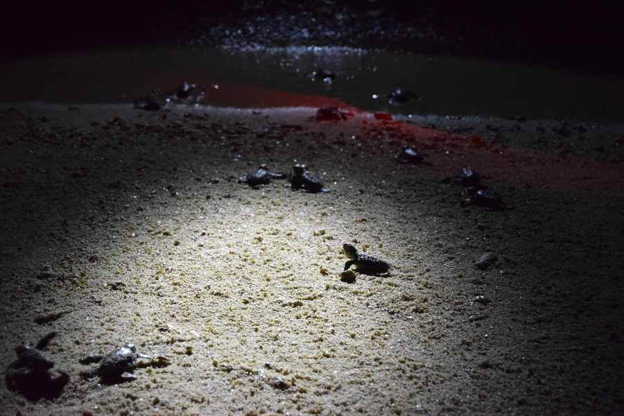

Shortly after another mother had landed and we got to see her lay her eggs. We'd read some reviews that talked about it being cruel, but the rangers were very good; shining the torch on the mother's back not on her face, being vigilant about others not having their lights on and getting people to rotate for photos. They promptly got us off the beach too so that the mother could go out to sea once she had finished.

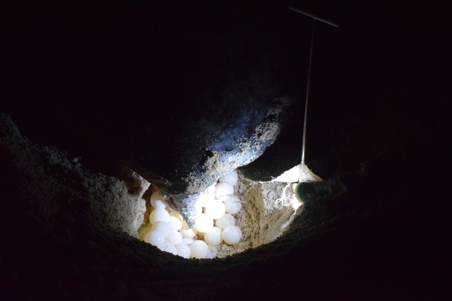

We woke up at 05:30 to get to the beach for 06:00 in the hope that one of the last turtles might still be laying her eggs. Even though we got there bang on six, it was clear that some of the tourists hadn't respected the rules and the turtles and had been on the beach well before 06:00. All the mother's had gone but some of the babies hadn't made it out to sea. We helped one of them go back in the water, he was on the beach and looked exhausted. No sooner had he gone out in the waves, he was on his side and fish were pecking at him; we don't think he made it. We helped another who swam off as fast as he could, and saw a skeleton and a couple floating in the waves, these too sadly hadn't made it!

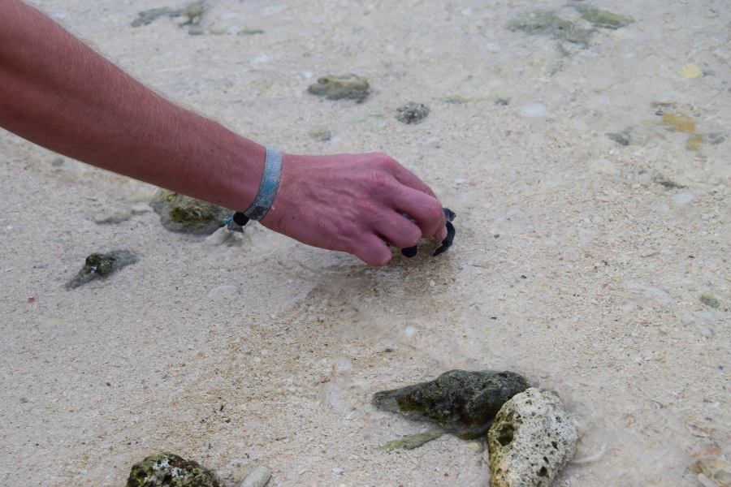

##Our verdict on Sandakan
Sandakan itself wasn't a pretty town but it made a good base for all the amazing activities around. We loved spending time in the Borneo rainforest and got so lucky to see six wild orangutans on top of seeing lots of at the Rehabilitation Centre in Sepilok. However, seeing the destruction and the amount of palm oil plantations in such a small part of the country was really sad and its no wonder so much of the wildlife is visible in such a small area. Visiting Turtle Island Park was also an incredible experience and one we'll never forget! We hope all the little guys we released make it. But again its sad to think that so many of them won't because they'll be tangled in fishing nets and will swallow plastic that ends up in the sea. After visiting Sabah, we'll definitely be making more of a concious effort to use sustainable palm oil and less plastic!
