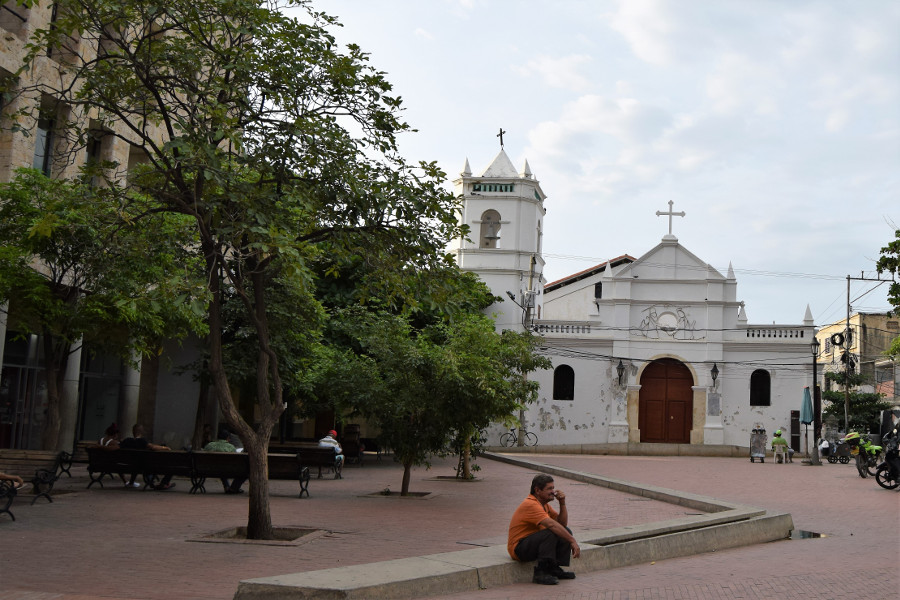
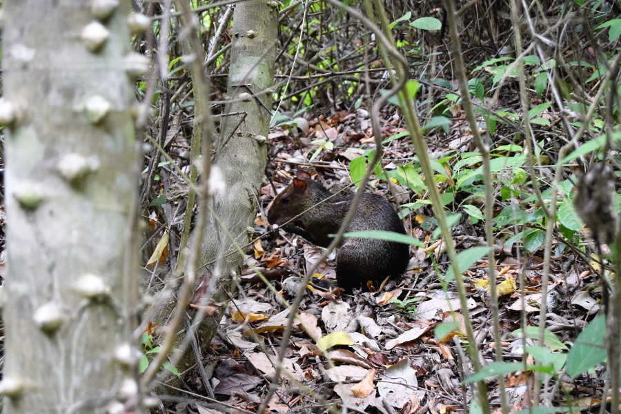
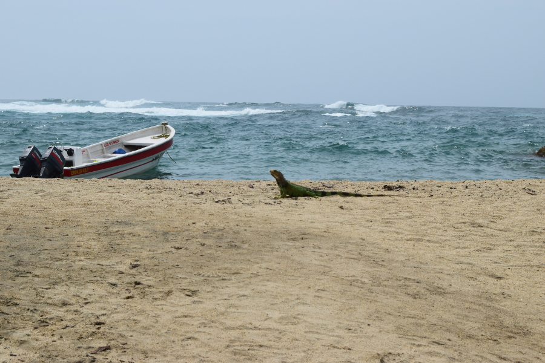
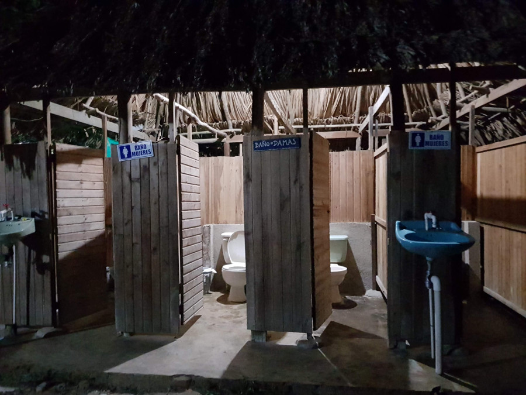
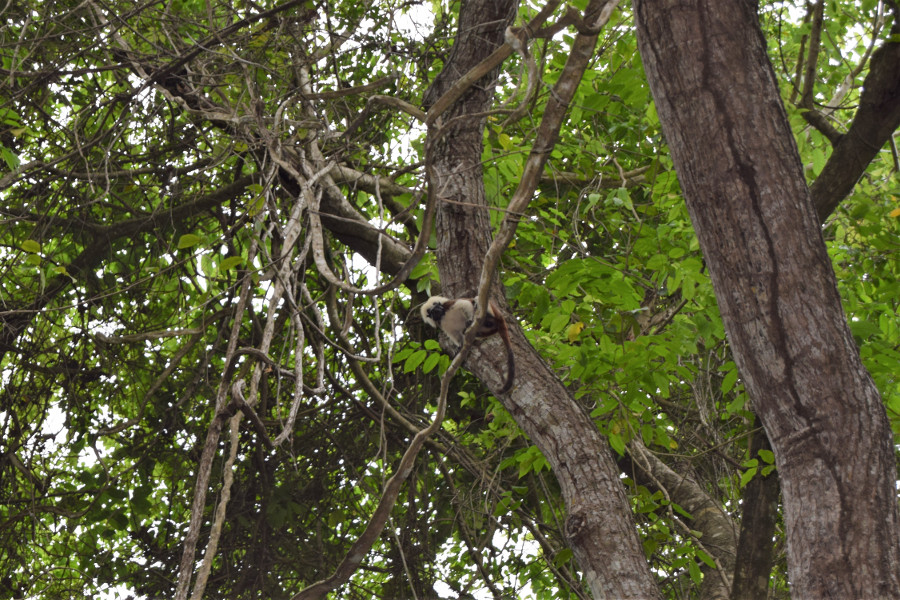
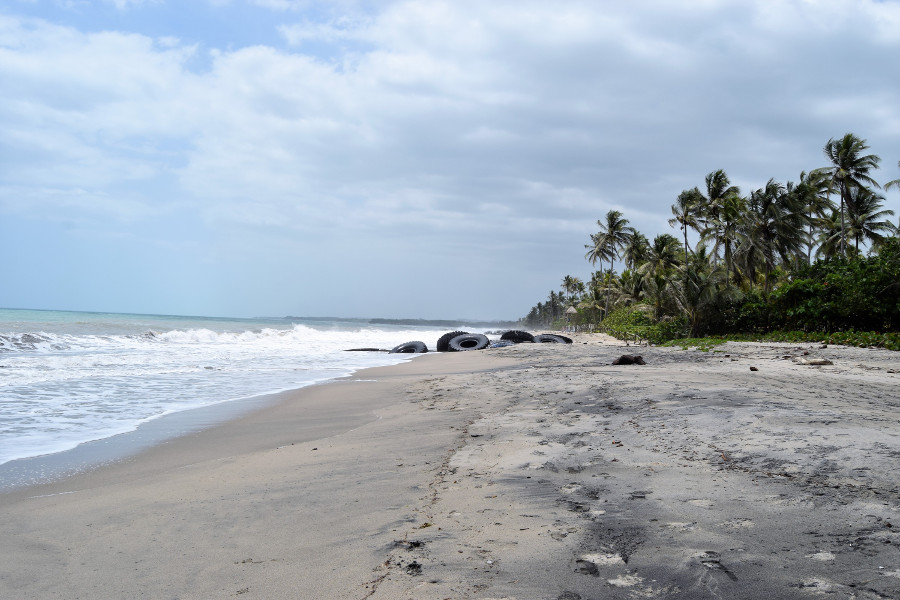

>"One's destination is never a place, but always a new way of seeing things."

Henry Miller.

##Santa Marta
After the pleasant surprise of Cartagena, Santa Marta was a bit of a let down. We were warned that many Venezuelan refugees had fled to Santa Marta and we’d been told to watch out at ATMs. Apart from a Cathedral, a library dedicated to Gabriel Garcia Marquez and a street full of bars and restaurants there was nothing else to really see in the oldest city in Colombia. It seemed that mainly Colombian tourists visited the resort of Rodereo and backpackers used Santa Marta as a hub to neighbouring attractions, luckily we didn’t hang around for long.

##Tayrona National Park
We decided to visit the [National Park](https://wikitravel.org/en/Tayrona_National_Park) for one night rather than two as accommodation options were limited. We could either camp in a boiling hot tent or sleep in a hammock where mosquitoes would have free reign, so we went with the tent. We got a bus from Santa Marta for $7000COP (£1.77) to the entrance of the park, paid the $54,000COP (£13.64) entrance fee to get in and hiked the hour and a half in the boiling heat to get to the campsite we’d picked. Within minutes we were dripping with sweat, Tayrona National Park was one of the hottest places we’d been, even more so than the Amazon rainforest.

After dropping off our bags we headed to San Juan beach. It wasn’t as big as we thought it would be but there was white sand and blue sea. As we tried to find a place under the palms in the shade we saw an iguana running across the beach and noticed a swampy lake with warnings that there are caiman living there.

We had wanted to hike to El Pueblito, an indigenous village where people from the Kogi tribe live, especially as we weren't going to do the Los City Trek. It's around a two hour hike from San Juan, but by the time we’d got there from our campsite we were wiped and decided to nap in the shade instead.

The campsite we stayed in was really basic, tents with a foam mattress, showers with a hose pipe, no WiFi and toilets with no toilet seat. We had an early night knowing the heat would wake up us the next morning. Around 5:00AM we woke up to the sound of howler monkeys in the forest nearby. After they left we managed to get another couple of hours sleep in before the sun got too hot and we had to evacuate the tents.

We’d decided to go back to the closest beach for the morning before the hike back and the sweaty bus back to Santa Marta. However, on our way we saw some cotton-top tamarin monkeys. They completely surrounded us squeaking and jumping from tree to tree. The brave ones stuck around and checking us out by peering around the tree trunks. After this we continued on what we thought was the way to the beach but we’d took a wrong turn and ended up walking an hour in the wrong direction to the exit. We stayed for breakfast and then hiked 2.5 hours back to the bus stop, absolutely drenched in sweat!

##Palomino
Palomino is only two hours from Santa Marta so we decided to spend one night in the little village in the hunt of some more beach time. When we arrived it was literally shacks and dirt roads with lots of hostels (and hippies). We spent the rest of the day by the pool with the plan of hitting the beach the next day. Palomino beach had a few bars and hotels but it went on for miles and miles and was much more secluded than we thought it would be. We had a stroll along it in the morning but it was sadly, a little disappointing. The sea was also so rough, that it wasn't possible to take a dip, so as we were melting from the heat, we headed back to the hostel to use the pool.

##The Dreamer
We booked two nights at [The Dreamer](http://www.thedreamerhostel.com/en/), a hostel just outside of town in Santa Marta, as we felt we needed some time to chill out in one place. The hostel had a pool, a restaurant, TV's with the World Cup on and we had a pool volleyball competition. One of the nights we were there we finally had a Salsa lesson; we struggled to master even the basics but luckily Dan didn’t tread on my toes!

##Our verdict on Santa Marta & Palomino
After spending some time in the beautiful city of Cartagena, Santa Marta and Palomino really didn’t compare. However, we loved Tayrona National Park and if it wasn’t for sleeping in a sweaty tent we would definitely have spent more time there!