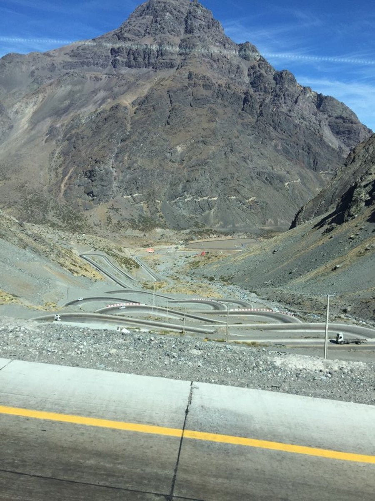
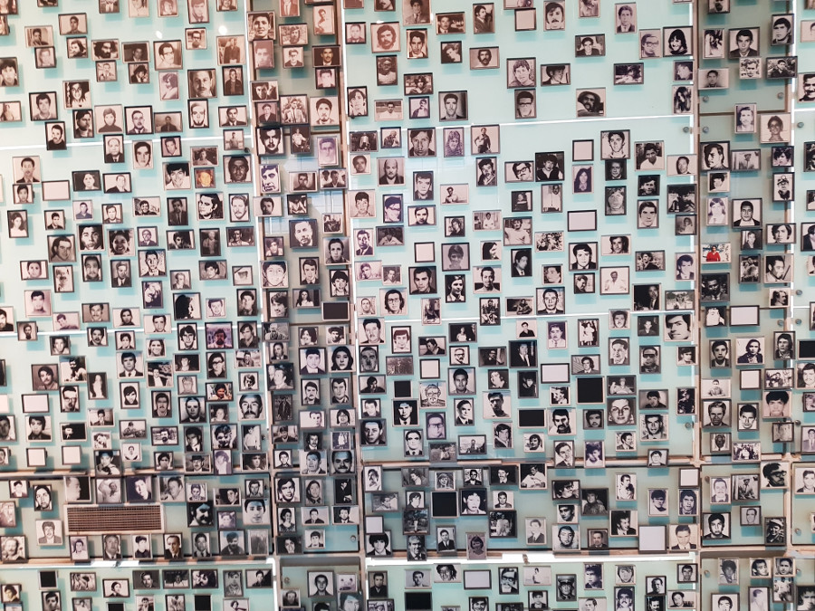
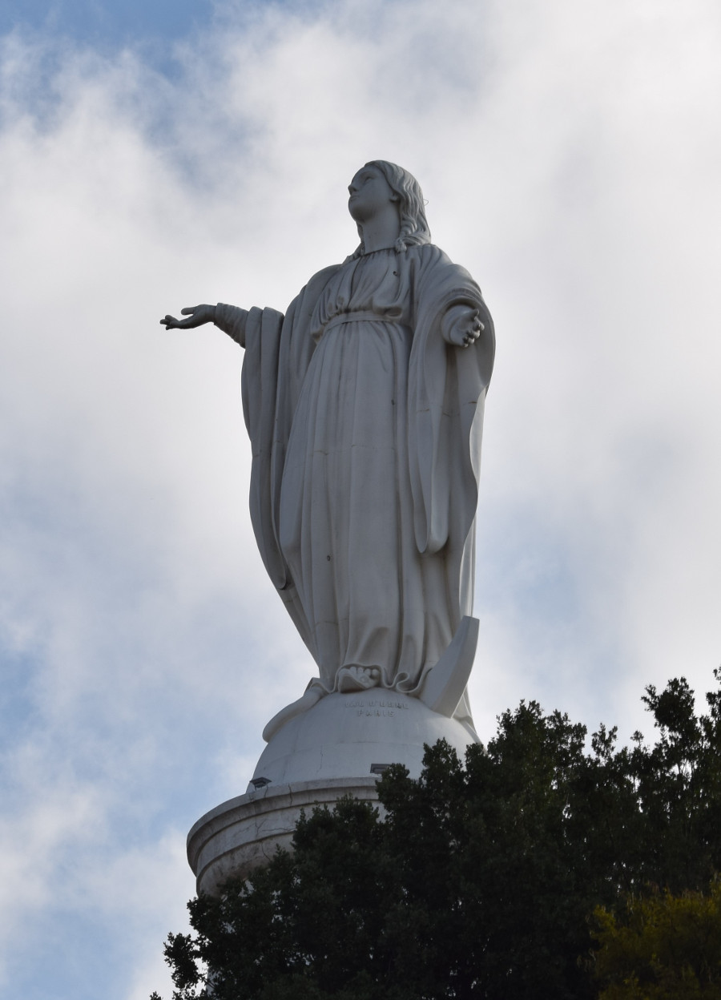
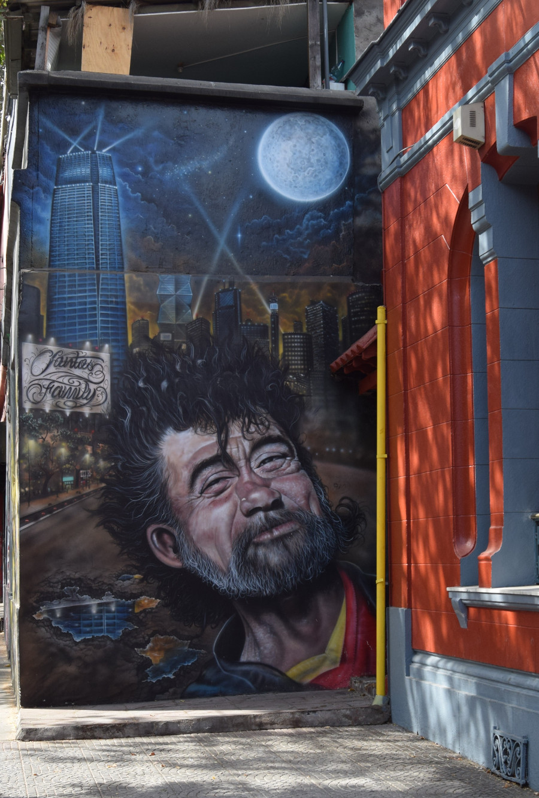
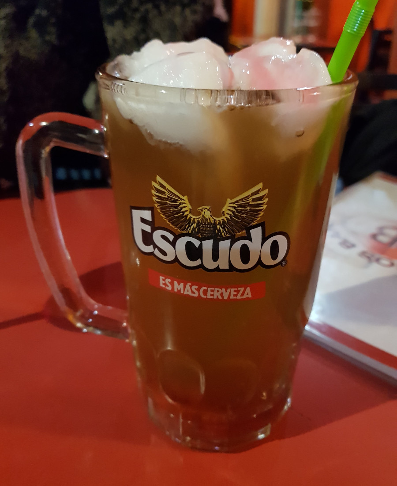
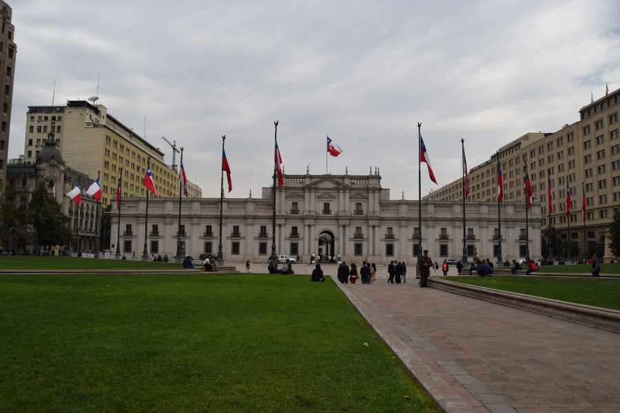
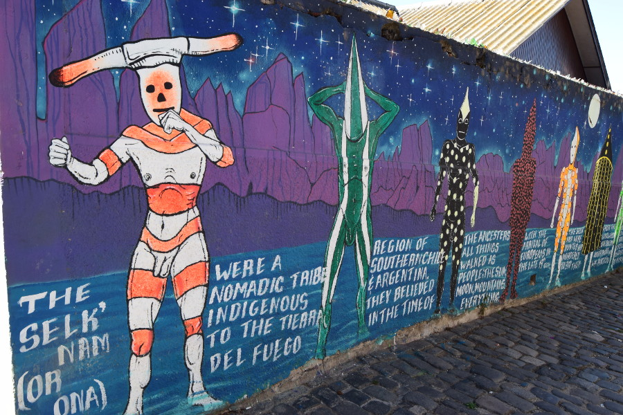

>“Laughter is the language of the soul."

Pablo Neruda.

##Bus Journey & Border Crossing
The drive from Mendoza to Santiago was the most picturesque journey we'd had so far, with stunning views of the Andes as we passed over and between the mountains. As were on the upper level of the bus we became quite nervous at the sheer drop as the bus snaked along the trails down the mountains.

When we arrived at the border crossing, we were puzzled to see a Chile flag as all other bus journeys we had taken, stopped at the border control of the country we were leaving to stamp our passports first. In Brazil, we had overheard some people saying that they had huge fines when trying to re-enter countries that they had left without getting a stamp. When we told the bus driver he shrugged it off and said we didn't need a stamp and when we queried it with an older Brazilian man, he told us that Argentina doesn't care! If we ever come back to Argentina, hopefully they won't care then either.

##Arrival
Having thrown on our big and small backpacks once we arrived in Santiago, looking like turtles, we navigated ourselves onto a main road. We were immediately met with the hustle and bustle of the busy streets as vendors shouted desperately trying to get anyone to buy their fake nike trainers or dog coats.

After squeezing onto the metro, around 45 minutes later we arrived at the stop closest to the hostel. Due to the hustle and bustle earlier, we were relieved to walk through a peaceful and clean suburbian area and arrive at our hostel, Parron de Colores, just off a street called Coventry.

##Earthquake
The morning following our arrival, Sophie was woken by the room shaking and clattering of the windows. She in turn woke me up; apparently there was an earthquake. We later found out that it had a magnitude of 6.6 and its epicentre was in a nearby city. Our walking tour guide told us that anything above a 7 occuring within Santiago would have the capability to cause damage, so we were glad it wasn't any closer. All it really did was open the window a little.

##Museum of Memory and Human Rights
The guide from the walking tour recommended the [Museum of Memory and Human Rights](https://www.atlasobscura.com/places/museum-of-memory-and-human-rights) to learn more about the genocide from the military dictatorship of Augusto Pinochet in Chile from 1973 to 1990. Although the museum was free, we were told at the entrance that it was all in Spanish but we could pay for an English audio guide, which we opted against. Fortunately, we found that the numerous videos were subtitled in English and there were some translated displays dotted around so we were able to get a good understanding of each area.

The military dictatorship in Chile was something we both knew very little about and we were glad we took some time to learn about this period in recent history. The museum was informative, moving and shocking across the diplays. There was a particular section that still haunts us, which was about the ways in which the soldiers tortured and interrogated the accused political prisoners. There was even a 'how to' guide with diagrams showing how to perform various different torture methods which would have been distributed to the soldiers.

I'd recommend anybody to research about this period of history, [wikipedia](https://en.wikipedia.org/wiki/Military_dictatorship_of_Chile_(1973%E2%80%9390)) has a good overview of the events that occurred. When we learned about the involvement and support provided to the military from other countries, such as the USA and the UK, it certainly made us wonder about history repeating itself today.

##Cerro San Cristobal
One morning we ventured up Cerro San Cristobal via the funicular for views of Santiago in front of the Andes. We climbed up some steps to find a statue of the Virgin Mary which overlooked the city. It wasn't quite on the same level as Christ the Redeemer, but impressive nonetheless.

We were lucky as the pollution above the city wasn't too bad so we got to see impressive views at the top and on the teleferico (cable car).

##Bellavista
Bellavista was definitely our favourite area of Santiago. There was loads of street art, hipster bars and restaurants where we spent an afternoon wandering and came back on an evening for food and drinks.

The walking tour guide explained that, as Santiago was growing, the rich aristocrats who had lived on the other side of the river pushed all of the risque places they didn't want to taint their reputation over to Bellavista. That wasn't to say that they didn't visit! Pablo Neruda who was a famous Chilean poet and politician bought his mistress a house in Bellavista so that he could sneak off and meet her.

##Drink
Following the walking tour guide's recommendation we tried a few drinks down student street, including Piscola (pisco and Coca-Cola) and Terramoto. Terramoto is translated to mean earthquake because it's said that if you have a few of them, afterwards when you stand up you feel as though the ground is shaking. I only had one so I wasn't about to experience our second earthquake in Santiago. There are a few variations of Terramoto, but the one I had was made up of a fortified white wine (like Country Manor), pineapple ice cream and a bitter spirit called fernet. Not the best sounding combination but if you're a student, it's strong, cheap and a good way to get drunk.

The tour guide explained that because the coffee was so awful in Chile, noone really drank it until a visionary entrepreneur set up a coffee shop, nicknamed coffee with legs. Customers would go for a really bad coffee served by strippers essentially! The majority of the coffee shops had blacked out windows but the tour guide showed us one that you could peep inside, which we did and it was a very bizarre scene. Young women stood on podeums with short red dresses on talking to and kissing the customers on the cheek goodbye. I starred it on Google Maps but we never went back. The guide told us that that his girlfriend once dragged him to 'coffee with three legs' which I don't think needs any further explanation.

##Free Walking Tour
As you can probably tell with all the mentions of the walking tour at [Free Tour Santiago](https://freetoursantiago.cl/portada.html), we thought that the guide Franco was fantastic. Even though the tour lasted 4 hours, it really didn't feel like that and we were disappointed that it had to end. We even bumped into the "Mayor" of Santiago as we passed his offices who welcomed us to the city. Although later googling showed the mayor to be a woman so maybe we misheard!

The guide also told us about the Mapuche people in Chile, that they are indiginous people to Chile and there are violent conflicts today going on about their rights. He also told us about Chilean Independence day; that it is the only day where people fight in the street and things can turn violent due to the political differences in the country.

We also finally found out what the figures were in Puerto Natales,the naked men that were patterned wearing a mask. The guide told us these are from the Selk'nam people who lived in Patagonia. One of their traditions was that when a boy became a man, the males in the family would paint themselves like this and then try to scare the boy, if he wasn't frightened then he was a man. The guide recommended going to the Museo Chileno de Arte Precolombino to learn more about this, but we ran out of time!

##Our Verdict on Santiago
We both absolutely loved Santiago from the suburban regions, to the hustle and bustle of the city to the hipster, student neighbourhood. So much so, that it was the first place we visited where we could easily see ourselves living. Everyone we spoke to was warm and friendly which was a refreshing change to some of the Argentinean's we encountered.