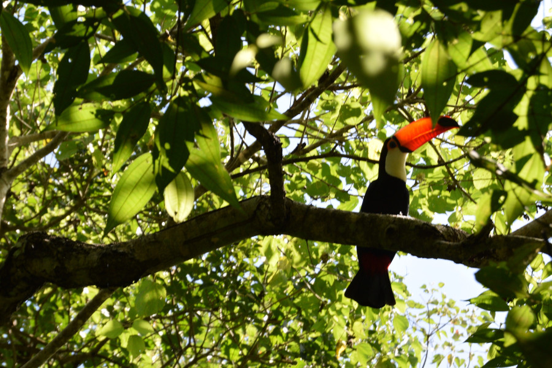

>“There is a hidden message in every waterfall. It says, if you are flexible, falling will not hurt you!"

Mehmet Murat Ildan.

##One night in São Paulo

We used São Paulo to break up our journey as we made our way to Foz do Iguaçu from Paraty. We spent less than 24 hours there and ended up eating our dinner in a shopping mall. As soon as we stepped out of the Metro station and onto the huge boulevard, it became evident as to why São Paulo is known as the 'financial capital' of Brazil. There were huge glass skyscrapers on each side of the road, uniquely shaped buildings and three lanes of traffic on each side of the boulevards. However, there was still a sense of underlying poverty in the city. On our walk back from the mall we saw two young boys hitting an empty glass bottle of vodka against the curb until it smashed. They cheered and then jumped onto the doorway of a bus as it was driving off, until the driver opened the door and it shoved them off. They were wearing scruffy clothes and one of them couldn't have been older than seven.

We also had an interesting encounter on the Metro when we arrived, as three young men approached us and asked if we liked Tango. They proceeded to play Tango music right in front of us on their guitars and bandoneón for a couple of stops. What surprised us was that most people on the carriage applauded when they had finished and tipped them. If we had been in England, most people would have looked at their phones and pretended they hadn't heard anything. We did as the locals did and gave them some of our Brazilian real.

Sadly, [Hostel Paulista] (http://www.thehostelpaulista.com.br/pt-br) goes on our list of one of the grimmest places we've stayed. The mattresses were covered in blue plastic, the pillows in a plastic bag and Alz wasn't provided with a blanket. The bathrooms were another matter altogether, the door had come off the women's toilet, there were no locks on the showers and there was no toilet paper anywhere in sight after around 10PM. Safe to say after one night, we were glad to leave and carry on with our journey to Foz do Iguaçu.

##Foz do Iguaçu

As we got off the plane in Foz do Iguaçu, the warm air hit us as we were back in temperatures of around 34C, even the breeze was warm. We opted for a local bus to get us to the hostel as the town seemed small. Getting on the bus with two backpack's on, one on our back and the other on our front was a nightmare, as the bus had a pointless turnstile in the middle of it, which we had to go through once we'd paid. The woman accepting money for tickets got so annoyed with me trying to get through, she took my backpack from me and threw it over the turnstiles.

We had booked to stay at [Tetris Hostel] (http://tetrishostel.com.br/), made of shipping containers stacked on top of each other. We were shown to our 12 bed dormitory which was sweltering hot. We immediately thought that staying in a metal containers in such high temperatures was a mistake. However, the hostel offered free Caipriniha's from 8:00-8:30PM which made it much more bareable!

##Iguazu Falls

Being on our bucket list and one of the seven natural wonders of the world, we had always expected [Iguazu Falls] (https://iguazufalls.com/national-park/) to be spectacular. What we didn't expect was how long the waterfalls went on for and how big the National Park was, particularly on the Argentinian side. It was so huge we had to ride trains to get around. There are between 150-300 waterfalls in the park depending on the season, leading up to the big one Garganta del Diablo or 'Devils Throat'.

On the Brazilian side, the platform out to Garganta del Diablo allowed us to walk to the middle of the river and look through either side of the falls. It was really loud and so powerful, that even from such a distance we were sprayed with the mist caused by the force of the water as hit the rocks. On the Argentinian side, we walked a platform across the top and watched the water as it pummelled down the rocks. The mist was so thick you couldn't see the rest of the falls or the platform out on the Brazilian side. However, because of the sunshine and the mist, there were some vibrant rainbows that helped to make the perfect photo.

We also walked the upper and lower trails on the Argentinian side of the falls, which other than seeing the top of Garganta del Diablo, was probably our favourite part of the park because of all of the wildlife we saw. The lower trail also took us very close to a waterfall which was so violent it soaked us with it's spray and mist, and the water was so loud we had to shout at one another to be heard.

##Wildlife

There were butterflies everywhere in the park, landing on our arms, bags and on people's heads. Some people held out bits of fruit to attract them and the butterflies would sit on their hands for ages enjoying the sweet fruits. There were also Coati, racoon-like scavengers and there were warnings everywhere about them attacking people for food and that they may have rabies. We saw one woman stupidly sat on a bench eating some biscuits and when a Coati tried to jump up her, she kicked it away. They were however, deceivingly cute.

As there were more walks through the park on the Argentinian side, we saw a lot more wildlife there. There were lots and lots of spiders, some which had made their webs over our heads on the trails, we quickly ran under those. We also spotted a really colourful Toucan up in the tree's; I managed to snap a photograph before it was scared off by guided tour.

Unexpectedly we also saw a whole family of Capuchin Monkeys; we saw a mother with her baby, two fighting and one chilling on a branch in the tree.

One even came into the crowd of people on it's two legs, and because everyone was so busy taking pictures of the monkey's in the trees, no one even noticed. Dan got a pretty good photo of it waving to everyone looking very cheeky.

As if the day hadn't been exciting enough, on one of our train journeys a jeep went past and in the front was a short haired blonde woman, looking very cool eating her ice cream - she looked remarkably like Katy Perry. As it turned out, she was Katy Perry. We heard one of the staff members later telling people she had come today and her presence at Iguazu Falls had even made the local news.

##Crossing the Border

We'd heard some horror stories about our intial plan of local transport to cross the border, where buses hadn't stopped for people to be stamped out of Brazil leading to hefty fines. We got chatting to a Canadian girl in the hostel and she easily convinced us to share a taxi with her and a couple from England to cross the border to the Argentinian side of the falls, which was hassle free and cheaper than the hostel's day trip to the Argentinian side. The hostel arranged this for us, however when the taxi came, the driver refused to take us as 4 of us had luggage. As it was nonsensical to pay double for two taxi's on our budgets we went our separate ways and headed for the local bus stop. In actual fact it was pretty straight forward crossing the border from Brazil to Argentina; one bus to the Brazilian border, one bus to the Argentinian border and then another to the bus terminal in Puerto Iguazú. After an hour and a half, we were finally in Argentina and had to rembember to switch from obrigada to gracias. De nada.

##First thoughts on Argentina

We dumped our bags at [Poramba Hostel] (http://www.porambahostel.com/) and headed into town to get some cash out of the ATM so we could head to the falls. The ATM charged us $240ARS (£8.54) to withdraw cash which was a bit of a shock. Apparently standard in the whole of Argentina! The bus was also £5.35 to the falls instead of the 80p it had been the Brazilian side; it became evident very quickly that it would be harder to stick to our budget in Argentina! It had been so much easier in Brazil.

##Our Verdict Iguazu Falls

When we'd initially done our research, people had recommended to visit both sides of the falls and we would totally agree with this. The Brazilian side gives great views from the bottom, but the Argentinian side is huge with unexpected surprises such as Toucan's, monkeys and if your lucky even a celebrity.