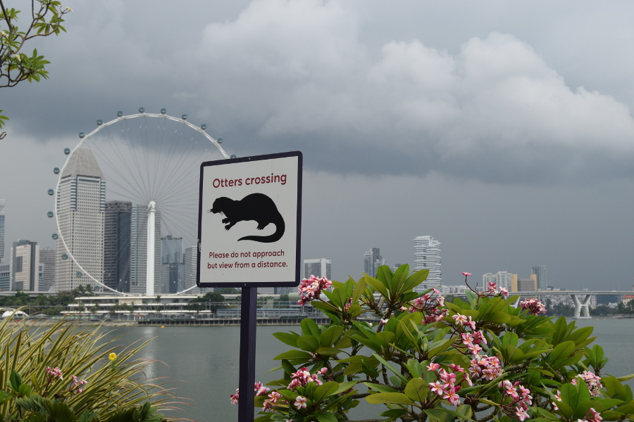
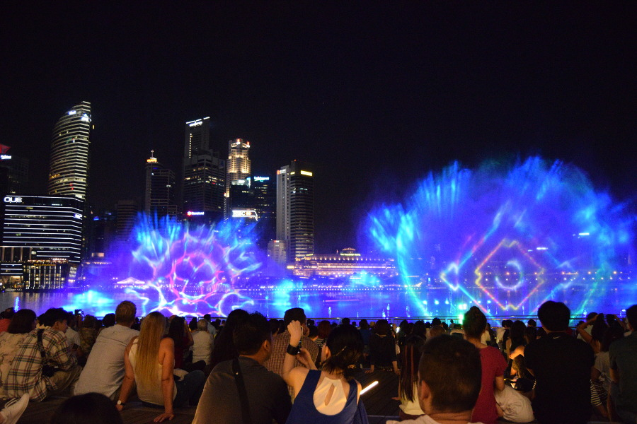
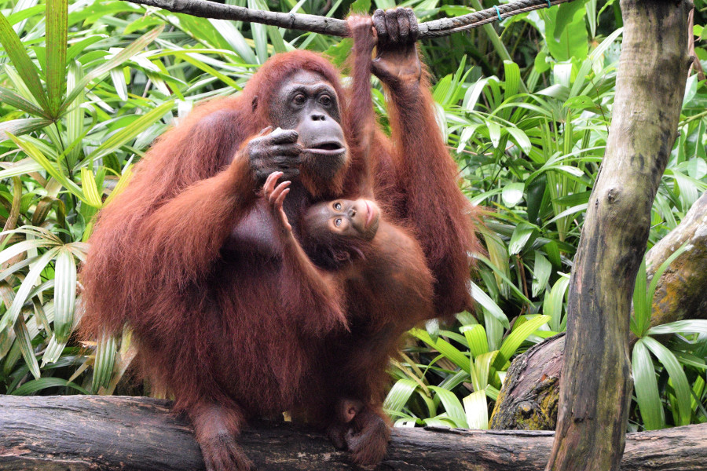
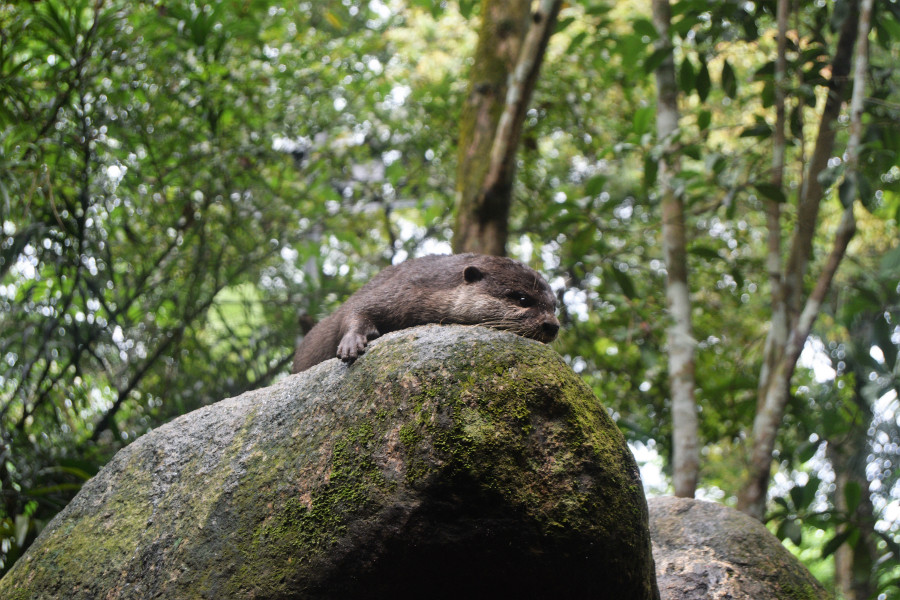
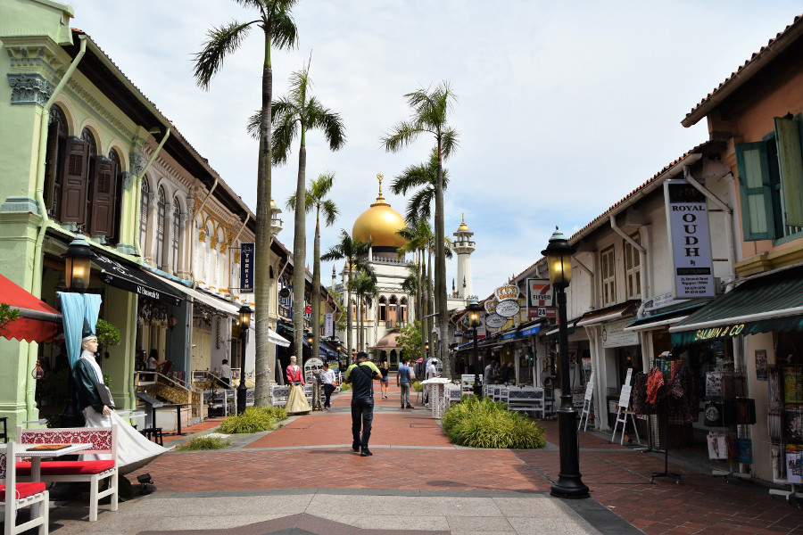
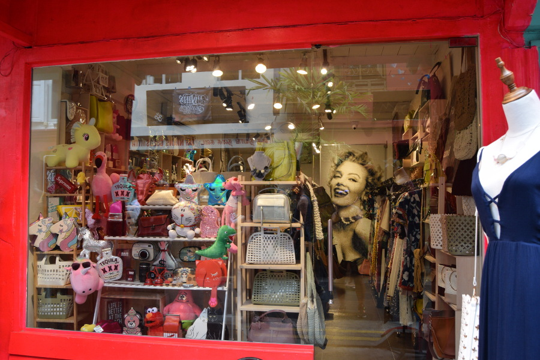
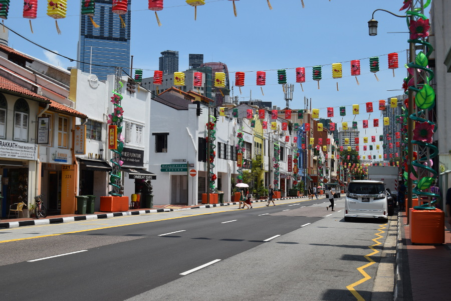
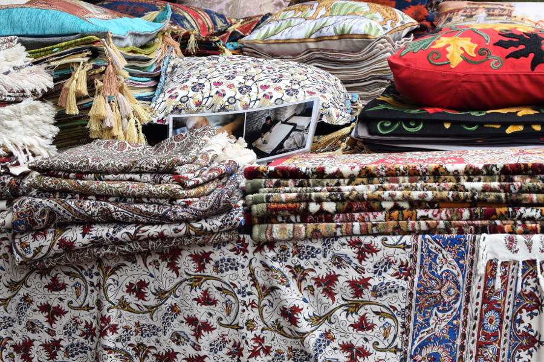

##Marina Bay
After a short, cheap flight (£7 for our seat and £9 for our luggage) we arrived in Singapore and headed straight for Marina Bay, as there are a family of otters who live there. We walked around the water enjoying the view of the thundering skyline, but sadly the otters were no where to be found. At one point Dan thought he had seen one but it turned out to be a monitor water lizard; the massive and scary looking cousin of the komodo dragon. We saw quite a few of them along the waters edge in Singapore. There were also some people flying kites on top of the marina as this is the windiest point in the city. We walked along Helix Bridge, which is similar in style to Millennium bridge in London and we took plenty of photo's of the ArtScience Museum, which is shaped like a flower.

##Promenade
One evening we headed to the promenade. There's a huge shopping mall nearby with designer stores like Gucci and Christian Louboutin and Louis Vuitton even had a shop on its own island. Inside the mall, Vegas style, you can ride on an old Chinese boat, a little like a gondola. At night, we'd heard there was a free water show called [Spectra](https://www.marinabaysands.com/entertainment/spectra.html), it was absolutely pac ked and it felt like we were at Disneyland. A film was projected onto the water of birds and kaleidoscope patterns whilst music played and it was really picturesque against the backdrop of the skyline.

##Gardens by the Bay
We came here twice as the gardens were a great place to get away and relax in a really busy city. We didn't pay the ridiculous fees to go into the cloud forest or walk the bridge by the lit up trees but enjoyed all the free bits the gardens had to offer. We had a look around a temporary lantern garden, a cacti garden and went to the 'Silver Garden' to see the tree's lit up at night. Our favourite part of the gardens was Satay by the Bay, a hawker centre selling street food. Still a little more costly than neighbouring Malaysia but more affordable for us than restuarants. We tried a mixture of different satay and they were all the best we'd ever tasted!

##Singapore Zoo
We decided to spend a day at [Singapore Zoo](https://www.wrs.com.sg/en/singapore-zoo.html) as it claims to be one of the best in the world. We got tickets for $28 (£15) and we were able to get there and back on the MRT and bus using our three day tourist passes. These had cost $20 (£10) for unlimited travel on public tranpsort. We didn't realise until we got there but there are four different parks in Singapore Zoo; the zoo itself, a river cruise, night safari and a bird park. We ended up spending almost six hours at just the zoo. Some parts were really amazing, the monkey's had great enclosures, there was even a part where they could just roam around. The orangutans had a freewalk treetop enclosure for the mother's and their babies. At first we thought this was great as they seemed to be able to wander really far around the park, they had lots of ropes and platforms to swing on to. We watched them for ages and even caught them coming down for feeding time, where we were able to sit near them and get a photo. However, the more we watched we realised that they couldn't get down of their own will at all. There were electric wires on the tree's preventing them from climbing down to the ground.

The African section of the zoo we felt was really poor. The animals had tiny enclosures and the big cats in particular were pacing around, the zebras had a tiny patch of grass and the penguin enclosure was filthy. It seemed that the animals native to Asia got the best treatment at the zoo.

Along with the orangutans we spent a long time watching the otters. Two were exceptionally playful, fighting over a stick and then just generally fighting. One of them had an arm missing and was hesistant to get into the water. There were not only two seperate otter enclosures, but there were also a couple of otters in the section with the orangutans, we watched them steal some of the orangutans food and run off with it after feeding time.

##Kampung Glam
We found a company called [Monster Day Tours](https://www.monsterdaytours.com/) who did six different walking tours in Singapore. These were all on different days and from past experience we'd found that different walking tours in the same city ended up being quite similar and repetitive. We picked the Kampung Glam tour as it was on during the day we had free. Kampung Glam is the Malay part of the city. Yap, our guide, showed us the residential part of the area. He explained that 80% of the housing in Singapore is public housing which people buy from the government and that the cheapest housing in Singapore is on the outskirts of the city, costing just £30 per month spread over 35 years for a three bedroom flat. However, residents are not able to buy unless they are married so it is not unusal for people to live with their parents until they are 35 years old!

We visited the area with the traditional shophouses and the [Sultan Mosque](http://www.visitsingapore.com/en_my/see-do-singapore/culture-heritage/places-of-worship/sultan-mosque/) and we were able to have a look inside. I'd told Dan to dress appropriately as we'd probably end up going into a religious building but he'd decided to wear shorts and a Tiger vest, so on entry he was given a skirt to wear. Even though I had my shoulders and knee's covered, I still had skin on show and therefore had to wear a full on robe which dragged about a foot on the floor. Inside the mosque was really ornate and Yap explained that the part under the dome was made by glass bottles donated by the poorer community when the mosque was built.

##Bugis
After Kampung Glam we headed into Bugis. We visited a hotel rooftop for views over Singapore and saw a triangular building which gave an optical illusion of being flat. Then we hit the 'hipster' area of the city, a few streets of shophouses with vintage stores, bars and restuarants. We came back here one evening to have a cocktail which ended up costing $17 (£9) each. Singapore was a really expensive city!

We also visted a mall in Bugis and headed to a street food market to eat, which was actually in our budget range. I had a marshmellow crepe, which was basically a giant fortune cookie. There was a massive food court inside the mall too where we managed to eat for under $10 (£5).

##Chinatown
We had a wander around Chinatown but found the area to be very touristy. There were lots of bars, a street called 'food street' and lots of market stalls selling souvenirs. There were some relgious buildings in the area, including a Hindu temple, Sri Mariamman and a Buddhist temple, Buddha Tooth Relic Temple and Museum.

##Little India
Singapore was so diverse that we ould walk from one area to the next and feel like we were in a different country. Yap told us that in Singapore people's religion cannot be defied by their race, he explained that due to different people marrying, there were Chinese Muslims and Hindhu's and vice versa.

Little India was full of gold and fabric shops. We visited another mosque which was painted yellow and green on the outside. Initially we were just having a peak at the architecture but three different men invited us to come in and have a look, so we felt obliged to do so.

##Hostel
We stayed in an area called Lavender, not too far from Bugis and Kampung Glam. Yap explained it was called Lavender ironically as the area used to be where human waste (night soil) was collected for manure for agriculture.[The Hive Hostel](http://the-hive-singapore-hostel.bestsingaporehotels.net/en/) was sadly one of the worst places we'd stayed on our travels. The dorm and futuristic space pods were okay but the bathrooms left a lot to be desired. There were also lots of older residents there who would walk around the social area in their towels and just generally made us feel really uncomfortable. However, being in Singapore, it was all we could afford on our budget!

##Our Verdict on Singapore
We packed a lot into the few days we had in Singapore, but we enjoyed our time here and we wished we had stayed longer. We proved that Singapore can be done on a budget if you are willing to stay in a pod and eat at the food markets, but if we ever visit in the future it'll be with a little more cash to splash out!
