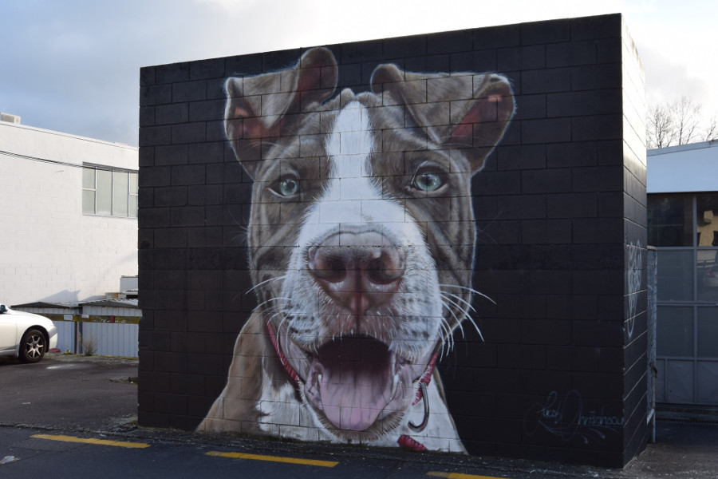
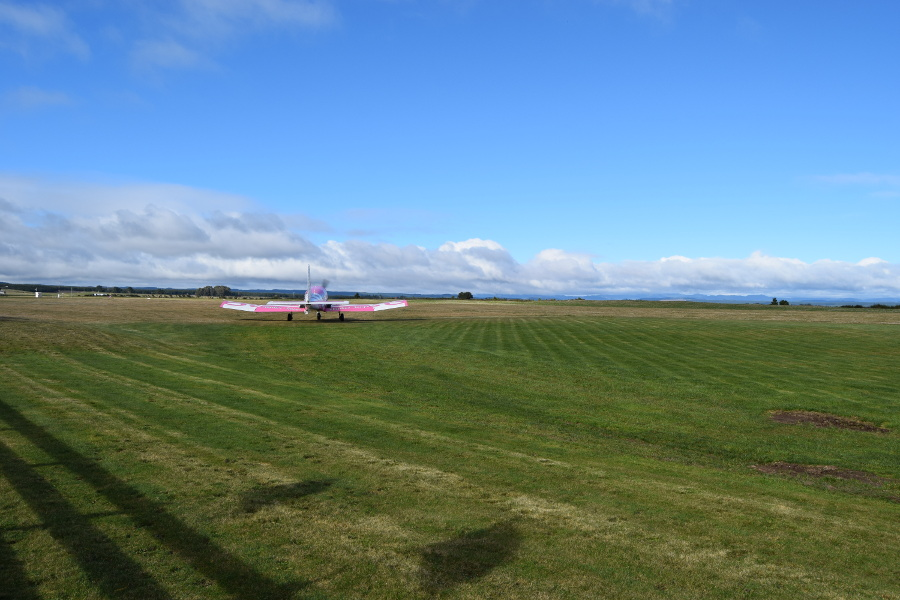
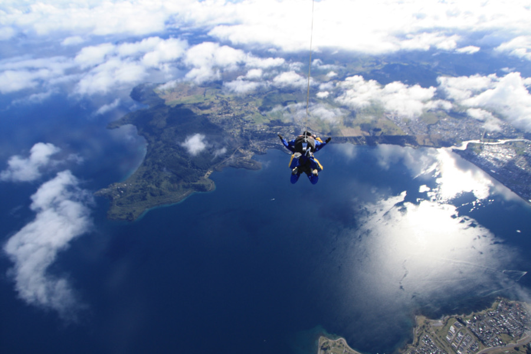
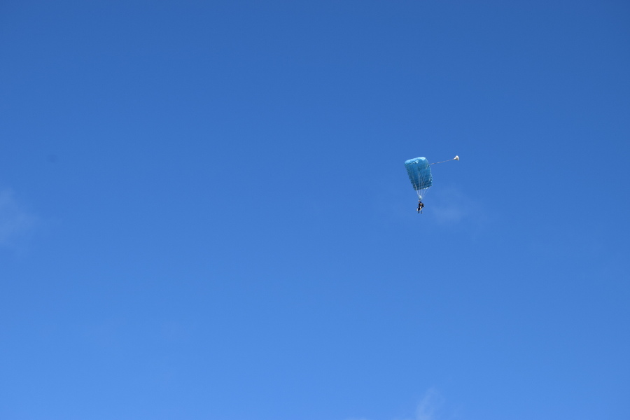
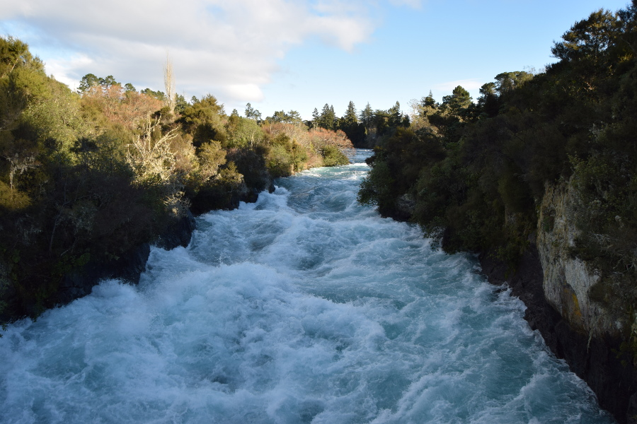
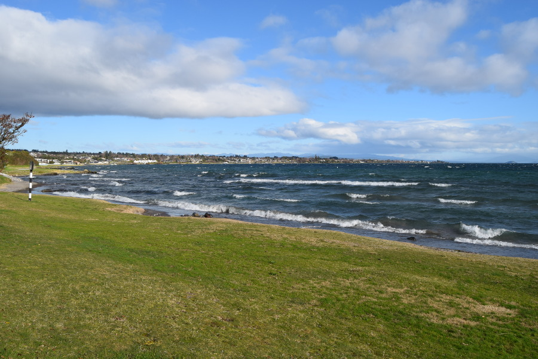

>"Those who don't jump will never fly."

Leena Ahmad Almashat.

##Taupo
The journey from Rotorua to Taupo was a quick one, but made longer by a 25 minute stop just outside the city, at a petrol station. We were starting to remember what the benefits of driving in New Zealand would have been very quickly. Although a city, Taupo was more the size of a bigger town in the UK. We stayed at [Rainbow Lodge](http://www.rainbowlodge.co.nz/) and we were lucky enough to get a dormitory to ourselves, one of the perks of travelling in New Zealand winter. The owner was lovely, from Glasgow but he had lived in New Zealand for the last 16 years. He had a dog called Jess who was really affectionate and pinned down your arm with her paws to make sure you kept stroking her and couldn't get away.

We had a wander around the city on our last afternoon in Taupo and found lots of street art in the back allies which had been produced as part of a [Graffiato](https://www.google.co.nz/search?q=graffiti+taupo&oq=graffiti+taupo&aqs=chrome..69i57j69i60l3j69i59l2.2590j0j4&sourceid=chrome&ie=UTF-8). The graffiti looked new and there was barely any tagging around the city. We also went out for a meal in Taupo, as we had mainly cooked due to the well equipped kitchens and western supermarkets. We went to a curry place called [Malabar](https://malabartaupo.com/) and it was the most similar to the ones we have at home.

##Skydive
Skydiving has been on my bucketlist since I learned what it was and as we were heading to the adrenaline capital of the world, it made sense to do a skydive in New Zealand. Dan point blank refused to even entertain the idea. I booked with [Skydive Taupo](www.skydivetaupo.co.nz/) as it was one of the cheaper places to do it and a friend had used the same company. I tried not to work myself up before, as I knew that the skydive could be cancelled due to bad weather.

However, when the day came, it was partially cloudy and the limo came to pick us up on time. There were six women in total jumping the morning I did it and Dan stayed on the ground to watch. The staff took us through a safety video, made us sign to say if we die or injure ourselves it's not their fault and then showed us the difference between the photo packages. I went with 15,000ft freefall, which meant that another person would jump with us and take pictures. In total it cost $529 (£278).

I met my instructor Damo M, got suited and harnessed up before heading out to the plane. We had to sit on a bench virtually on top of one another and we were facing the back of the plane. It took around 15 minutes to reach 15000ft and at 8000ft we had to wear oxygen masks for safety reasons. As we were going up we got great views of parts of Tongariro National Park and I was able to see Mount Ruapehu poking through the clouds from the sky. Damo strapped us together and it wasn't long before the first two people dropped out of the plane and it was my turn.

Damo shuffled us along the bench and I sat with my legs dangling out of the plane for a few seconds. As I had to put my head back on the instructors shoulder, I couldn't look down so after giving Sam the cameraman a nervous/terrified smile, Damo let go and we started falling out of the sky. As we tumbled down I had the lurching feeling in my stomach until we stopped tumbling and fell on our front. Then it just felt like we were floating, although we were actually falling at 125mph! What they didn't warn us about was how cold it was, my face went numb immediately and I couldn't catch my breath.

We freefalled for around 60 seconds and Sam took loads of photos. Considering how fast we were falling, it felt more like floating and it didn't feel like we were pummelling to the ground. At 5000ft Damo opened the parachute and it was a slower descent to the ground. He let me help him to steer us to the ground and as there was no wind we landed pretty fast.

It was all over so quickly! The views had been incredible over the lake but my brain had been so busy processing what had just happened, I didn't feel I had time to enjoy it. Skydiving was an absolute adrenaline buzz and I wouldn't hesitate to do it again.

##Tongariro Crossing
We'd booked this well in advance with [Adrift](https://www.adriftnz.co.nz/) and we were really looking forward to an 8 hour hike through the National Park to see where Peter Jackson filmed Mordor in Lord of the Rings up close. As it was winter we had to have a guide and we'd have to use crampons and an ice axe, so we knew it would be a hike that would challenge us a little more than others we had done. However, due to the bad weather it was cancelled, there were high winds, -11C temperatures and snow storms. Adrift gave us a refund and a very good reason to return to New Zealand in the future!

##Huka Falls & the Great Taupo Lake
As the Tongariro Crossing was cancelled we did a couple of free walks in the local area. We walked to Huka Falls and back which took around 2.5 hours. Huka Falls is a powerful waterfall and the water there was really blue.

The other was the walk on the Great Lake Walkway, we headed towards Five Mile Bay but got to around three before we headed back as the weather was turning. The side of the lake had some grey sandy beaches and some hot pools of scalding water in them. There were lots of individual looking houses overlooking the lake and plenty of parks and patches of grass for walking dogs and having BBQ's in the summer. The lake itself was massive and we hardly walked around any of it in 4 hours.

##Our verdict on Taupo
We liked Taupo as a city and I absolutely loved doing a skydive. We were both pretty disappointed about the Tongariro Crossing but it has given us a reason to return to New Zealand in the future, maybe in the summer months when the weather is more reliable!