>“It seems to me that the natural world is the greatest source of excitement the greatest source of visual beauty the greatest source of intellectual interest. It is the greatest source of so much in life that makes life worth living.”

David Attenborough.

##Iquitos
Landing in Iquitos was a bit of a shock to the system, as soon as we walked outside we were swarmed by local taxi and motortaxi drivers offering to take us into Iquitos for various amounts of money. It was the most we had been harassed since arriving in South America, including on Copcabana Beach! We managed to find an offical taxi driver who weaved in and out of the traffic to [Hostel Neydita](http://www.hospedajeneydita.com/) where we were staying. The traffic was crazy; there were families of four balanced on one motorcycle, women breastfeeding their children on motorcycles and people sat in plastic chairs in the trailers attached to the motorcycles. We later learned that as Iquitos is only accessible by air or by a very long boat journey, there is a Honda motorcycle factory in the city where people can buy one for less than S./3000 (£672).

##Belen Market
We were picked up in the morning by our guide, Osmar from [Libertad Lodge](http://www.iquitos-tour.com/en/jungle-tours-Libertad) where we would be staying in the Amazon for four days. We picked the lodge as it seemed to be good value for money; we could make our own itinerary, the money went towards helping the local community and there wasn't a single bad review on Tripadvisor out of hundreds. It cost us $350 each (around £280) for three nights and four days all inclusive. We broke up the three hour journey there by firstly visiting [Belen Market](https://www.lonelyplanet.com/peru/iquitos/attractions/belen/a/poi-sig/1277432/363385). We had read that it was one of South America's most bizarre markets, with all sorts of strange things for sale in 'Shaman's Alley', such as monkeys hands, bird beaks, snake skins and ayahuasca by the bottle. Ayahuasca is a plant that has hallucagenic properties said to heal all sorts of problems when used by a Shaman; lots of tourists come to Peru to experience ayahuasca ceremonies.

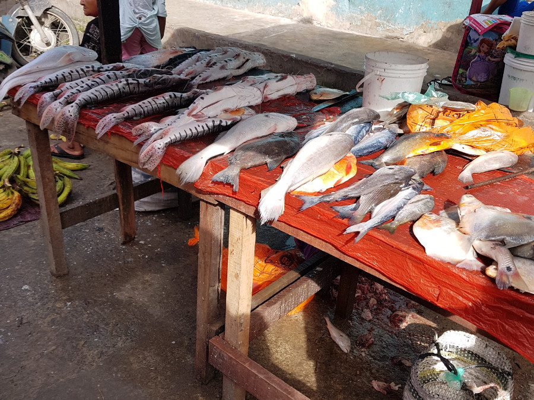

Osmar showed us around and pointed out all the tropical fruits and vegetables. He then took us around the part where people were selling meat; the weirdest thing we saw was a turtle without its shell, which people apparently eat. After getting to know Osmar a little better and how much he loves animals, we knew this was the reason why he didn't take us to see anything really strange and in the end we were grateful.

##The Dallas World Aquarium; Amazon Rescue Centre
[The Amazon Rescue Centre](https://www.dwazoo.com/conservations/peru/centro-de-rescate-amazonico-amazon-rescue-center/) started up ten years ago for rescued manatee's and is now funded by Dallas University. For S/.20 (£5) each a guide showed us around and introduced us to all of the rescued animals they have there. He explained that the animals they have in CREA are rescued from local people who had them as pets. He explained that they are rehabilitated and then put back into the wild when they are deemed ready by biologists. We saw a two month old ocelot, a type of big cat, she was very cute and playful. Its owners had given her up when she started to bite. There were also two scartlett macaws there who had been mistreated, they guarded all of the rescued turtles. The guide demonstrated this by entering the pen and trying to pick up the turtles, the macaws chased him threatening to bite until he left the turtles alone.

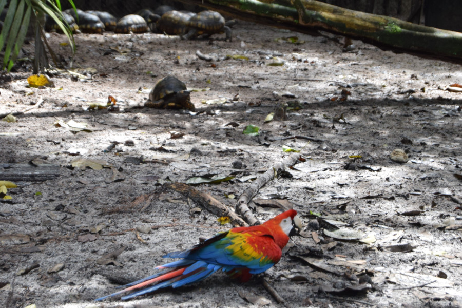

There were also rescued otters, my favourite animal! One was only a baby and the guide said that his owners had caught him when he was young and never taught him to swim. He explained that they are currently giving him swimming lessons but he cries when he is ready to come out of the water!

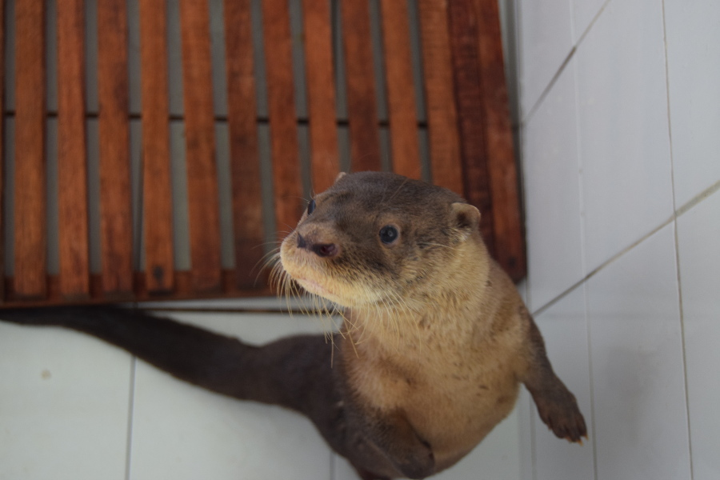

There were also sloths and lots of monkeys. Sadly, the guide told us that once monkeys had become domesticated and dependent on humans, because of how smart they are, they are not able to rehabilitate them back to the wild completely. The guide explained that they go to places such as [Monkey Island](https://laisladelosmonos.org/) where they are able to live in the rainforest, but tourists visit and give them food. Lastly we saw the manatee's; there were three. The guide told us there are more but they are closer to being released so are in the rehabilitation centre. He explained that rehabilitation takes three years in total for each manatee and in ten years they have successfully rehabilitated around twenty. There was one manatee isolated in his own pool, the guide said that he had been found with a plastic bag in his stomach which he had swallowed due to it being in all the vegetation.

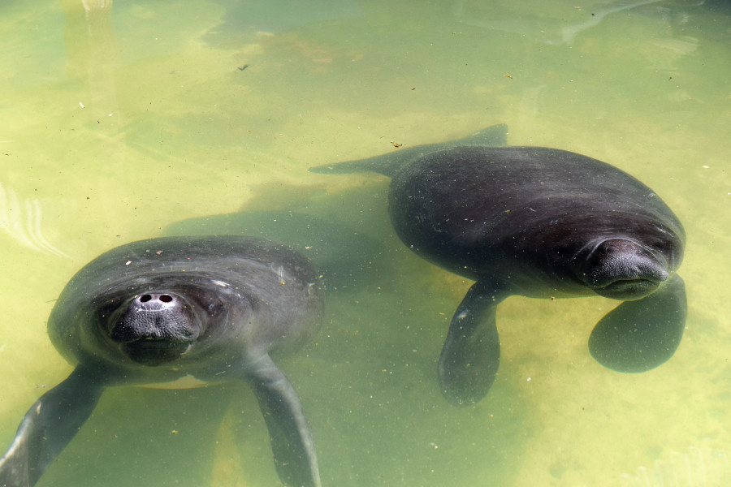

The guide told us that although they are a rescue centre, their main purpose is to educate the local children. He said when children come to visit they talk about the exotic pets they have at home at the beginning of their visit, but by the end they know that it is wrong and that the animals should be free. He said many of the children actually come back with their parents to donate their pets to the centre. The guide explained that the older generation are stuck in their ways and will continue to hunt manatee and kill turtles for meat, but that they hope educating the younger generation will help make a difference to the animals of the rainforest.

##Libertad Lodge
After a two hour drive and an hour and a half on a motorboat, we finally reached Libertad Village. The lodge was on stilts due to the flooding during rainy season, however we were visiting just at the end, so although it was muddy we could walk on the land around the lodge. We had a cute bungalow with a bathroom and most importantly a mosquito net! The village is located in the Pacaya Samira National Reserve and there are around 350 people living in the village.

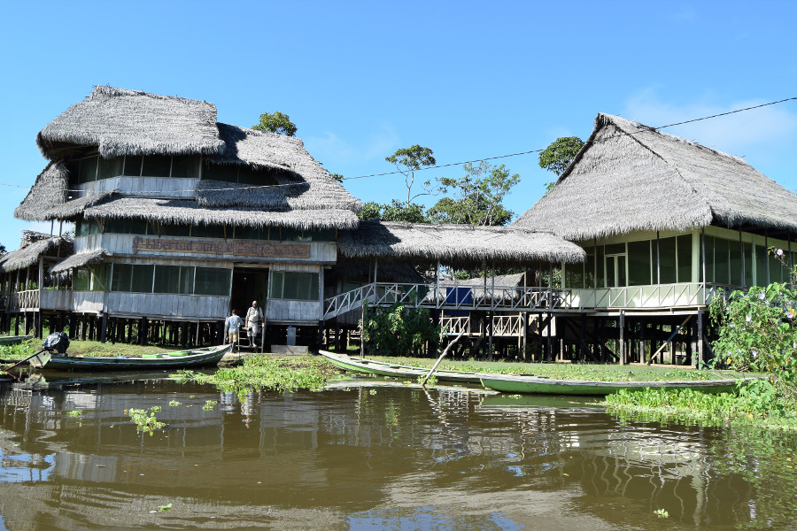

##Searching for sloths

After lunch we headed out on our boat to look for three-toed sloths. We found one pretty quickly hanging down from the tree. The guide told us all about them, how they move around four different trees a day and will come down once a week to defecate under the tree it lives in to help to fertilise it.

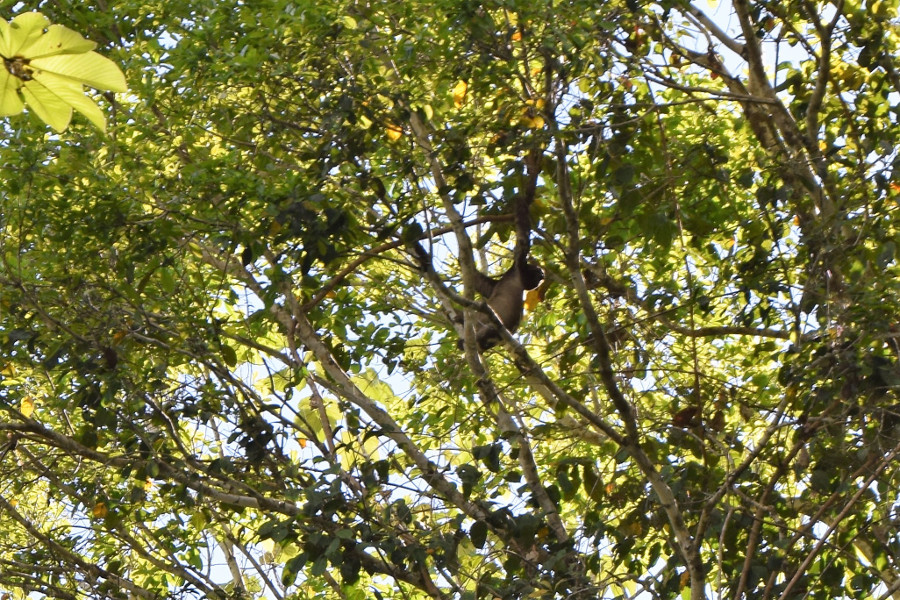

##Dolphins at sunset
We ended up doing this twice, but we were lucky enough to spot Amazon river dolphins every time we went into the Rio Ucayali near the lodge. There were two types, pink  which were shyer, had a longer snout and a rounder dorsel fin, and grey tucuxi dolphins which were more playful and easier to spot. We sat with the motor off for a long time watching the pink sunset turn the murky water lilac, with the dolphins popping up out of the water all around us. At one point, Manuel one of our drivers, did donuts in the water in the boat to disturb the fish and get the dolphins closer to us. There were parts of the water we could swim in but the water was so murky and knowing that there were piranha, water snakes and stingrays in there, neither of us were brave enough to take a dunk.

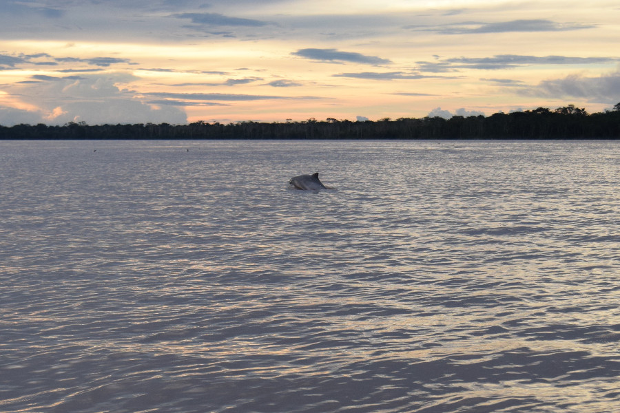

##Tarantulas
We had expected to go hunting for tarantula and got ready in our wellies, long sleeves and headtorches for a night hike, but it turned out there were lots of tarantula on the other side of the village. Peruvian pinktoe tarantulas; they live in the trees so we didn't have to get too close. We got a few pictures and our guide asked if we wanted to hold one, he told us that they bite and can be venomous but mostly to paralyse their prey such as insects and that their hairs are just irritating to human skin. We weren't sure if he was joking but said no as we didn't fancy getting bitten.

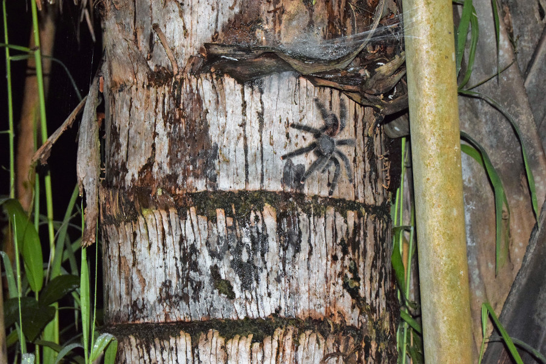

##Hiking
We spent a lot of time in the rainforest on our boat. As it was the end of rainy season, the local rainforest was 'flooded forest'. We did however do a couple of hours hiking when we managed to find some land. Firstly, Manuel our driver had to navigate through a creek, because the creeks were drying out, there were lots of logs and tree roots to navigate through. At one point the boat got stuck on a tree stump and I thought it was going to tip over; both guides had to get out in their wellies to dislodge it.

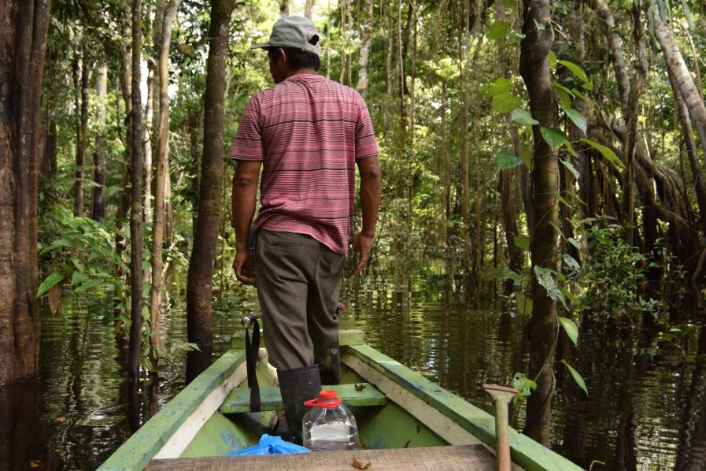

The land was muddy and in parts flooded. On foot, we managed to spot some common squirrel monkey's and red howler monkeys. Even Manuel got really excited when we spotted the red howler's as these are really hard to find. Whilst we were walking, Osmar had a bullet ant on his boot and Manuel managed to get it off with his machete before he was bitten. The guide explained that bullet ant bites are supposed to be really painful for 24 hours. Osmar also showed us a fruit with a grub inside and said we could eat it. When we both said we were full he ate it and said it tasted like coconut. He also collected some mocambo fruits which he said we could try on the way back and he would roast the nuts on the inside for us with our dinner.

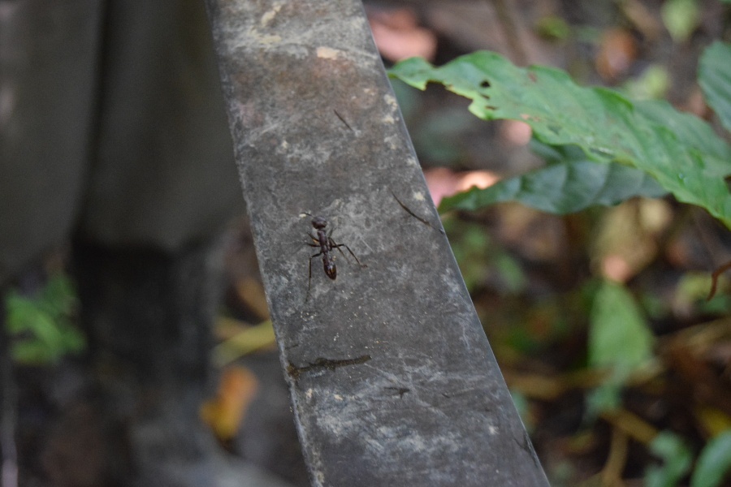

##Monkeys
On the way back, the guide opened some of the mocambo fruits for us to try. They were stringy and pretty tasteless. Manuel pulled in towards some trees, we weren't sure why until a monkey jumped in the boat, sat on our laps and started helping herself to the mocambo fruit in Dan's hand! Two more then joined in. The guide told us that they were common woolly monkey's and they had been rescued from a market by the local people. He said that although they could collect their own fruits and nuts, whenever they heard an engine, they knew it was the sound of humans which meant food and they would come down to investigate.

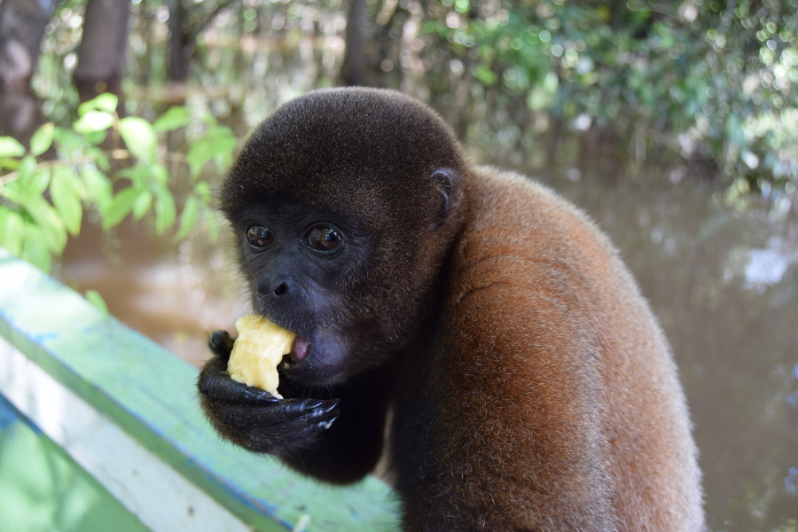

They absolutely loved scooping the flesh out of the mocambo fruit and when they had finished they cuddled up together on the guides lap before coming over and doing the same on ours. They were really soft and their tails were like an extra arm, wrapping around things. It was such a great surprise and Osmar and Manuel had clearly had it planned all along!

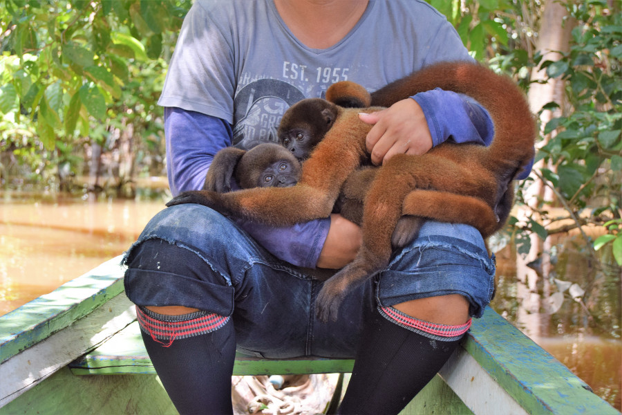

We saw lots of different types of monkey's during our time in the Amazon. We spotted a few monk saki monkey's, titi monkeys and some capuchins high in the tree tops and the guide took us to a spot where some pygmy marmoset monkeys lived, the smallest type of monkey in South America. We watched one licking the tree sap. We also saw some owl monkeys, they're nocturnal so the guide had to hit the tree with a vine to get them to come out and see what was going on. The monkey's were  either small, so quick or so high up in the tree tops it made it almost impossible to get a good photo unless we had invested in an expensive lens as long as our arms.

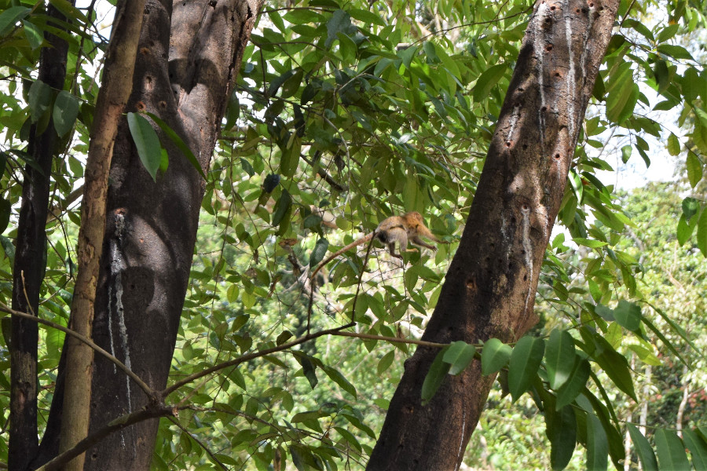

##Searching for caiman
We were nervous about looking for caiman at night, especially in the lodges tiny boats and because Osmar had said we'd try and catch one. Manuel drove the boat through a small creek and after a while we hit a lot of vegetation, mostly lillipads and water lettuce. This also meant lots of insects, there were thousands of them. Because of the light from our headtorches there were mosquitos and flies in our faces and grasshoppers, spiders, crickets and frogs were all jumping in the boat. The thick vegetation was building up at the front of the boat preventing us from going anywhere and we knew there were caiman in the water. After the ordeal was over, we asked the guide about the big spider's we'd seen, he said they were wandering spiders but the aquatic kind not the deadly ones to humans. He told us they often find water snakes in the vegetation too which get lifted up towards the boat, luckily this hadn't happened to us.

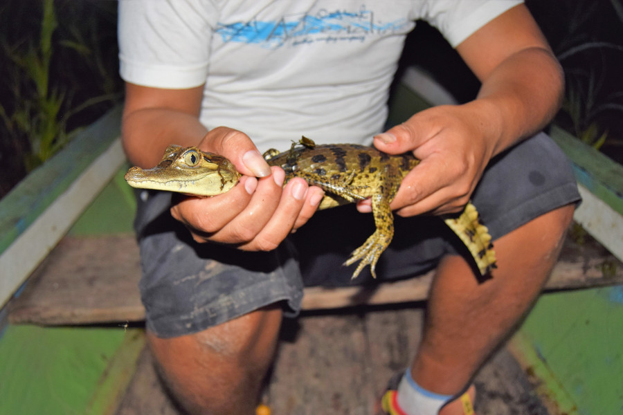

Osmar told us we were looking for red eyes in the vegetation and it wasn't long before he found a baby caiman. He told us we could hold it but with the crickets, frogs and mosquitos buzzing and hopping around us we decided not to. He told us a little about them and said its mother would be somewhere in the vegetation too. The black caiman can grow up to six meters long and Osmar told us about the time he had been bitten by a small caiman on his hand. We were pleased when we came out of caiman territory and able to relax on the boat ride back to the lodge.

##Sunrise in the Amazon
We woke up at 05:00 to see the sunrise over Rio Ucayali. Although it was cloudy, there was a gap and when the sun came up it was really orange. Some of the dolphins were about swimming around the boat again. Osmar explained on a good day the sun is really big and lights up the whole of the river. We were happy with the sunrise we'd experienced and crawled back into bed for a siesta.

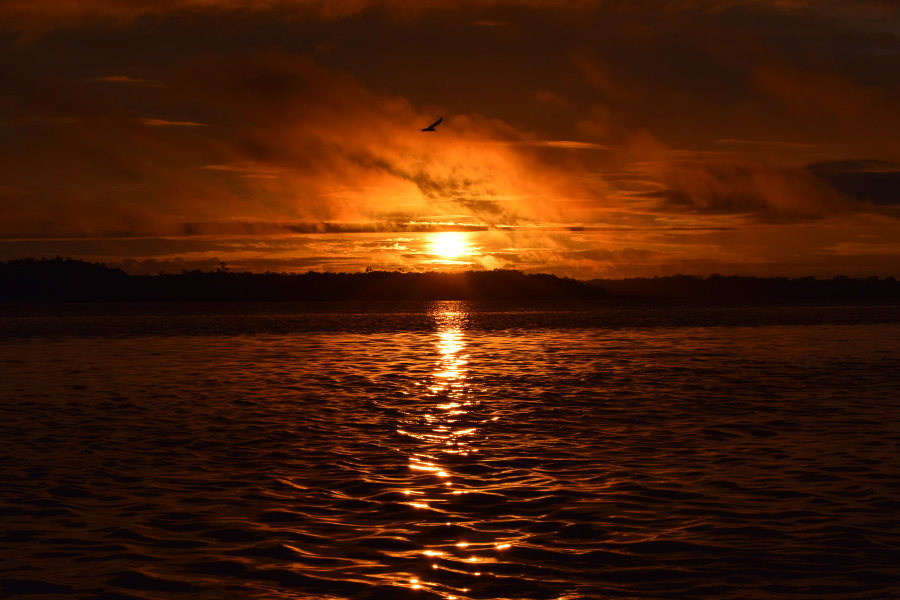

##Fishing for piranha
We went on a day excursion with Osmar and Roland, one of the chef's in the lodge and a local fisherman. We saw a few lakes and found some land to cook lunch. He made a fire and cooked us rice, chicken and fried plantane. It was delicious, it then absolutely poured it down so it looked like we were out of luck and couldn't spend the afternoon fishing. There was thunder and lightening and after waiting a while we gave up and headed back to the Lodge. However, it stopped on the way back so Roland pulled into some fishing spots for us to try and catch some dinner. Between us we caught six catfish and a red-bellied piranha.

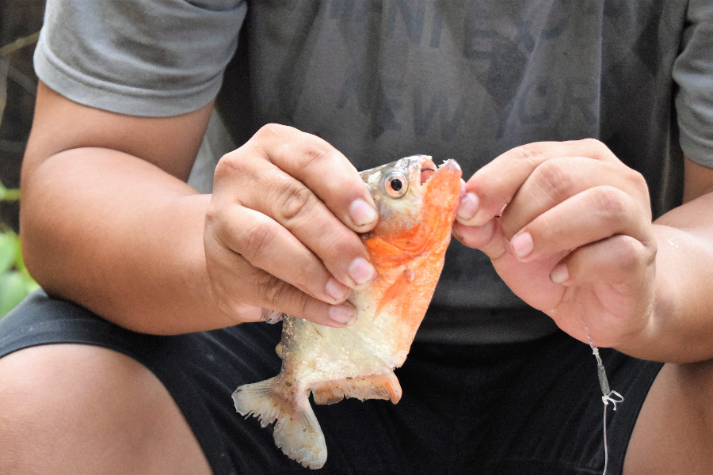

We'd been told that once there was a bite to lift the rod up sharply to get the fish into the boat, however when Dan caught the piranha, as he flicked the rod into the air it wriggled off of the hook and hit me in the back. They were really mean looking and Osmar told us to be careful as they would bite and take a chunk of flesh. Roland later cooked them up for dinner, although they were small the meat on them was really tasty.

##Snakes
We'd been to a lake hunting for snakes basking in the trees but we hadn't managed to find any. Osmar told us that snakes are very random, on some days he sees none and on others two or three. On the last day he told us he had a surprise for us, we'd gotten used to Osmar and his surprises and usually they didn't disappoint. He took us around Libertad Village, the kids started to follow us and Osmar told us we were at Roland's house. Underneath was a wooden box and Osmar said that Roland had caught a three metre long boa constrictor. He explained that it had been caught up in his fishing net, so they had freed it and Roland was waiting for it's scars to heal before releasing it back into the wild. The kids gathered around underneath the house whilst Omar took the nails out of the top of the box to get it out. It immediately started hissing and going for Osmar and Roland, it sounded angry. When they did manage to get it out you could see how powerful it was and how hard they had to work to stop it from wrapping around their arms and squeezing tightly.

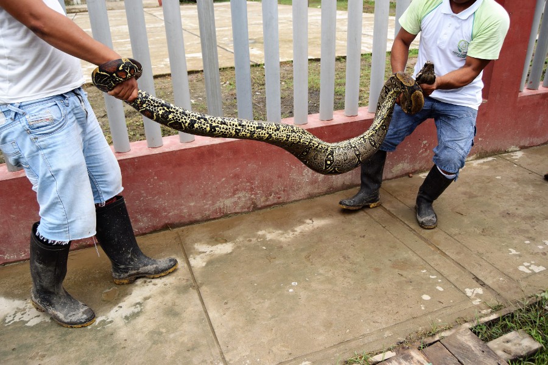

##List of most of the animals we saw in the Pacaya Samira National Reserve;
* Monk saki monkeys
* Common squirrel monkey
* Pygmy marmoset
* Titi monkey
* Capuchin monkey
* Red howler monkey
* Common woolly monkey
* Night owl monkey
* Three-toed sloth
* Pygmy long-nosed bats
* Tree rats

* Pink Amazon river dolphins
* Grey tucuxi dolphins
* Baracuda
* Red-bellied piranha
* Catfish

* Amazon kingfisher
* Green kingfisher
* Scarlett macaws
* Blue and yellow macaws
* Blue capped heron
* Black collared hawk
* Hummingbird
* Small yellow bellied toucan
* White fronted toucan
* Crimson crested woodpeckers
* Cream woodpeckers
* Red cardinals

* Peruvian pinktoed tarantula
* Giant moth
* Millipede
* Beetles
* Golden weaver spider
* Aquatic wandering spider
* Bullet ant
* Grasshopper
* Leafcutter ants
* Army ants

* Iguana
* Boa constrictor
* Tiny tree toad
* Colour geko

##Our verdict on the Amazon Rainforest
We absolutely loved the Amazon! It was really relaxing to spend four days without technology, eating local tropical fruits and going out everyday to see animals in the wild. Even though we ended up with more than 100 mosquito bites altogether (we now look like we have chicken pox) and at times were covered in bugs, feeding monkeys and being surrounded by dolphins at sunset was absolutely incredible. We can't thank Libertad Lodge, our guide Osmar and the locals enough for having us, allowing us to stay in their village and taking us out on their boats to see some of the wildlife in the Amazon.