##The best decision we made on our trip.
We’d toyed with the idea of going to Japan when we were planning our trip over a year ago, but like many people, we decided that it was too expensive. However, after we'd decided the time wasn't right to go to Bali and Lombok, Japan was the only place we both really wanted to go to instead. We found return flights from Kuala Lumpur for £330 with [Air Asia](https://www.airasia.com), which was an absolute bargin given that each flight was 7 hours long! Prior to going to Japan we also brought our [JR Passes](http://www.japanrailpass.net/) which can only be used by foreign tourists and have to be purchased from and sent to a foreign country. We paid £300 for unlimited use of all the JR trains in Japan for two weeks, including some of the monorails, subways and ferries. If we'd decided on a more limited itinerary we could have got a limited and cheaper pass. Regardless, this worked out much cheaper than paying for individual journeys, as Hiroshima to Tokyo costs around £120 one way.

We arrived in Tokyo at 10:45PM and jumped on the monorail into the city from the airport. The city is absolutely massive, more like lots of little cities all joined together; in fact there are 23 different city wards in Tokyo. We arrived at [Hostel Den](http://hostel-den.tokyo-hotels-stay.com/en/) in the Nihobashi district just after midnight and went straight to bed ready to explore Tokyo the next day.

##The busiest railway station in the world.
The first area we went to was Shinjuku, which has the busiest railway station in the world as it handles more than two million passengers every day. We booked our seats for our onward journeys at the JR office and had a wander around. The area is full of administrative buildings and tall skyscrapers, some of the tallest in the city, but we found there wasn't much to see as a tourist during the day.

We came back to Shinjuku at night to the Kabukicho area, as it is known to be the red light district of the city. The area was really lit up, especially 'Godzilla Road', which had a statue of Godzilla’s head on top of the building at the bottom of the street. We also found a statue of King Kong in one of the back streets. There were endless seedy clubs and 'love hotels' where rooms can be rented for a 'rest' or for the night. It was definitely a side to Japan that we weren't expecting to see!

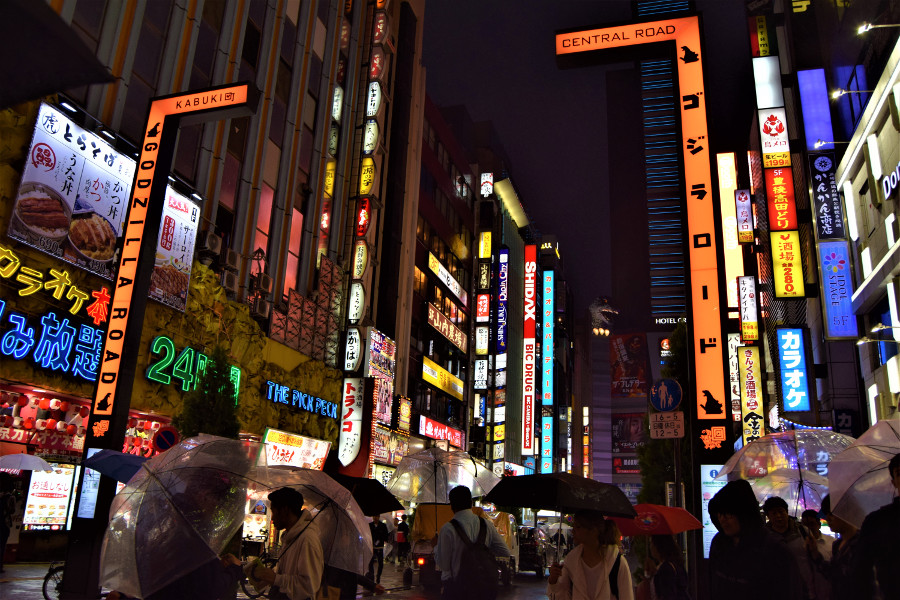

##The most popular area in Tokyo.
Shibuya was one stop on the JR Yamanote line from Shinjuku, the busiest line in Tokyo. We headed there to see the infamous pedestrian crossing just outside of the Shibuya station. We weren't even there during peak time but it was really busy and we headed to a bridge to view it from above; there were so many people crossing the roads when the lights changed they looked like little ants. We also visited the Hachiko statue, a popular meeting point just outside of the station. Hachiko is Japan's most famous dog, he is remembered for his loyalty to his owner, Hidesaburo Ueno, who he waited for for nine years after his death.

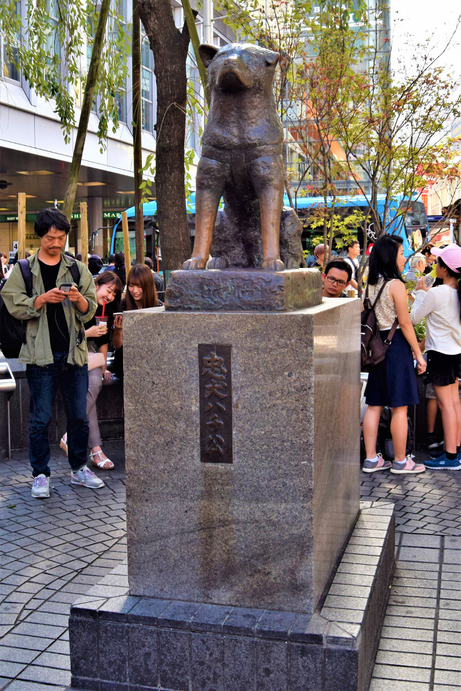

We also visited the [Meji Shrine](https://www.japan-guide.com/e/e3002.html), which is a peaceful place in the middle of the bustling city. The shrine is dedicated to Emperor Meji and Empress Shoken. It is located in a 70 hectre evergreen forest and walking around made us feel like we were in the countryside, not in the middle of Tokyo. Sadly some of the shrine was being restored whilst we were there, but compared to other Shinto Shrines we visited during our time in Japan, it wasn't heaving with tourists and it was definitely worth the visit.

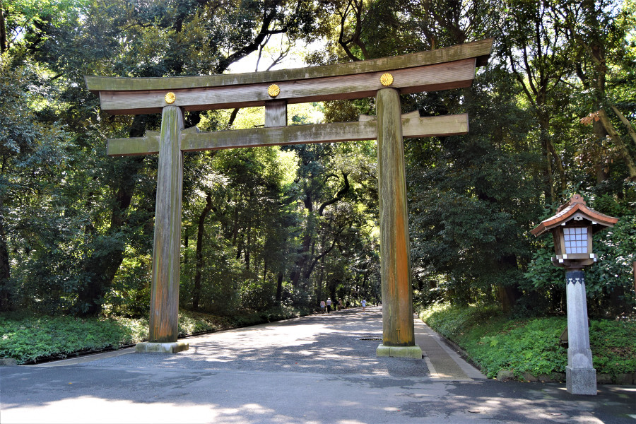

We also did a little bit of shopping in Shibuya. Dan found a street called Cat Street that had some high street brands such as Patagonia, Champion and Adidas Originals. Samsung also had a shop advertising their new phone by having everyone in VR headsets on a stimulation ride which was funny to watch. It didn't take long for me to feel uncomfortable in Japan in my backpacker clothes as Japanese women rarely had their knees or shoulders on show and almost everyone was in pastel and neutral coloured work wear. Japan was definitely not a place for my baggy elephant trousers, which made a great excuse to do some shopping!

##Tokyo's Cafes.
After Shinjuku our second stop in Tokyo was [Harry Hedgehog Cafe](http://www.harinezumi-cafe.com/en/). There are a lot of weird and wonderful cafes in Tokyo to visit including owls, cats, goats, lizards, dogs and even one with otters. Not to mention 'cuddle cafes', where guests can cuddle the staff, cosplay maid cafes and a crazy looking [Robot Restaurant](http://www.shinjuku-robot.com/pc/). Knowing we couldn’t visit all of them, we picked two. As hedgehogs are bred and sold as pets in Asia, like we have hamsters and chinchillas in the UK, we headed there first. We knew we wouldn't have felt comfortable seeing animals like owls being confined to a cafe and otters living in a small buckets of water. We paid around 1300¥ (£8.70) for 30 minutes with the hedgehogs and 230¥ (£1.50) for some hedgehog treats. There were loads of hedgehogs in the cafe and we could see that they are rotated round so they weren't handled all day. We got to pick them up with gloves on and saw some people next to us who had hedgehogs asleep in their hands. Ours were quite mischievous, they wanted the treats and ran over our hands like hamsters. When they got fed up we got a nip through the gloves to tell us to put them down. They were super cute, but our favourite was Bob, the biggest one they had. He was three years old and spent the entire thirty minutes curled up asleep with his face pushed against the glass.

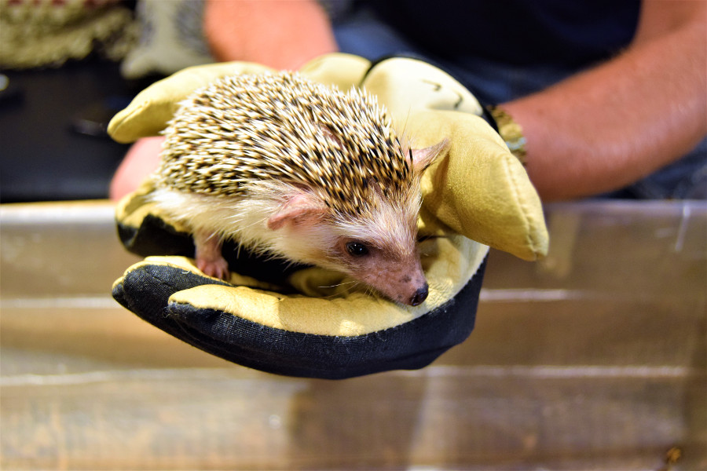

The second cafe we decided to visit was the [Kawaii Monster Cafe](https://www.govoyagin.com/activities/japan-tokyo-reservation-for-kawaii-monster-cafe-official-partner/4138). As we walked in we felt like we'd walked into a children's story, everything was so bright, there were colourful booths to sit in, milk bottles hanging from the ceiling and a stage like a merry-go-round in the middle of the floor. Like most things in Japan it was super cute at first glance, until we realised it was actually a little creepy. The milk bottles hanging from the ceiling were 'feeding' a couple of woodland animals and it didn't take long for the entertainment to start. A woman in a pink bellydancer outfit took to the stage with a pink cat and both danced to some very creepy music. All of the food on the menu was brightly coloured and we chose some colourful and almost inedible ramen. It cost 500¥ (£3.30) cover charge to enter and we had to order one drink and one food dish. Despite the fact that it was the worst and most expensive meal we had in Tokyo, Kawaii Monster Cafe was worth the visit just for the creepy entertainment.

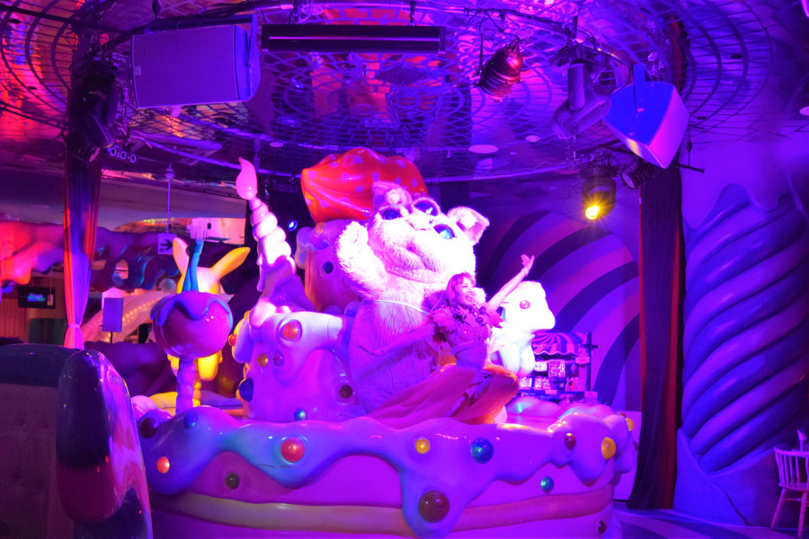

##Harajuku
Harajuku is known for being the area that youngster's dressed like 'Lolita' hang around in, a bit like Birmingham's 'pidgeon park'. Although we saw a few people dressed up in a tame form of Lolita fashion, it was only inside the malls that we saw the huge dresses and crazier attire that are associated with Harajuku.

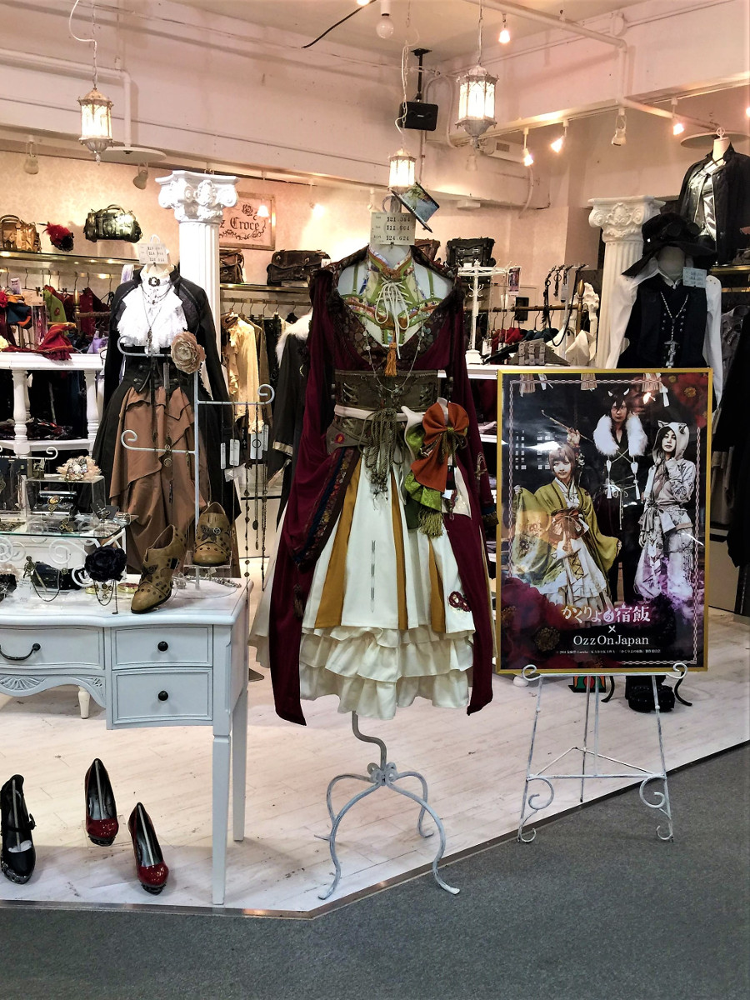

We also headed to Takeshita Dori, a busy street lined with boutique shops, vintage stores, souvenir shops and colourful sweet foods. There were mutiple crepe stands, that not only sold crepes, but sold cheesecakes in crepes topped with creme brulee. It was a desert lovers heaven! There were also a couple of sweet shops that sold rainbow coloured candyfloss for 900¥ (around £6) and ice cream stands that served the ice cream in the form of animals.

We did a bit of shopping on the street, there was a small alley full of souvenir shops, which sold some of the cheapest souvenirs in Japan. We also picked up some chopsticks and paper fans from [Daiso](http://www.daisojapan.com/), Japan's equivalent to a Poundland. We also had a look around the vintage stores; one of the bigger ones 'Chicago' was probably the best vintage shop we've ever been in. It wasn't over-priced and everything was sorted into clothing type, colour and brand. There was even a shelf full of vintage Disney jumpers. We could easily have filled an empty suitcase in Tokyo!

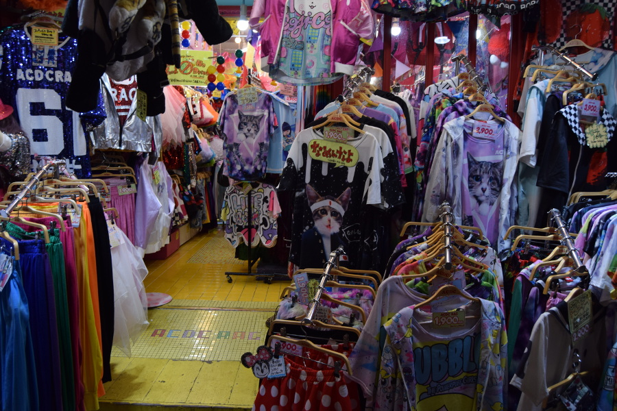

##Vintage Shops
Harajuku wasn't the only place full of vintage shops. We also visted two other area's in the city that were full of them, Shimo-Kitazawa and Koenji. We headed to Shimo-Kitazawa first, an area with narrow streets, no footpaths and lots of boutique and vintage shops, some were cheaper than others. Annoyingly the second hand kimono shop we'd read about that sold them pretty cheap was closed, but we did stumble across a store called [Vintage Vanguard](https://tokyocheapo.com/shopping-2/village-vanguard-vintage-books-nerd/), technically a bookshop but it was also filled with Snoopy, Pokemon, Hello Kitty and Disney stuff.

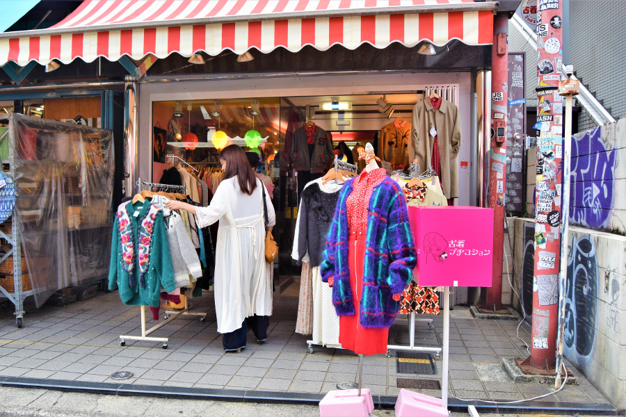

On our return to Tokyo we headed to Koenji, which was more relaxed than Shimo-Kitazawa and some of the shops were more like charity shops rather than a vintage store. There was a long street full of them and we thoroughly regretted that we weren't able to stuff anything else in our backpacks.

##Senso-ji Temple
We spent one morning in Asakusa, which is an area famous for Tokyo's oldest temple Senso-ji Temple, built in 645AD. To reach the temple we had to walk down Nakamise, a street that is several centuaries old, now full of souvenir shops.

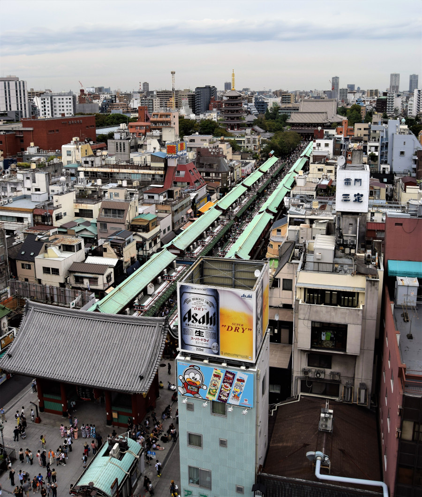

Senso-ji was absolutely heaving with tourists and a lot of people were dressed in kimono's, which can be rented for the day. There were also lots of men in tight shorts pulling tourists in rickshaws around the area. After we'd snapped a few photo's and resisted buying anything from the shops, we tried matcha ice cream made from Japanese green tea, it was much nicer than the bitter cold green tea drinks that can be found everywhere in Japan.

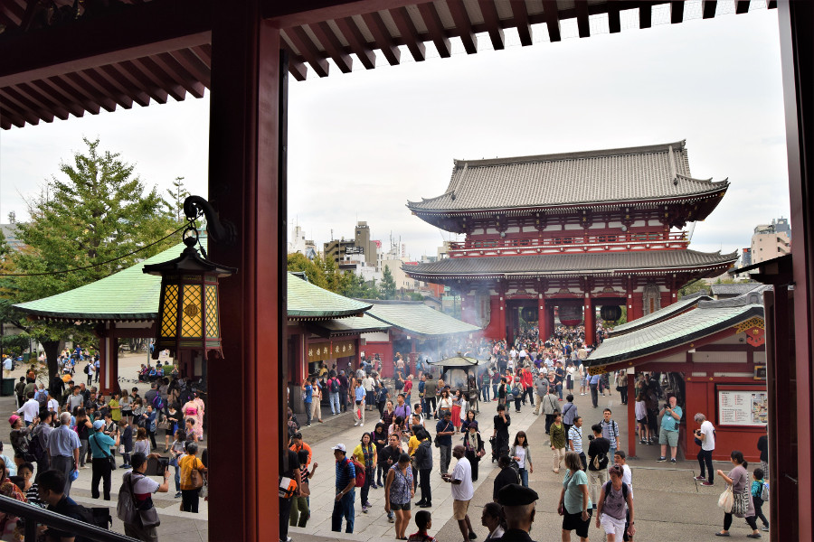

We also went into the Asakusa Visitor's Centre and up to the 7th floor where we were able to get some views of the city for free. We could see Senso-ji Temple and Nakamise, the Asahi Headquarters which is a building shaped like a mug of beer and the 'golden turd' or 'Asahi Flame'.

##Sumo
It turned out that we were fortunate enough to be in Tokyo for a sumo tournament, but we unfortunately couldn't get tickets, as all the seats had sold out. Second hand seller prices were absolutely insane, some were going for £500, so our options were to either head to the stadium in the early hours of the morning to get same day tickets or our hostel was able to call ahead to one of the sumo houses to ask if we could watch them practice. We asked our hostel to do the latter but they said that because of the tournament we weren't able to watch them.

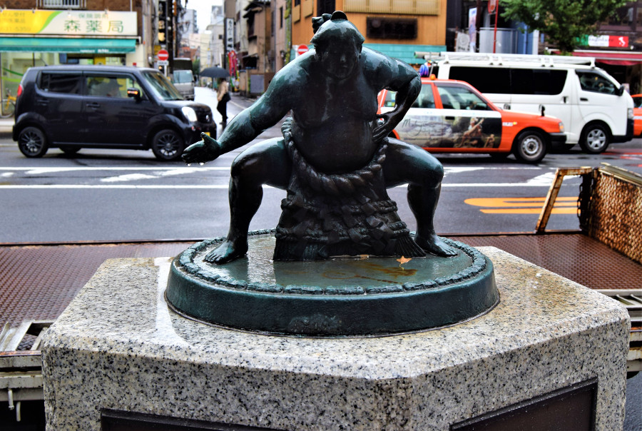

We headed to Rygoken anyway as we went to visit the [Edo Museum](https://www.edo-tokyo-museum.or.jp/en/) and at least see the stadium. On our walk to the stadium we saw plenty of sumo walking around in their yakata getting breakfast and completing their daily errands. One sumo came out of a restaurant and loads of people were queuing up and asking for a photo with him, so we did the same! It turned out that he had retired that day and he was the heaviest sumo wrestler to date! His name was Orora and he is a Russian sumo wrestler.

##The Edo Period.
We ended up spending hours at the Edo Museum, it was huge and there was lots to read and look at. The museum gives a very detailed history from the Edo Period, through the Meji Period and into modern day Japan. It was very interactive and a great museum for kids so unsurprisingly it was full of school trips. It cost us 600¥ to visit, just £4.

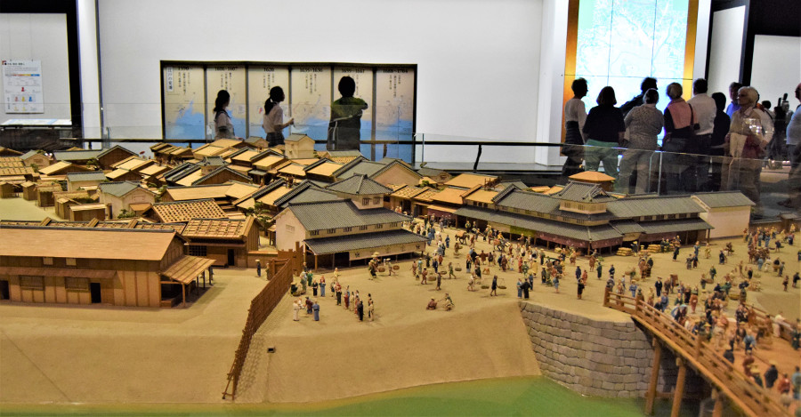

After spending so long in the museum, we were starving so headed to a local ramen restuarant. Japan is so clean we figured we didn’t really need to worry about hygiene and where to eat so headed to wherever was popular with the locals. Like most bars and restaurants in Japan there was a kitchen in the middle with a bar to sit round and eat at. We had to order our food at a vending machine and give the tickets to the chefs!

##Geek Heaven.
We’d read about a place in a Tokyo that was tech heaven, where we could look through manga shops, hit the arcades and even buy retro video games and consoles. Akihabara did not disappoint. As soon as we got off the train and came up to the street there were huge lit up signs, like in Shinjuku. There was a massive Sega shop and we had a look in Yodobashi which was 7 stories high, full of everything electronig that we could think of. We had a look in some of the smaller stores and found retro games including game gear and sega megadrive.

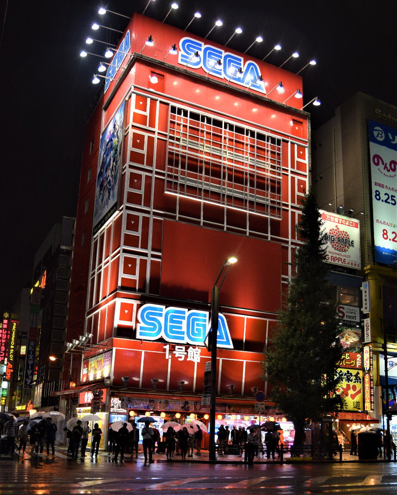

All along the streets were shops filled with vending machines, the ones that spit out a toy in a plastic shell. There were hundreds of them; random animals, Pokemon, Disney, there were even ones that spat out different headbands for cats. We decided to get a souvenir from one and got a Shiba key ring. We also had a go on the grab machines, we got a bit hooked trying to win a Pikachu but sadly we couldn’t get it had to give up as we didn’t want to waste too much money.

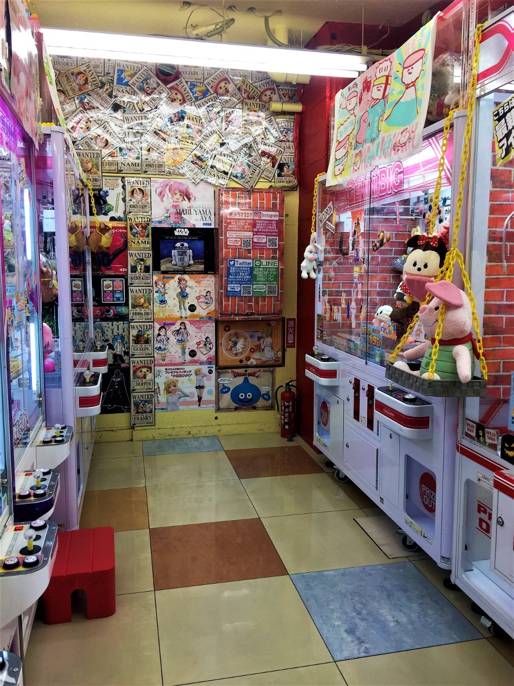

We’d heard about maid cafes in the area, another one of Tokyo’s crazy cafes. People go there to be waited on and treated like a ‘master’, the girls also like to have conversations with their guests whilst they enjoy their drinks. All along the main and backstreets in Akihabara, there were girls dressed in ‘cosplay’ maid outfits trying to get people to go into their cafes. It was bizarre and felt very seedy, so we decided to give it a miss!

##Mount Fuji
Mount Fuji is a couple of hours away from Tokyo and on a very clear day can actually be seen from one of the skyscrapers on the edge of the city. We'd decided we wanted to at least see the symbol of Japan and as trekking season was sadly over, we were going to head to the nearby lakes for the day. However, the weather was so bad that in the end we didn't bother. We were able to see the view of Mount Fuji from [webcams](http://www.fujigoko.tv/english/), which was covered in fog and discovered that the best time to see the volcano is during the winter when the morning's are much clearer. However, we got really lucky on our way back from Hiroshima and we could actually see Mount Fuji from the window of the shinkansen!

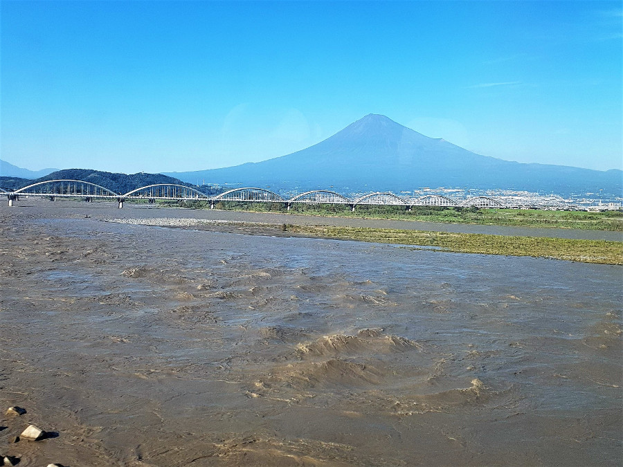

##Baseball.
After a couple of days in Tokyo, we decided we loved it so much that we wanted to stay longer and changed our train from Hiroshima to give us more time there. Unfortunately Typhoon Trami hit so we ended up only gaining an extra afternoon. We’d heard that baseball is Japan’s favourite sport but it wasn’t until we got to Hiroshima and saw the Carps advertised everywhere that we realised how big it was! We tried to catch a game in Hiroshima but tickets were sold out so thought we’d try our luck in Tokyo to see the Yakult Swallows and Yomiuri Giants. Our train was due in at 15:40 and the game started at 18:00. Worried it would be sold out too we booked tickets on Viagogo, they cost £17 each so we knew we probably could have got them half the price if we’d got them from the stadium or a seven eleven.

We thought the game would probably be all in Japanese but there was an american announcer and it turned out to be as much fun as a basketball game in America. We sat in the ‘free seat’ area with the hardcore fans who sang the entire time the Swallows were batting. Luckily the game was an exciting 8-5 and the songs and chanting kept us entertained.

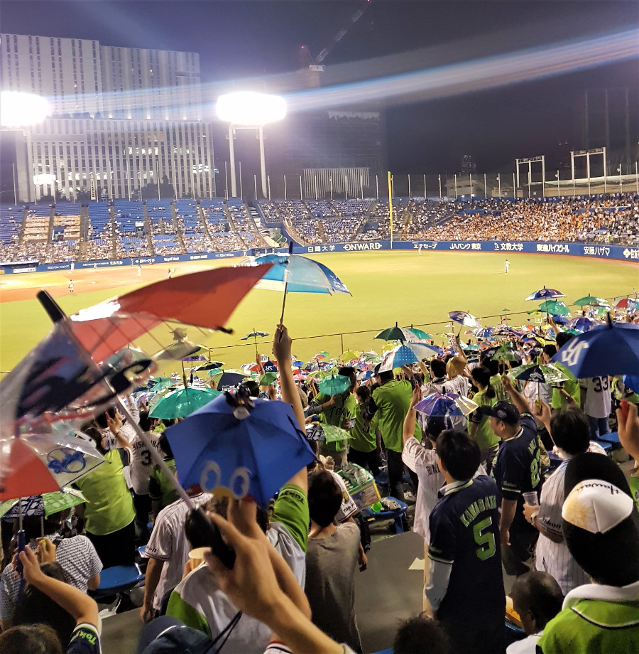

The fans had a band who spurred them along and fans had a chant for each player. They also had hand gestures and used plastic bats to clap with. After the Swallows got a home run they all high fived another, including us and then all got out mini umbrellas and did another song and dance to celebrate! The people around us were so friendly that they let us borrow their spare umberellas so that we could join in! There was also a KFC in the stadium and ‘ghostbusters’ (girls with beer) so we didn’t starve or go thirsty during the game either!

##Our verdict on Tokyo
Tokyo was easily one of the best cities we've ever visited. It was full of museums, unique activities and lots of places to shop. It was so good we've already had a snoop at the cost of return flights for next year!