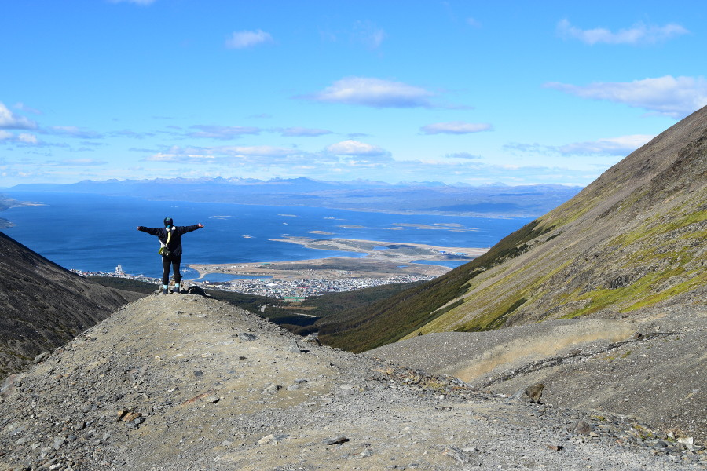
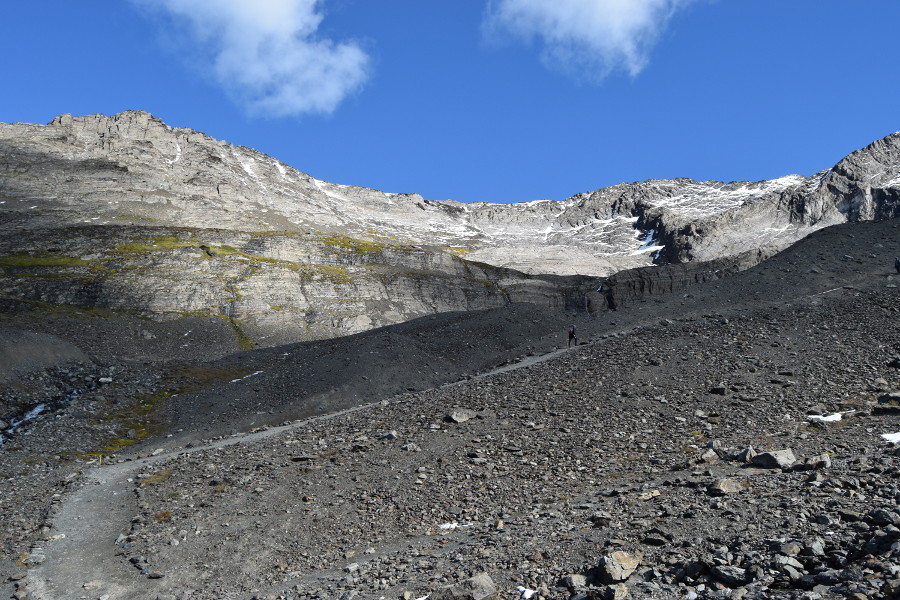
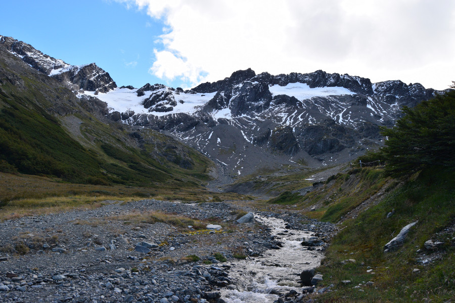
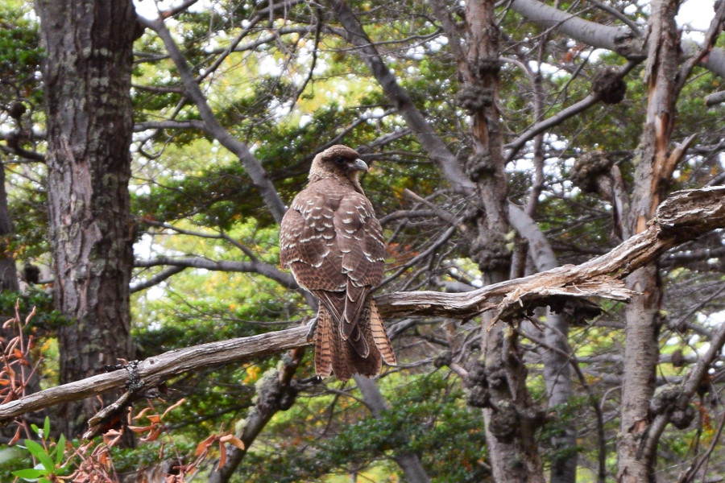
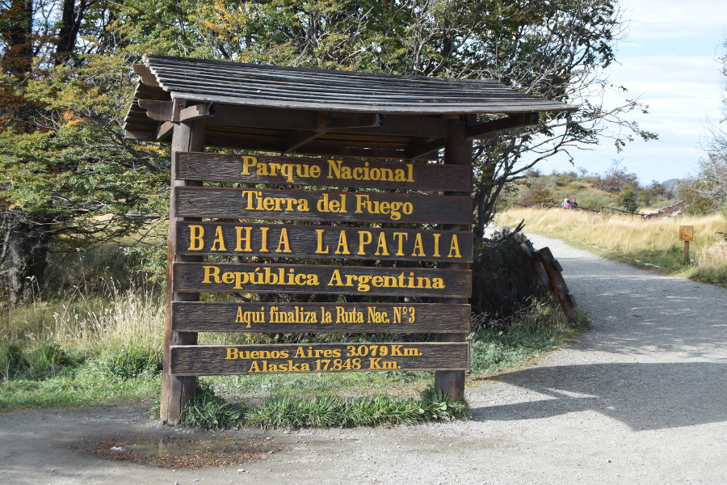
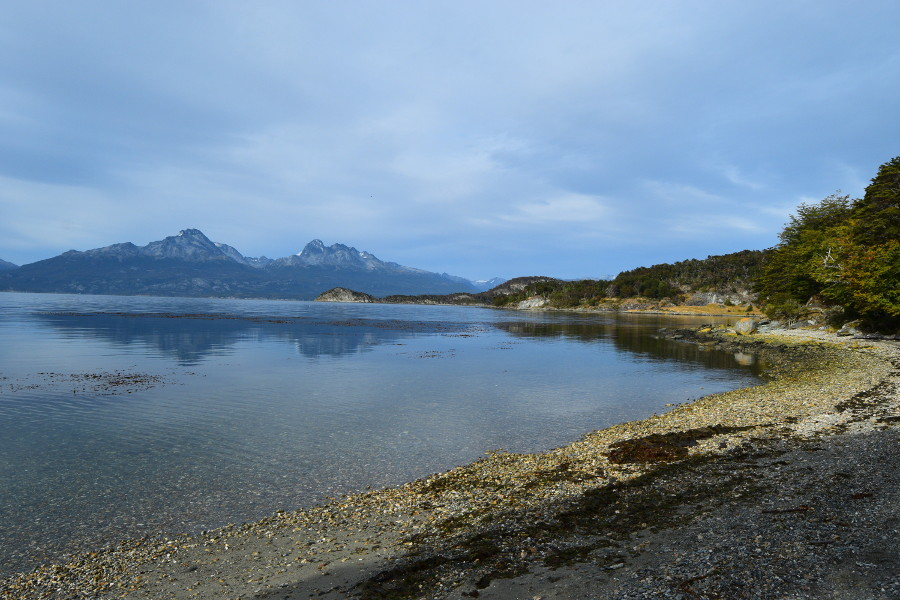
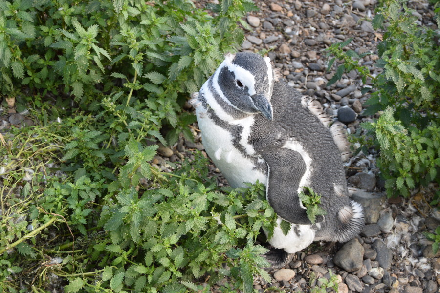
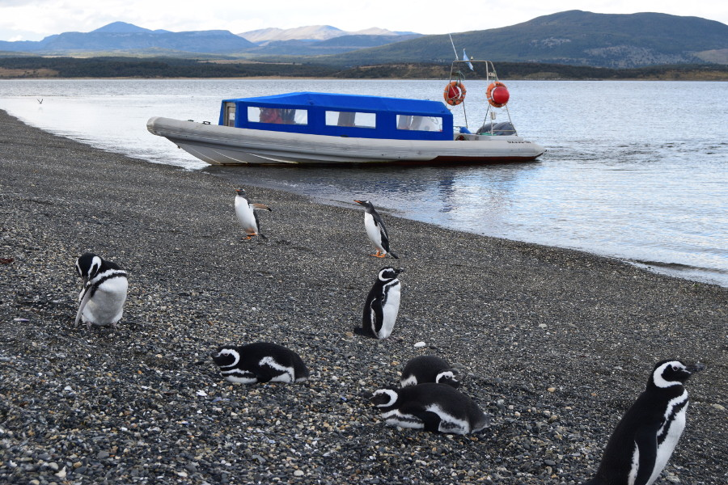
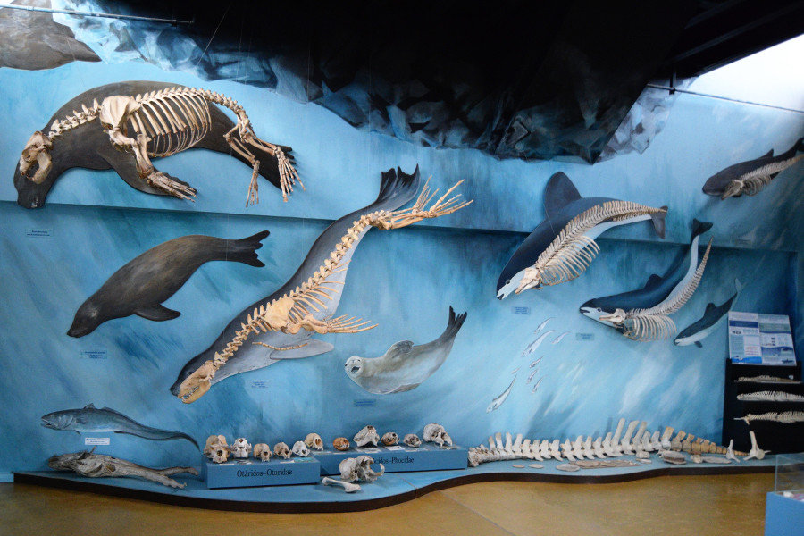

>“No one will protect what they don't care about; and no one will care about what they have never experienced.”

David Attenborough.

##Our Flight Nightmare

Due to Dan’s love of penguins, going as far south as possible in Argentina was an absolute must. Before we left we booked a tour in Ushuaia where we could walk among wild Gentoo’s, Magellanic Penguin's and sometimes King Penguins on an island off the coast of the Beagle Channel. Getting to Ushuaia was expensive; a coach from Buenos Aires would take days so our only realistic option was to fly so we booked a flight with [Dream World Travel] (https://www.dwtltd.com/) for £126 each.

When we got to the Aerolíneas Argentina check in desk at the airport, the guy told us there had been a problem with our payment and sent us to go to the ticket desk. At the ticket desk, they told us to hold on five minutes. He disappeared for around thirty minutes, leaving us to become very anxious as time was ticking and there wasn’t long left before the gate closed and we'd miss the flight. After what felt like a lifetime, the manager told us that the agency ‘Travel Junction’ (who turned out to be a vendor for Dream World Travel) hadn’t made the payment to the airline. He told us we could either ring them again ourselves and speak to them or buy new tickets; he reminded us we didn’t have long as the plane would be leaving soon. We had no SIM cards in our phones, the next flight to Ushuaia was on Monday, we had accommodation and trips booked and paid for and we had 45 minutes to pay, check in and board the flight. £375 each for a new ticket later, we ran through the airport to board the plane! Of course the flight was delayed as we were on Argentina time, so whilst we waited we wrote a strongly worded email to Dream World Travel.

##The City of Ushuaia

Ushuaia is a small city of 75,000 people and apart from having a Hard Rock Café, it doesn’t feel like a city. It has one main street, San Martin which is full of shops, bars, restaurants and tourist information centres. There hadn't been many stray dogs in Buenos Aires but there were loads in Ushuaia. A lot of them were just laid on the streets, they looked full of disease so despite having our rabies injections we resisted the temptation to stroke them. On our last night in Ushuaia, we declined an invite to go to a salsa bar and we went to the famous irish bar Dublin Pub instead. It was packed and seemed that everyone in Ushuaia came here at night. We weren't sure why as it was packed, expensive and served green beer!

Ushuaia reminded us of places like Reykjavik in Iceland and Tromso in Norway, which in the past we have quickly fallen in love with. We stayed in [Antarctica Hostel] (http://antarcticahostel.com/) which again had a hostel cat! Dan said this one was his favourite as he was noisy and one night let himself into a dorm and fell asleep on someone’s bed.

We met a lot of people staying here, including a Danish guy and a woman from Florida, who had come back from Antarctica and we were both very envious of their experiences. They told us about their time kayaking with whales and seeing the penguins in Antarctica. However, they also told us that the boat, on its way there and back, had rocked for 4 days, to the point where almost everyone was sick and people were huddled in the corner with life jackets on, sure they were going to die. It also cost them around $8000. Going to Antarctica was definitely well out of our budget!

##Glacier Martial

The receptionist at the hostel had recommended several things to do in Ushuaia, one of them was a hike to Glacier Martial. He told us that most people get a taxi up for around $200ARS (£7) and then walk back down. He said it was 1.5 hours each way. As it was free to see the glacier, on the first day we got a taxi up there. It then turned out that from that point it was a 1.5 hour hike up to see the glacier, all uphill. We set off with our tree branch walking sticks that were at the entrance and made our way slowly to the glacier.

There were some stunning views of Ushuaia and the Beagle Channel on the way and the surroundings made us feel like we were in Lord of the Rings. Annoyingly the view of the glacier had been better further away than at the end of the hike but at least we had done it!

##Tierra Del Fuego National Park

There were a few different ways to see [Tierra Del Fuego National Park] (http://www.patagonia-argentina.com/en/tierra-del-fuego-national-park/) and one of them that we’d looked into was [The End of the World Train] (http://www.trendelfindelmundo.com.ar/en/tarifas.html). This used to transport prisoner's from Ushuaia's prison to work in the park. However, getting the train would only allow us to see a small part of the park and it was $850ARS (£30) on top of getting there and the park entrance fees. We went with the hostel’s recommendation and booked a bus there and back for $500ARS (£17) and then planned to walk the trails on our own. Armed with a photocopied map we followed the yellow posts around the park. The first trail we did was the Costera Trail (8km long) through the forest next to Lapataia Bay, it took us three hours. Unlike Ilha Grande, there wasn't much wildlife to look out for, although we did see a Chimango Caracara up pretty close. What struck us was how quiet and peaceful the national park was, there was no sounds of people, traffic, insects or even water. Just pure silence.

The second trail we did was to Roca Lake and was only a 3 kilometre round trip. It was a great view so we braved the cold and stopped for a picnic. After this we did lots of little trails making our way to Lapataia Bay to the bus stop. The buses back came at 15:00, 17:00 and 19:00 and after being dropped off around 09:00 and our legs feeling like they were going to fall off by 13:00, we were keen to get the first bus back to the city. After walking Paseo De La Isla and past Laguna Verde we made it to the end of the trail and to the bus stop just in time for the 15:00 bus. We were also rewarded with the sign marking the end of the Pan-American highway, spanning from Alaska to Ushuaia. Literally the end of the road.

We expected the national park to be busy with lots of tourists on the trails, however it seemed that more people did the day tours on the coaches. This dropped them at the main viewpoints of the park so these places were a little bit busier, but on the trails there was no one around. How we didn’t get lost with our inaccurate paper map, lack of any kind of directions or signs and no proper hiking gear we’ll never know!

##Penguin Rookery

This was definitely the highlight of our trip so far. Our tour, booked through [Piratour] (http://www.piratour.net/en/) took us to an island called Isla Martillo, where a colony of Magellanic Penguin's live during the summer months to have their chicks in their burrows. They'd had their chicks in December so they were now adults. We’d also come at a time where they were moulting and were skinny from being on land for so long.

We got to walk between their burrows and were told we could get up to two metres close to them but no closer. The guide told us that any closer would stress them out as their eyes would not be able to focus on us. He told us that they are not afraid of humans as long as they can see us. The penguin's were mostly in two’s, pruning each other and some were in their burrows. They were also a lot less smelly than we’d anticipated!

After some time with these penguins, the guides took us round to the beach, where there was a colony of Gentoo Penguins. On the way we saw a vulture devouring a dead penguin by the sea. The guides told us that the Gentoo’s stay on the island all year long and we saw 4-5 come out of the sea onto the beach after catching some fish. One of them waddled all the way up the beach to join the rest of the colony.

We spent an hour on the island, as it’s all that’s allowed so that the penguins do not become stressed. Piratour seemed to be the only company that offered tours to Isla Martillo and they were really strict about what we were and weren’t allowed to do on the island, so it didn’t feel like a tourist trap and felt that they actually cared about the penguins.

After the penguins, we had a hot chocolate in a cute little teahouse and then were taken to Acatushun Museum for a guided tour. This was really random, a little hut in the middle of nowhere full of bones that scientists have found washed up in Tierra Del Fuego of whales, dolphins and birds. We were also shown the lab where volunteers live, work and clean the bones. It stunk of a mixture of decaying flesh and freshly made cookies. A really bizarre end to our tour.

## Our Verdict on Ushuaia

Having the opportunity to walk between the penguins in their natural habit was incredible, like a real life episode of Planet Earth. It will certainly be difficult to beat! Hiking for hours through Tierra Del Fuego was also an experience as it's a beautiful part of the world to explore. Annoying, but definitely worth the extra £375 to get there.