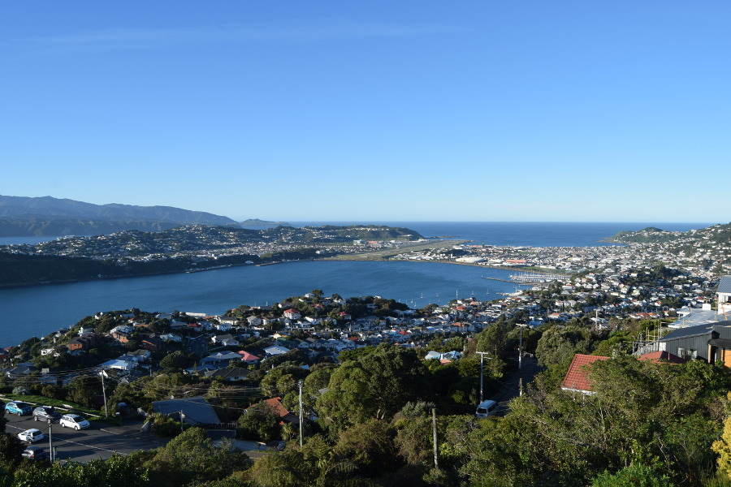
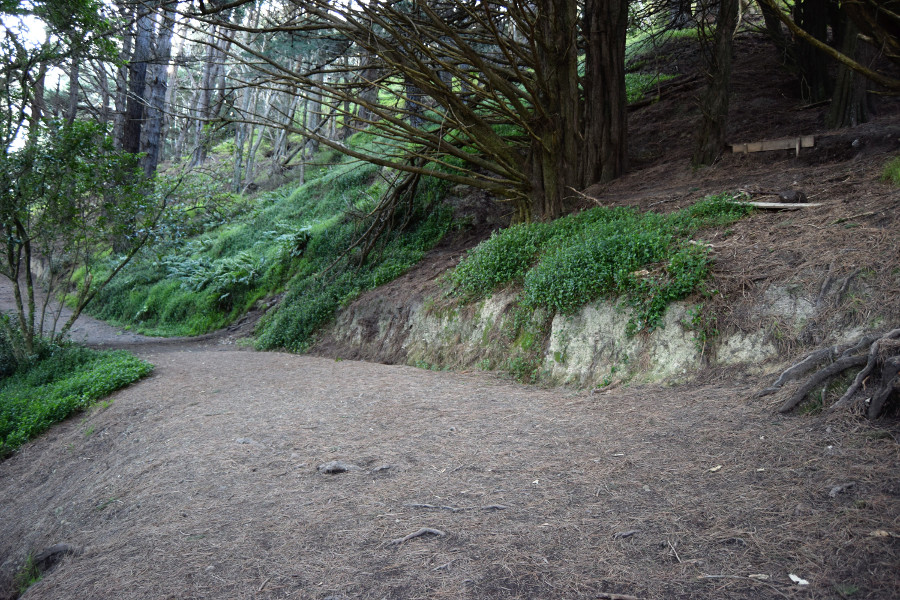
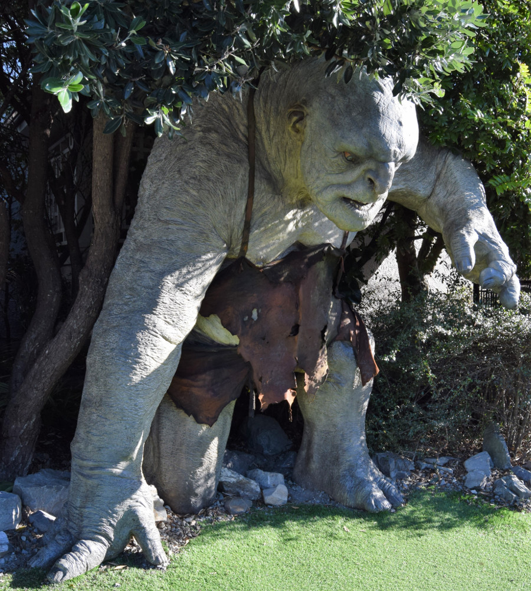
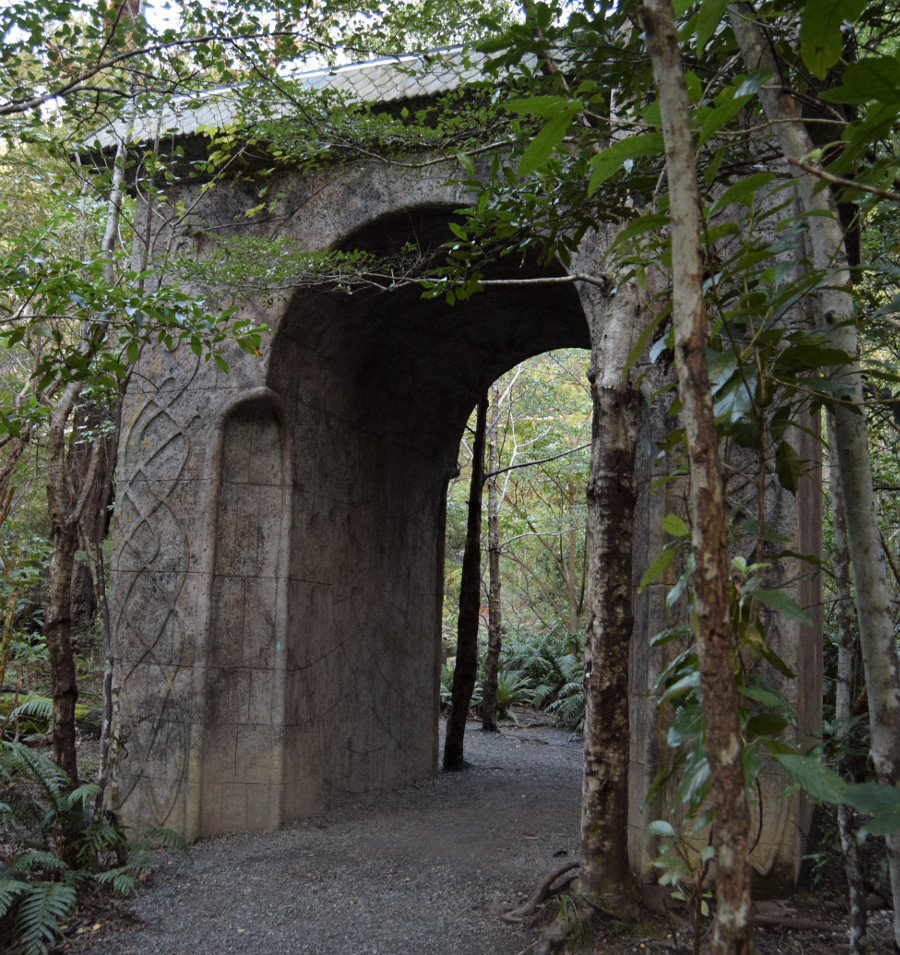
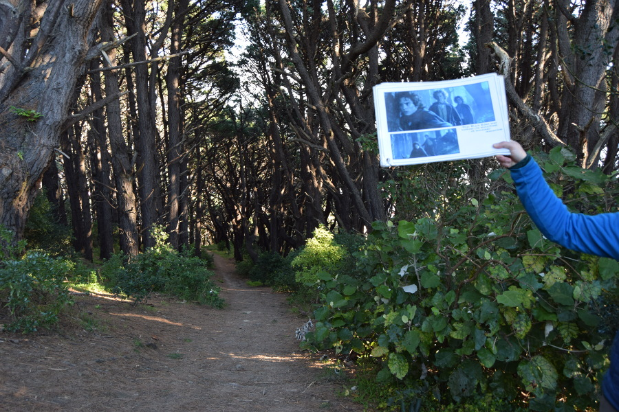
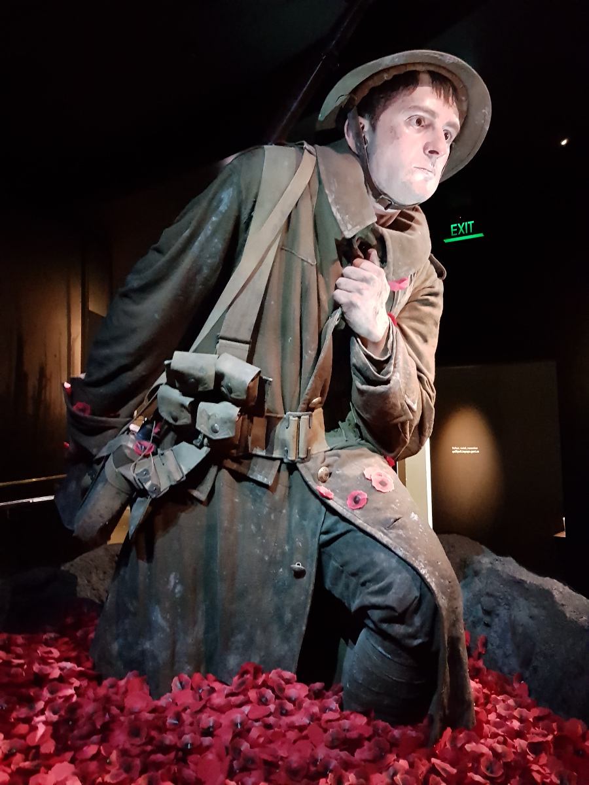

>"It's a dangerous business, Frodo, going out your door. You step onto the road, and if you don't keep your feet, there's no knowing where you might be swept off to."

J.R.R. Tolkien.

##Wellington
The journey from Taupo to Wellington took the best part of the day and this wasn’t helped by the awful driver who almost ran out of fuel and struggled with the gears. The drive is through the central plateau so we drove straight past Tongariro National Park, past the mountains Mount Ruapehu and Mount Ngauruhoe and guess what?! The weather was blue skies and low winds, although we could feel the cold on the bus.

Delayed and tired we arrived in Wellington around 6PM and had a 25 minute walk from the bus stop to our hostel [Set Up on Dixon](https://www.setupdixon.co.nz/). The hostel was an old office building that had been converted as the kitchen was more like a staff room and there were the iconic square tiles on the ceiling. There was no lamp in the room and the ceiling light was ridiculously bright which came in useful to wake Dan up.

##Cuba Street
We headed straight out for a drink after cooking spaghetti bolognese for dinner as we only had around 36 hours in Wellingon, we wanted to make the most of it. We’d heard that Cuba Street was very hipster and full of bars. As soon as we turned the corner we were greeted with a long row of vintage shops, quirky bars, a street market and a street salsa class. We fell in love with the city immediately! After a little exploring we went in a bar called [Laundry](www.laundry.net.nz/), there were old converse hanging from the ceiling, creepy barbie dolls on the lampshades and random umbrellas and mannequins around the place. Dan had a craft beer and I had a glass of wine. As it was $10-20 per drink, we had one and then headed to the liquor store and brought a bottle of wine to consume in the room whilst watching New Zealand’s version of ‘Have I Got News For You’. We hit the nightlife the second night we were in Wellington too, as the city had a higher concentration of restaurants than New York, we headed out to eat in a Vietnamese place called [Restuarant 88](www.restaurant88.co.nz/), where we both had a delicious Beef Pho.

##Lord of the Rings Location Tour
This had never been on our itinerary, we had looked it up before we got to New Zealand but felt at over £100pp it was too expensive for our budget and there were other things we’d decided we'd prefer to see and do. However, after the Tongariro Crossing was cancelled, we decided to go for it so that we could see some of the other filming locations from Lord of the Rings. We managed to find tickets on [www.bookme.co.nz](www.bookme.co.nz), a great website where lots of activities and trips are heavily discounted and it was booked through [Rover Rings Tours](https://roverringstours.co.nz/).

'Kiwi Dave' our guide picked us up from the i-Site in his mini van called 'Aragorn'. We were really worried that the tour would be geared towards absolute Lord of the Rings super fans and would be given by a bigger super fan. However, as it turned out Kiwi Dave wanted to show us and talk about New Zealand just as much as he did Lord of the Rings, and it turned out we were probably the biggest Lord of the Rings geeks on the tour.

Our first stop was Mount Victoria, a lookout point over the city of Wellington. Dave pointed out where the bigger landmarks in the city were before we headed to the park to see some of the filming locations. Dave showed us a photo of the scene which was really helpful to visualise it before giving us time to have a photo there; in the park were the scenes "Shortcut to Mushrooms", "Race to the Buckleberry Ferry" and the "Get off the Road" scene.

Dave then drove us to ‘Wellywood’, New Zealand’s version of Hollywood. He showed us a sign mimicking the Hollywood sign which now says Wellington after locals vandalised it, not liking the nickname 'Wellywood'. He took us to the Roxy Cinema, owned by Peter Jackson, to see an actual Oscar Award which was won for Lord of the Rings. He also stopped outside some of the studios that have been used for films like King Kong and the Hobbit.

We then had some time at [Weta Workshop](www.wetanz.com) on a guided tour around a very small part of the studio. We got to see lots of props made for films like the hobbit feet, Sting (Bilbo/Frodo’s sword), armour and a car from Halo. The guide told us about forced perspective and some of the secrets as to how Lord of the Rings was filmed to make the hobbits look smaller, there were two sizes of everything, one to make the hobbits looks small and the other characters look big. Weta Digital have just signed a deal to make four more Avatar films and the live action Mulan movie.

Kiwi Dave drove us to a cafe for a Lord of the Rings themed lunch, by the beach on the road where Peter Jackson lives. The houses in the area sell for a couple of million dollars and mainly celebs, doctors and rich business men live there. Some of them were up in the hills and therefore they had their own private trolley lifts to get up to them.

In the afternoon we hit loads more filming locations, we drove past the quarry used for Helms Deep and Minas Tirith, we stopped at the Hutt River which is where the Great River Anduin was filmed. We visited a rainforest in Kaitoke Regional Park where Rivendell was filmed and we went to a park where they shot scenes from Isengard.

What made the tour worth every penny were the stories that Dave told us about Lord of the Rings. He had been an extra on all three films and said that his favourite actors had been the guys who played the hobbits. He told us that Billy Boyd and Dominic Monaghan (Merry and Pippin) had been pranksters and they had asked one of the helicopter drivers to do some stunts on their way to one of the locations, John Rhys-Davies the actor who plays Gimli was terrified and thereafter refused to get in a helicopter. He subsequently hiked up to 'Mount Doom' for filming. He told us Ian McKellen is scared of horses so his stunt double had to do all the scenes where he is horse riding. On the scenes where he is sat still on a horse they made a fake leg and he just stood next to it. They shot it from an angle that made it look like he was sat on the horse.

Dave also told us that Viggo Mortensen (Aragorn) was a method actor so before he knew who he was he mistook him for a homeless man when he was sat opposite eating lunch. He said he didn’t eat with cutlery and still had the dirt under his fingernails. He said that he was hired after the previous actor playing Aragon had been sacked for partying too much, and this was because Peter Jackson’s wife had a crush on him. He said Viggo only took the job after his son told him it was his favourite book and that Aragon is a bad ass, prior to his son intervening he was going to turn it down. As a thank you Peter Jackson added his son as a casting crew member on the credits.

Dave told us about other little parts of the film that we would never have known otherwise. He said that Peter Jackson is renowned for retakes for luck, so in the scene where he hobbits run and roll down through the shire, Frodo’s stunt double decided to throw himself down the hill, resulting in a broken collarbone, which is why Merry pulls out a carrot in the scene and says I think I’ve broken something. He also told us that Sean Astin, the guy playing Sam turned up all ‘buff’ to play the part as he didn’t realise he was the fat hobbit. He had a 6 week diet of KFC and donuts to put on 12kg so in the early scenes of filming he isn’t in it so much, which is why he isn’t seen running in the scenes in the shire and why he just pops out from behind a tree.

Dave told us about some of the casting could haves which would have been disasterous. He said that initially Sean Connery auditioned for Gandalf but turned it down. The studio wanted to put Nicholas Cage in the film as Aragon but Peter Jackson said no so they made him use Liv Tyler instead. Overall, we had a great day, we got to see bits of windy Wellington and bits of the countryside around the city.

##Te Papa
After the tour we got dropped off outside [Te Papa](https://www.tepapa.govt.nz/) which is a free museum. There was an exhibition on about New Zealand’s role in World War II and there were some huge hyper realistic sculptures of soldiers which had been produced by the Weta Workshop. We had a wander around the permanent exhibitions on about European immigration to New Zealand, Maori culture and the Whaitangi Treaty.

##Our verdict on Wellingon
Although we only had a really short time in Wellington City, we really liked it and it was easily our favourite city in New Zealand so far!

