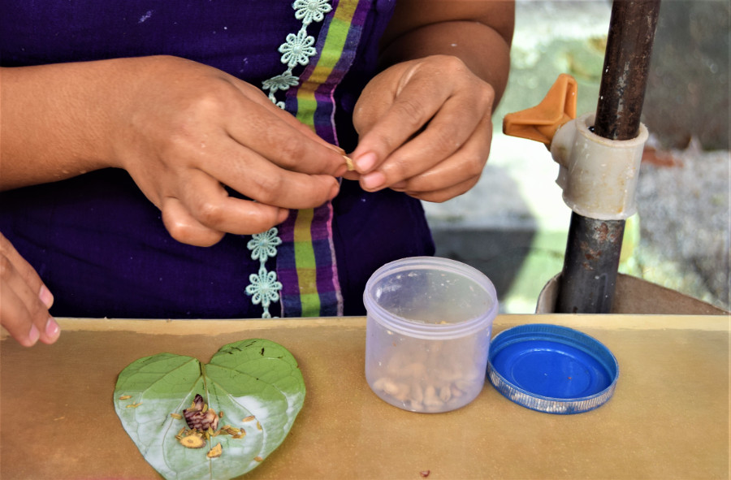
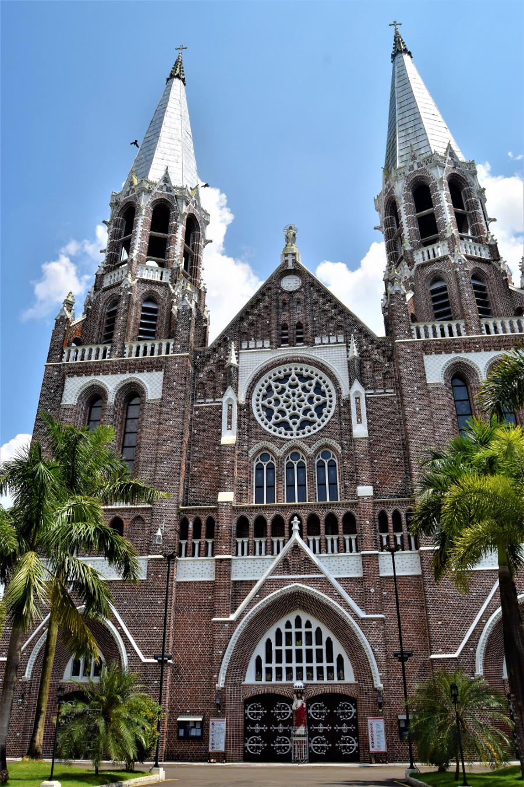
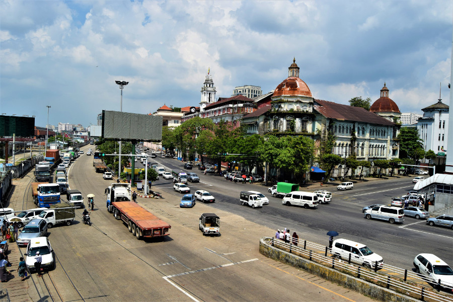
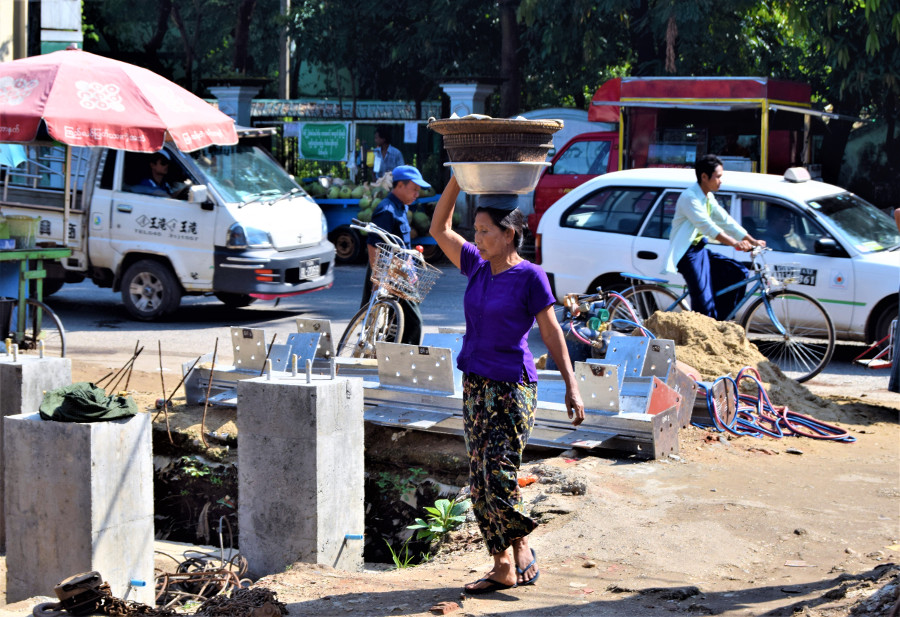
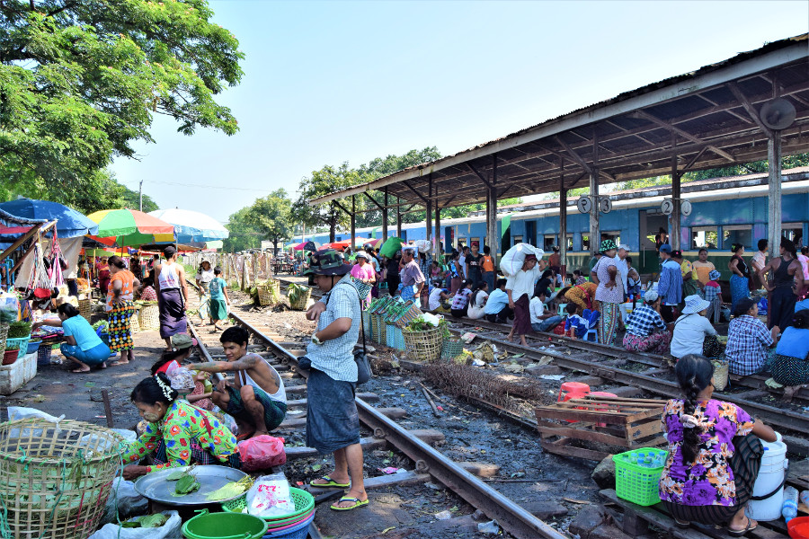
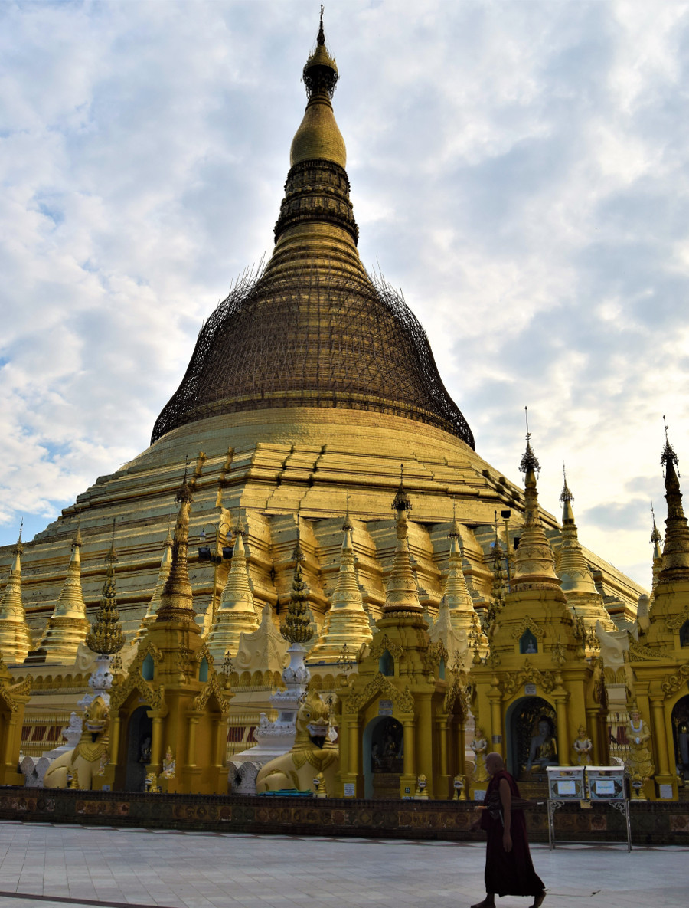
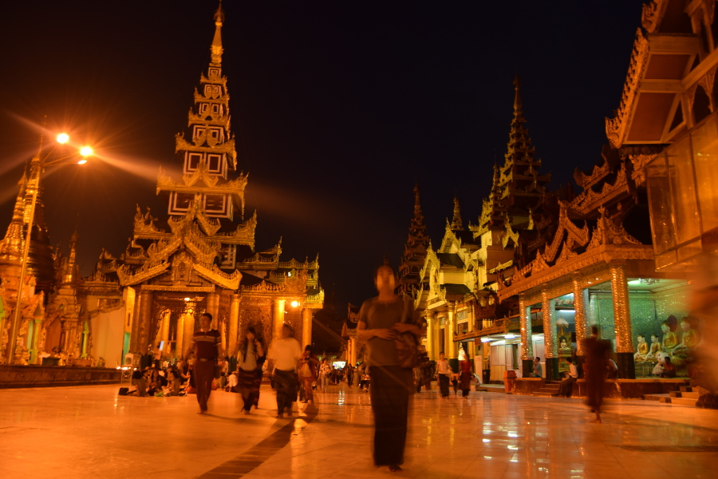
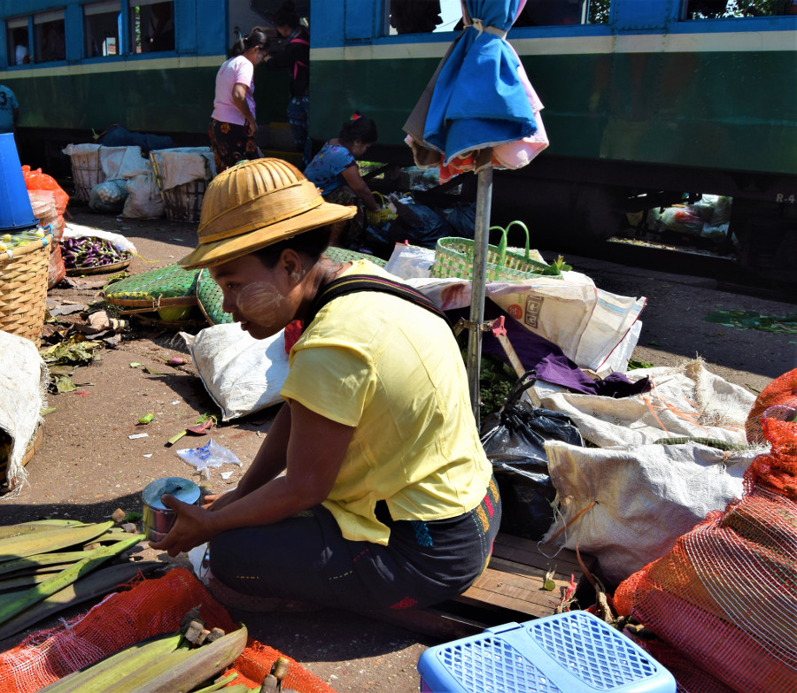

>“This is Burma, and it will be quite unlike any land you know about.”

Rudyard Kipling, 1898.

##First impressions
After a red eye flight from Tokyo to Yangon, including a short stop in Kuala Lumpur, we were picked up by our budget hotel, [Motherland Inn 2](http://www.myanmarmotherlandinn.com/) from the airport. It took almost an hour to get to the hotel and after a few hours sleep we headed out to explore the city. Initially, we didn't know what to make of Yangon; there were no footpaths to walk on, and where there was, people were selling food so we had to walk on the roads. There were stray dogs on every street who fortunately didn’t seem hungry and generally left us alone. Litter was everywhere and the streets were stained with spit from beret nuts, something Myanmar people chew for caffeine but cannot swallow as its mixed with limestone paste. Consequently, every third person we walked past spat on the streets, making them look stained with dried blood. We also saw some massive rats running around at night and so, it’s safe to say Yangon did not make a good first impression. However, it was really strange that we managed to find a few really nice restaurants in amongst the dirt and chaos of Yangon; [Root](https://www.facebook.com/rootkitchen/), [50th Street Bar & Grill](http://50thstreetyangon.com/) and [Union Bar](https://unionyangon.com/) and once we were inside it was like being in a different country. The restaurants were clean, the food was good and they were full of western tourists and expats.

One of the first things we did was get a SIM card for our phones, it was ridiculously cheap, 1500ks for the SIM (75p) and 1000ks (£1) per GB of data. We did a bit of research first and decided not to go with MRT which used to be owned and monitored by the military government. People told us that around ten years ago a SIM card would cost $3000 USD, so people in Myanmar are very happy now that the price has dropped radically and almost everyone is able to use a phone.

##Colonial Buildings
The colonial buildings in Yangon are difficult to miss. Apart from the gold pagodas, they’re the only picturesque parts of the city; they’re crumbling, colourful and made a great photograph. We did a [walking tour](http://www.freeyangonwalks.com/) in Yangon, mainly because we had one too many days there and thought we would try and learn a little more about Myanmar culture. However, the guide mainly took us around the city pointing out the colonial buildings, explaining what they were and what they are now. Our favourite was St Mary’s Cathedral, which was a red brick building and looked like it was only finished yesterday.

Our guide told us that Myanmar gained independence from British rule in 1948 following World War 2; Aung San was responsible for bringing about Burmese independence and he is loved by the people of Myanmar, despite the fact that he was assassinated before the official independence of the country by a gang of paramilitaries. We later read it's rumoured that the arms used to murder him were supplied by the British. He was assassinated at the Secretariat building, a huge red colonial building which we could only see from the outside. Our guide told us that its being renovated into a museum and that once a year on the anniversary of Aung San's death, people of Myanmar are able to visit to pay their respects to their national hero.

From 1948 Burma, as it was known then, was a democratic country until a military coup in 1962. During military rule Burma was cut off from the rest of the world and experienced a lot of violence; for example, protests were suppressed violently often ending in people being killed. We learned that in 1987, the countries leader U Ne Win, declared some of the countries bank notes invalid due to his own superstitions about numbers, which caused the country to go bankrupt. This, and violence against student protests led to demonstrations throughout the country in 1988.

The military leaders in 1989 announced that the country would no longer be known as Burma but as Myanmar; we later found out this was to include 135 ethnic groups in the country, not just to reflect Burmese people. In 2005 the capital of Myanmar was changed from Yangon to Naypyidaw; a newly built city, which didn't make it onto our itinerary as it’s a ‘ghost city’, there is barely any traffic and few people actually live there. Following anti-government protests in 2007 a referendum was held and the first election was held in 2010. Despite the country no longer being a military dictatorship, the military hold a large proportion of seats within government and some high positions, in Myanmar’s hybrid-regime. We found Myanmar politics complex but fascinating, and as the country is so new to the rest of the world and under-developed for tourism; there were no museums or ways to learn other than reading about it [online](https://en.wikipedia.org/wiki/Myanmar#Military_rule_(1962%E2%80%932011)).

##Circular Railway
Every blog we'd read about Yangon recommended riding the 'circle train'. It takes three hours to go from Yangon all the way around and we’re pretty sure the ticket costs less than a pound. However, as we were unsure about the country and how safe riding the train was, we decided to take a tour, hoping the guide would also give us more insight into the country. We paid $35 each with [Motherland Inn Tours](http://www.myanmarmotherlandtravel.com/) which was ridiculously expensive for Myanmar. Our guide took us to the station and we were surprised to see that the trains passing through were really old Japanese Railway trains. They had metal benches, holes for windows and doors and people were hopping off them whilst they were still moving. We got on the circle line and sat front facing by the window for some natural air con. The train was very rickety and went about 20mph. We ‘people watched’ the locals for about an hour, which we found fascinating; people were walking on the railway tracks, people lived by the side of the railways and had farms of watercress right by the tracks. Sadly our guide was more interested in learning about life in England than he was about telling us about Myanmar culture and history, so we didn’t learn much.

We got off at Danyingone, which we definitely wouldn’t have done without our guide. There was a fruit market which started immediately next to the railway tracks and it was absolute chaos. Our guide led us into the centre of the market and pointed out all the tropical fruits such as dragonfruit and pomelo. The market was filthy; rotten skins of fruit covered the walkways which were oozing black liquid when we stepped on it in our sandals, big mistake! And it smelt as bad as the toilets at a music festival. After a short wander around the guide took us to a ‘tea house’, a tent serving drinks, where we had Pepsi for 200ks (10p).

A driver came and collected us shortly afterwards and drove us back to Yangon where we made a brief stop in Chinatown for some lunch. In hindsight we would have ridden the circle train on our own and just stayed on it for the whole three hours, it was as safe as the rest of Yangon city, it wasn’t too hot early in the morning and we didn’t learn a lot from our seemingly offensive guide anyway!

##Shwedagon Pagoda
[Shwedagon Pagoda](https://en.wikipedia.org/wiki/Shwedagon_Pagoda) is the most sacred Buddhist pagoda in Myanmar, it is said to contain relics from four Buddhas. It is believed by historians that the pagoda was built by the Mon people between 6th and 10th century AD. However, legend states that it was built more than 2600 years ago, making it the oldest Buddhist stupa in the world. We had to take our shoes off to enter, like all religious buildings in Myanmar and had to pay 10,000ks to enter, around £5. The building was huge with smaller shrines and religious buildings surrounding the large gold pagoda. No sooner had we arrived, we were approached by a man trying to sell his tour; before we managed to get rid of him, he told us that because we were both born on a Tuesday, according to Burmese Buddhism we were both ‘lions’ and we could offer water to the Tuesday corner. The animal is supposed to be a representation of your personality and we later learned its lucky when two people are the same animal in a relationship.

Around 90% of the people of Myanmar are Theravada Buddhist and we saw a lot of monks, even in Yangon. There are around half a million monks in Myanmar, we learned that they are not allowed to eat after noon and that it is very disrespectful to step on a monks shadow or to cross their path. We saw a lot of novices with mobile phones and people told us that they are allowed to live ‘normal’ teenage lives, playing football and video games but that they also have a  tough life, living in dormitories and getting up early in the morning. All boys between the age of 7 and 13 are expected to enter a monastery for a period of a few weeks or months and they are able to choose whether they go home or remain as a monk. We learned that education is expensive, even for a public school it’s around $250 per year, therefore many poorer and rural families send their children to monasteries to become monks as they will also receive free education. To us, it seemed like a way to institutionalise children where families are not able to afford to care for them.

After wandering around the pagoda taking a lot of photos in the late afternoon, we decided to hang around until the sun had gone down so that we could see the building lit up at night. We sat down and a man approached Dan and struck up a conversation explaining why he shouldn’t point his legs to the pagoda. He told us that he comes to the pagoda regularly to practice his English with foreign tourists.

At night, all lit up, the pagoda looked ridiculously gold and it was more peaceful once the sun had gone down, as there seemed to be more people praying rather than tourists taking tours and photographs. The very top of the pagoda is said to contain a 74 carat diamond and it felt strange to be in a country full of gems and gold but for it to be so poor.

##People of Yangon
We found people in Yangon to be very friendly and inquisitive of us, which initially put us on edge. We met a couple of people in the park near the Sule Pagoda in Yangon, one man approached Dan and told him he was handsome before striking up a conversation about football. Another guy called Htoo Htoo spoke to us in the park. He had an American accent which he said he had picked up from watching the movies and he told us about the tour he does in his hometown Dallas. When we walked around the streets in Yangon many people would say hello to us, or ‘good morning’, even in the afternoon and it felt like people were keen to practice their English. Even children would shout ‘hello, how are you?’ to us as they rode past on their motorbikes with their parents. It took us a few days to get used to people’s inquisitiveness of us!

Despite the country starting to be westernised, almost everyone in Myanmar wears longyi, a long wrap skirt. Even men where longyi, which they tie in a knot at the front and we saw men wearing them with shirts carrying briefcases. Women and children also wear thanaka, which is tree sap used as sunscreen and make up.

##Our verdict on Yangon
Yangon was not a pretty city and we understood why many people pass through quickly, flying in and leaving soon after to visit some of the beautiful Myanmar countryside!
