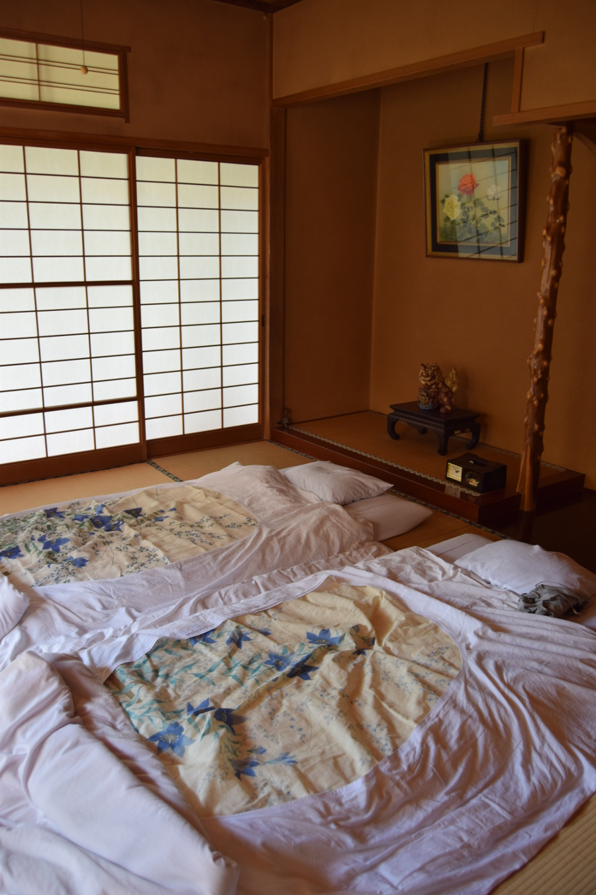
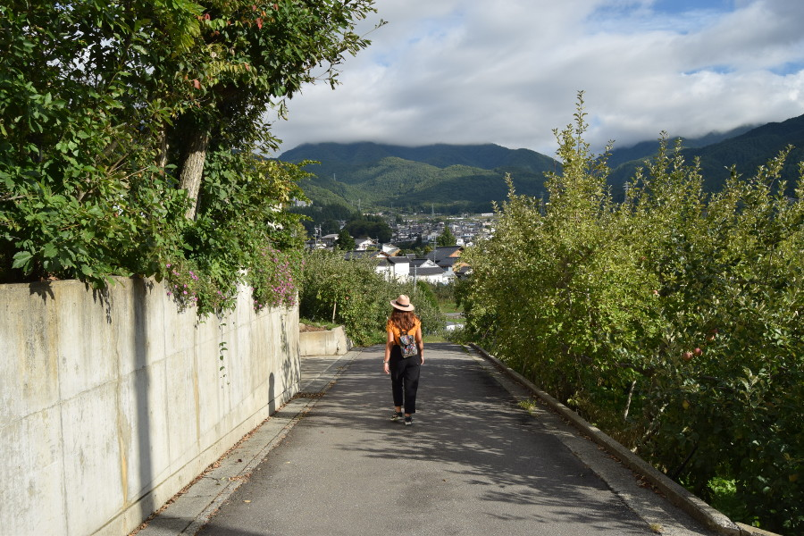
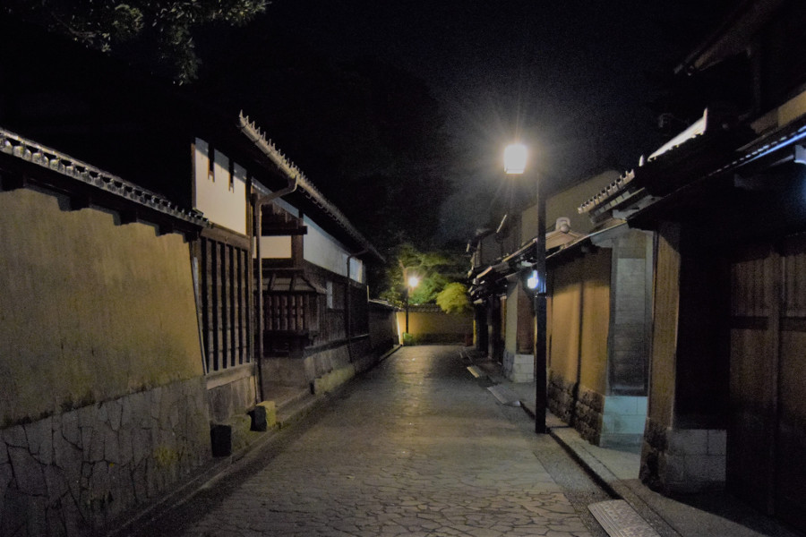
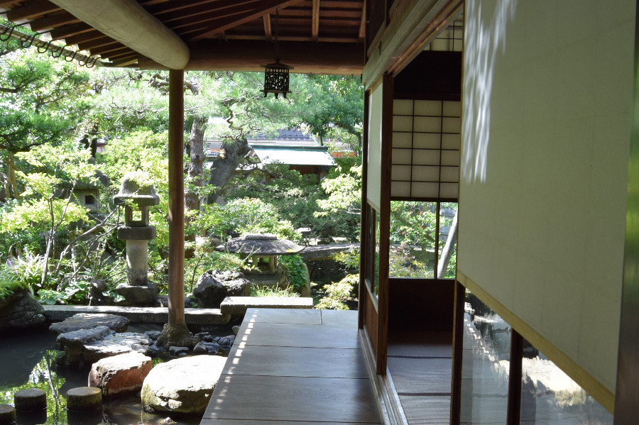
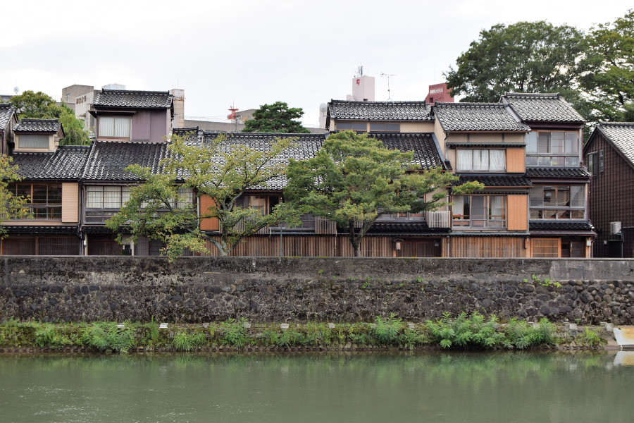
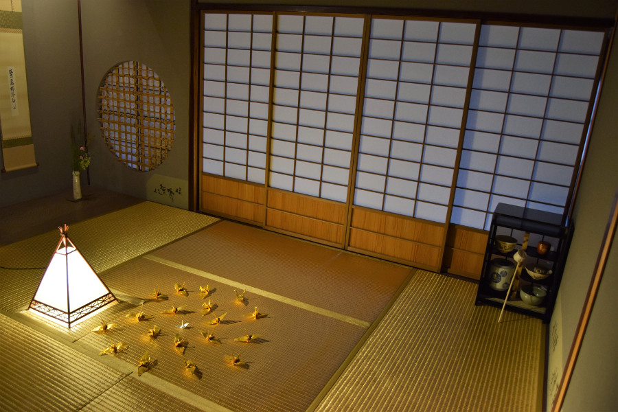
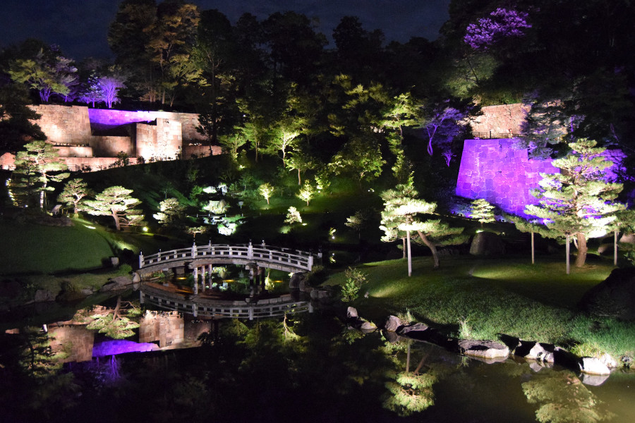

##Snow Monkeys
We decided to spend one night in Yudanaka for two reasons, firstly it’s an onsen town, which means there are hot springs everywhere, and secondly it’s home to the infamous snow monkeys of Japan. We took a train from Tokyo using our [JR Passes](https://www.jrpass.com/) to Nagano and then had to buy a ticket to Yudanaka which was 1,160¥ (around £8). As we were visiting at the very end of summer, in fact over the public holiday of the Autumn Equinox, we knew there would be no snow. However, we’d read loads of reviews about the monkeys still hanging around the hot spring during the rest of the year. The [Jigokudani Yaenoken Park](http://en.jigokudani-yaenkoen.co.jp/) has around 160 wild Japanese macaques that discovered and took over an onsen to keep themselves warm in the winter. In the summer the rangers add grain to the water to encourage the monkeys to take a dip. Sadly, when we arrived in Nagano there was a sign saying the monkeys hadn’t come down to the onsen, we checked the Facebook page which said they hadn’t come down the day before either. We watched the [webcam](http://www.yudanaka-shibuonsen.com/snow-monkey-livecam) throughout the day but they sadly didn’t make an appearance on the day that we were there.

##Yudanaka
Even though there were no monkeys it was still worth the trip to Yudanaka. We’d booked to stay at [Maruka Ryokan](https://travel.rakuten.com/hotel/Japan-Nagano_Prefecture-Yamanouchi-Yudanaka_Onsen_Maruka_Ryokan/1756/), which was over a century old. Due to affiliation with the Japanese mafia, there is a rule that if you have tattoos you can’t go in the public onsen. You also have to go in the onsen naked and they’re separated into male and female baths. Luckily Maruka Ryokan had its own onsen which we could use privately and I was able to go in even with tattoos. The family that ran the Ryokan spoke very limited English but they were really friendly, we got picked up from the station and the older lady there gave us some huge grapes to eat whilst we were sat in the communal area, they were almost as big as plums! We were provided with slippers for each part of the house and a yukata robe to wear to and from the onsen. The room itself was really traditional, with tatami mats, futons and shoji (paper screens).

We had a wander around Yudanaka, which didn’t take too long. We visited [Hyaku Shaku Cannon](http://shiga-kogenguide.com/nagano-city/) which had a big Buddha statue and visited the Onsen-ji Temple. We also walked through the onsen streets, which were full of tourists going from their ryokan to the public onsen in their yukata and wooden sandals. We also walked through some of the local apple orchards and were able to enjoy the views of the surrounding hills. We ate at [Goen](https://www.tripadvisor.com/Restaurant_Review-g1117904-d10391316-Reviews-Japanese_Dining_GOEN-Yamanouchi_machi_Shimotakai_gun_Nagano_Prefecture_Koshinet.html) and had Japanese Yakitori (meat on skewers) as it was the only thing on the menu that didn't contain seafood. They were delicious, one of them was local apple wrapped in meat.

##Japanese Etiquette
We were slowly becoming familiar with Japanese etiquette, particularly whilst staying in the ryokan; absolutely no shoes are allowed to be worn inside people's houses or in restuarants that have tatami mats. Even a Uni Qlo we went in had a 'no shoes in the fitting room policy'. We had to be careful to manoeuvre when taking our shoes off to stand on the part of the floor where no shoes are allowed in our socks so that our socks were not considered dirty. Everything is seriously clean in Japan, there are barely any bins around, yet no litter. No one eats or drinks on the move, so when we brought a coffee in a can from the vending machines we had to drink it there and then and dispose of the rubbish in the bin next to the machine. When it rained shops had plastic bags for our umberellas so water doesn't drip all over the floor. Japanese people also don't do physical contact so we didn't see people holding hands, hugging or kissing in public. People in Japan are also insanely polite and eager to help, they form orderly queues to get on buses, trains and even to cross the road. We learnt two phrases pretty quickly in Japan, which with a big smile got us quite far - 'konnichiwa' 'hello' and 'arigato-goszimasu' 'thank you very much'. Also, despite having western shops such as H&M, the fashion in Japan was very different and for the first time on our travels I felt really uncomfortable in the majority of my clothes in my backpack. Generally men are in shirts and suits and women in long skirts, lose fitting 'work wear' trousers and tops in pastel shades with their shoulders covered. So Japan wasn't really the place to wear my colourful elephant trousers and spaghetti strap tops.

##Kanazawa
After a night in Yudanaka we had to take the train back to Nagano and then jumped on the Shinkansen (bullet train) to Kanazawa. Bullet trains in Japan are infamous for hitting super speeds but with the JR Pass we were only allowed to ride the slower ones. However the Shinkansen still hit 200MPH; it was really efficient, we didn’t see a single delay, they were clean, roomy and had a great queuing system to get on so that you weren’t being barged out of the way for a seat. Kanazawa is known for being the 'little Kyoto' as it has areas that date back to the 'Edo Period' and it's full of Japanese culture and history. We booked to stay at [Shaq Bighouse](http://shaq-bighouse.com/english/), a hostel in Kanazawa which was run by a guy called Shaq and seemed to be part of his family home. Kanazawa was small enough that everything was in walking distance, including Omicho fish, fruit and veg market, from where we were staying as we only had the afternoon and evening to explore before we were moving on again.

##Nagamachi Samurai District
The main reason we’d decided to spend time in Kanazawa was because it is one of few places in Japan where a traditional samurai district can be seen, almost the same as it was in the Edo Period. During the Edo Period Japan was ruled by the Shogunate's and samurai (military) and it was only following imperial restoration and the Meji Period, when the emperor ruled once more, that Japan started to westernise and formed a military army rather than relying on samurai. As samurai were no longer needed their houses were burnt down and made into farm land. Other districts such as those in Tokyo were bombed and burnt down during World War 2 so not many places like the one in Kanazawa has survived. It didn’t take us long to stumble upon the narrow streets with beautiful traditional wooden houses on either sides of the lanes. An older Japanese gentleman approached us and showed us a famous samurai house, explaining a little of the history to us. He also showed us where to take the best photo and told us about his trip to England. He was a great example of how friendly the people are in Japan!

We had a look around the [Nomura Samurai Family House](http://www.visitkanazawa.net/3-old-samurai-houses-in-kanazawa) for 500¥ (around £3) which was very traditional, like the ryokan, with sliding doors and tatami mats. There was some armour, swords and old coins on display, but my favourite part of the house was the garden which had a stream filled with massive nishikigoi (koi). Dan had also found a ninja house which we’d contemplated visiting but the entrance fee was around $10, the tour was only in Japanese and as foreign tourists we would have to sign a waiver promising we’d behave. The ninja house apparently has hidden floors and staircases which would have been cool to see but we decided to visit the Higashi Chaya-gai District or Geisha District instead.

##Higashi Chaya-gai District
We’d hoped to catch one of the Geisha shows whilst we were in Japan but sadly they didn’t start until the 1st October. The Higashi Chaya-gai District was similar to the samurai district with the old wooden houses but they weren’t hidden by gates and walls. The area was heaving with tourists and many people had dressed up in a kimono for the day, which cost around 3500¥ (£23). We later learnt that many of the people who do this are Japanese, they come to areas of the country that are more traditional and dress up in traditional clothes to explore their heritage and cultural roots.

We went into the [Kaikaro Chaya](http://www.kaikaro.jp/eng/index.html), a working Geisha House that can be visited during the day and takes wealthy audiences at night. Some of the instruments and objects that Geisha use to entertain their guests were on display in the house like the drums. It cost 750¥ to enter (£5) and again had tatami mats everywhere. During the day Geisha are training for their shows at night so we didn’t see any real Geisha around in the area. We’d read that the best time to see Geisha was at dusk when they would leave their houses for their appointments but we'd also read about people 'Geisha Hunting' and seen photo's of tourists mobbing Geisha on the streets to get a photo, just like paparazzi.

##Kanazawa Castle and Kenroku-en Gardens
We weren’t going to visit Kanazawa Castle, although the gardens are said to be one of the three most beautiful in all of Japan, as we didn’t have time and we'd planned to visit Himeji to see the castle there. However, Shaq from the hostel told us that in the evening the gardens would be open and lit up, and better yet entry was free. We headed to the gardens for 7PM but we were a little perplexed when we got in as it was barely lit up apart from a fountain and a stream. In fact it was so dark that by a bridge on a pond a member of staff was holding a torch so we could see. In the gardens, the only bit of entertainment we saw were two people playing their instruments. We were so confused and about to give up, when we saw the castle all lit up and headed that way. We had a wander around the grounds and then saw that there were more gardens behind the castle. These were all lit up and there was a great reflection of the bridge on the water, which was really beautiful. We stayed here for a short time to watch the light show.

##Our verdict on Yudanaka & Kanazawa
Yudanaka was a cute little onsen town in the middle of the Japanese countryside. It was still worth a visit even without seeing the monkeys but we couldn’t help think that it would have been better to visit in the snowy cold of winter! Kanazawa was worth a stop too to have a look inside the Geisha and Samurai houses as it was like we’d stepped back in time to the Edo Period of Japan.

